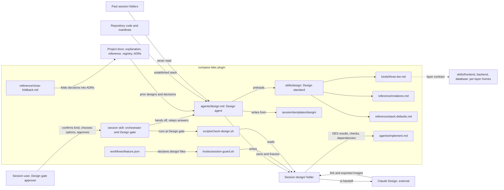

# Design (L3)

> → [System overview](../solution-design.md) | → Reference: [the Design standard](../../reference/design/standard.md) | → [Session overview](../session/overview.md) | → Decision: [ADR-004](../../registry/decisions/004-design-path.md)
> Origin: #27

## What Is Design?

Design is the Feature session phase that turns a frozen Define output into a solution a reviewer can approve at a glance and Implement can build from without making design decisions of its own. Its primary object is the **`design/` folder**: a main doc (`design/index.md`) with the sections every design has, plus files the solution's kind and scope call for, such as the whole-system design, layer designs and a Claude Design handoff.

Design is the plugin's only path that produces a solution design. Its depth follows the kind of solution: each kind can have an **in-depth path**, and a three-tier application gets a whole-system design followed by one design per changing layer.

### Why it exists

A design with no standard varies with however the agent improvises in that session, and a reviewer has to reconstruct from prose what the design adds, changes or retires. Layer decisions, such as extending a table versus adding one, get made silently. Two design paths with different structures and stack assumptions drift apart. And when a design leaves gaps, Implement fills them with decisions nobody approved. Design gives every session the same structure, a visual delta against the current system, an explicit choice at every significant decision, and a handoff Implement can order tasks from.

### Who it's for

- **The person approving a design.** At the Design gate they see a context view and a delta list that mark every touched element *new*, *changed*, *deprecated* or *unchanged*, so they can approve or adjust without reading the whole design first.
- **The session's user and the Design agent.** The design's depth follows the kind of solution and the scope Define confirmed. Every significant choice is put to the user with its options, pros and cons.
- **The Implement and Test agents.** Each `DES-*` item names its result, the check that shows it's done, and what it depends on, so tasks and tests come straight from the design.
- **compass-labs maintainers.** One design path, extended by adding a kind file or a layer standard, never by rewriting the procedure.

## How It Works

The orchestrator hands the Design phase to the Design agent, which preloads the `design` skill. The agent first reads **prior knowledge**: the project's docs (`docs/explanation/`, `docs/reference/`, `docs/registry/` and its ADRs), the code and manifests, and the current session's frozen `define/` output. It never reads a past session folder, because those hold drafts and reversed decisions; whatever a past session shipped is already in the docs. In a repo with no docs, it designs from the Define output and the code alone and says so.

It then **classifies** the solution as one primary kind (three-tier application, process/workflow, infrastructure, plugin/tooling or other) and writes a **scope checklist** marking each area in or out, with reasons. The user confirms both. If the kind has an in-depth path, the agent follows it. For a three-tier application, it writes the whole-system design (which layers change, the contracts between them, and C4 L1 and L2 views), gets the user's approval, then writes one design per changing layer. A kind or area without a path is covered in the all-kinds sections, and its follow-up issue is named. Depth follows Define: an area no live requirement touches is marked *unchanged* and gets no design.

For each stack area in scope, the agent looks for an **established stack** in the repo and designs for it. Only when it finds none does it propose the plugin's **stack default**. Every **significant choice** is put to the user with at least two options. Every component and choice gets a **principles check**: KISS and YAGNI always, SOLID too for software. Anything no live requirement needs is rejected under YAGNI. When visual UI design is in scope, the agent writes a **Claude Design handoff** (screens, states, behaviour constraints, no visual values) and records the export that comes back.

The visuals use the notation the catalogue gives for the kind (C4 by default), drawn as Mermaid so GitHub renders them, with four classDefs carrying the delta. Non-Mermaid sources, such as BPMN, are rendered to an SVG kept beside the source in `assets/`. At the gate, the orchestrator runs `check-design.sh`, which refuses the milestone if the classification, scope checklist, context view or delta list is missing, and shows the reviewer the context view and delta list.

### Context diagram

*C4 component view of the plugin's Design path, as a Mermaid flowchart.*

## Core Objects / Entities

| Object | Description |
| ------ | ----------- |
| `design/` folder | The Design phase's one artifact, owned by the Design agent and frozen as a unit at the Design milestone. `index.md` always, plus `solution.md`, layer files and `ui-handoff.md` when called for. |
| Primary kind | The one category the solution belongs to. It chooses the in-depth path. |
| Scope checklist | Each area (frontend, backend, database, infrastructure, process/workflow, plugin/tooling, visual UI design, others) marked in or out, with a reason. |
| In-depth path | `kinds/{kind}.md`: a kind's extra sections, approval steps and layer contract. Only three-tier has one today. |
| Delta status | Exactly one of *new*, *changed*, *deprecated*, *unchanged*, per touched element, in the delta list and in every visual. |
| Significant choice | A decision with more than one reasonable option whose outcome changes what gets built. Recorded with two or more options and the user's choice. |
| Principles check | KISS, YAGNI and (for software) SOLID, each *met*, *traded off* or *n/a*, per `DES-*` item and choice. |
| `DES-*` item | A row of the Components table: component, the requirements it covers, result, check, and depends on. |
| Per-layer home | `skills/{layer}/`: one skill per layer holding both its design standard and its Implement skill. |

## Code Map — Which Code Touches This

- **Standard**: `skills/design/SKILL.md` covers the procedure, the prior-knowledge rule, the all-kinds sections, the kind catalogue and "What a kind supplies", significant choices and the principles check, the Design → Implement handoff, and the Claude Design handoff.
- **On-demand files**: `skills/design/kinds/three-tier.md` (whole-system design, layer contract), `skills/design/reference/notations.md` (notation catalogue, delta styling, render routes), `skills/design/reference/stack-defaults.md` (the single source of stack defaults).
- **Artifact shape**: `skills/session/templates/design/` (`index.md`, `solution.md`, `ui-handoff.md`) and the `design/` entry in `skills/session/workflows/feature.json`.
- **Agent**: `agents/design.md` preloads `compass-labs:design`, with Bash scoped to render commands.
- **Gate**: `skills/session/scripts/check-design.sh`, run by the orchestrator at the Design gate (`skills/session/SKILL.md`).
- **Consumers**: `agents/implement.md` reads `design/index.md`; `skills/session/reference/close-foldback.md` folds a design back into the docs.

## Internal Architecture

**One standard skill, with on-demand files.** `SKILL.md` holds only what every kind shares. Kind paths, notations and stack defaults are read when the step needs them, so a session loads only what its kind uses.

**Kinds plug in by adding files.** A new in-depth path adds `kinds/{kind}.md`, rows in the notation catalogue, and its catalogue row. The procedure, classification and all-kinds sections don't change.

**Layers live in one home each.** A layer's design standard and its Implement skill share `skills/{layer}/`, so they can't drift apart. No layer home exists yet; when a layer's standard is missing, its area is covered in the all-kinds sections.

**The layout tells old sessions from new.** A session with a root `design.md` predates the `design/` folder. It keeps the old template, the guard treats it as before, and `check-design.sh` passes it with "legacy layout: no check".

**ADRs are written at Close, not during Design.** Design flags architecture-level decisions "ADR" and keeps them in its own artifact. Close writes them into `docs/registry/decisions/` once the session has shipped. See [ADR-004](../../registry/decisions/004-design-path.md).

## Dependencies

- **Internal**: the `session` skill (handoff, Design gate, `check-design.sh`), the guard hook (folder ownership and freezing), the frozen `define/` output, and Close's fold-back, which keeps the docs that Design reads current.
- **External**: GitHub's rendering of Mermaid and of SVG images in Markdown; Node tooling (`bpmn-to-image`, mermaid-cli, a headless browser) for non-Mermaid sources, render checks and Claude Design screenshots; Claude Design (claude.ai) for visual UI design. No API integration with Claude Design.

## Gotchas

- **Design's Bash isn't guarded by the hook.** The guard sees only Write, Edit and MultiEdit. The agent's own rule limits Bash to render commands writing to `assets/` or a temp directory, and the gate's `git status` check surfaces any stray write.
- **Only three-tier has an in-depth path.** Process/workflow (#49), infrastructure (#50) and plugin/tooling (#51) use the all-kinds sections, and the layer standards (#46–#48) don't exist yet.
- **Stack detection reads files, not a running system.** A repo with an unusual layout may need the user to name its stack.
- **Design's prior knowledge is only as good as Close's fold-back.** A repo whose sessions never fold back has no docs to read, and Design falls back to the Define output and the code.
- **The past-session rule binds Design only.** Widening it to every phase is #54.
- **Mermaid's native `C4Context` isn't used.** It's experimental and has no tags or legend. C4 views are `flowchart`s whose caption names the C4 level.

## Changelog

- 2026-10-10: Initial documentation.
