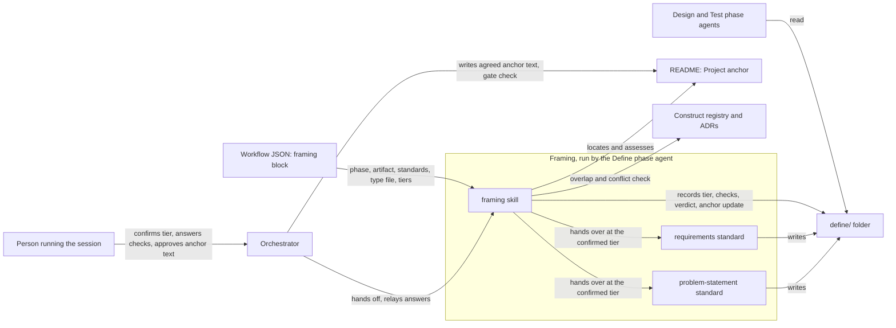

# Framing (L3)

> → [System overview](../solution-design.md) | → Reference: [tiers, checks, anchor contract and the framing block](../../reference/framing/tiers-and-anchor.md) | → [Session overview](../session/overview.md) | → Decision: [ADR-003](../../registry/decisions/003-framing-and-project-anchor.md)
> Origin: #23

## What Is Framing?

Framing is the step every session runs before it writes a problem statement or requirements. It makes sure the session is solving the right problem: not a fix someone picked too early, not a symptom mistaken for its cause, not work that already exists, and not work that quietly widens what the project is for. Its primary object is the **framing record**: the confirmed depth tier and its reason, the outcome of each check, and the aligns/extends verdict against the **project anchor**, the project's one authoritative statement of its vision, mission, scope and non-goals.

Framing is defined once and names no phase, so any session type can use it. Feature sessions run it in Define today. Bugfix (#24) and Research (#25) plug in the same way.

### Why it exists

Without framing, a session takes its issue's wording at face value, so its requirements can be precise about the wrong thing. Sessions frame problems differently by type, a bug fix differently from a feature and both differently from research, so one requirements table for Feature alone isn't enough. And without an agreed statement of the project's purpose, new work has nothing to be checked against: the purpose gets restated every session or goes unchecked, and features can drift from it or widen it without anyone deciding that they should.

### Who it's for

- **People who run sessions.** They get a proportionate amount of framing: a one-line typo fix skips it, and a change that crosses the whole workflow gets the full depth. They never have to restate the project's purpose once the anchor exists.
- **Downstream phase agents** (Design, Implement, Test). They get a definition deep enough to design and verify against: a stated need, measurable success outcomes, prioritised requirements that name what they serve, and at full tier quality coverage and diagrams.
- **Maintainers of a consuming repo.** Their project gets one anchor, written once with their approval, that every later session is checked against. Framing works in a repo with no README, no `docs/`, no registry and no ADRs.

## How It Works

A session reaches the phase its workflow names in the `framing` block (`define` for Feature). The phase agent proposes a depth tier (full, short or skip) with a one-line reason, and the user confirms or changes it. The confirmed tier decides which checks run and how deep the problem statement and requirements go.

At full and short tier, the agent then runs the checks in order. The **solution-first (XY) check** finds the need behind any fix the issue asked for, and either the user confirms the fix is the need or the fix is kept aside as a candidate solution. The **symptom vs cause check** keeps what was observed separate from why, and records the cause as unknown until it's shown. The **anchor check** looks for the marked `## Project anchor` section in the root README and assesses it against the anchor contract: a complete anchor is used as it stands, an incomplete one gets only its missing elements drafted, and a missing one gets a vision, mission and scope drafted with the user. The agent then records whether the work **aligns** with the anchor or **extends** it, citing the scope lines it rests on, and an extends verdict drafts the anchor change. Where the project has a construct registry or ADRs, an **overlap check** looks for existing work that already does this and past decisions it would contradict.

The phase agent never writes the README. The agreed anchor text goes into the framing record, the orchestrator writes it into the README in the same commit as the decision, and the Define gate refuses the milestone until the README contains it. So an extends verdict is settled before the phase is approved. At skip tier none of this runs, and a missing anchor waits for the next full- or short-tier session.

Framing then hands over to the standards skills the workflow lists. For Feature these are `problem-statement` and `requirements`, each reading its `types/feature.md` for what the tier requires. The result is the `define/` folder: a main doc, plus sub-docs that exist only when the tier needs them.

### Context diagram

## Core Objects / Entities

| Object | Description |
| ------ | ----------- |
| Depth tier | `full`, `short` or `skip`. Proposed with a reason, confirmed by the user, recorded in the main doc. A floor, not a ceiling. |
| Framing record | `define/framing.md` for Feature: XY outcome and candidate solutions, symptom and cause, anchor state, verdict and citations, the anchor-update block, and overlaps. Exists at short and full tier. |
| Project anchor | The README's marked `## Project anchor` section: vision, mission, scope and optional non-goals. One per project. |
| Anchor-update block | The action (`create`, `complete`, `extend` or `none`), the elements, and the exact agreed text. The orchestrator writes from it and the Define gate checks against it. |
| Verdict | Exactly one of `aligns` or `extends`, citing the anchor's scope and non-goal lines. |
| `framing` block | The workflow JSON entry through which a session type plugs into framing. |
| Type file | `types/{type}.md` in each standards skill: a tier table, what each element must contain, templates, examples and a checklist. |
| Methods record | `reference/methods.md` in each standards skill: an adopt, adapt or reject verdict per method for Feature and Bugfix, with when it applies. |

## Code Map — Which Code Touches This

- **Procedure**: `skills/framing/SKILL.md` covers the tiers, the check × tier table, each check, and "What a session type supplies".
- **Anchor contract**: `skills/framing/reference/anchor-contract.md` covers location, form, markers, checklist and how the anchor is written.
- **Standards**: `skills/problem-statement/` and `skills/requirements/`, each with `SKILL.md` (rules for every type), `types/feature.md`, `types/bugfix.md` and `reference/methods.md`. `skills/requirements/reference/diagrams.md` is the diagram catalogue, and `skills/requirements/examples/feature-full/` is a worked full-tier `define/` folder.
- **Plug-in point**: the `framing` block in `skills/session/workflows/feature.json`, and the templates in `skills/session/templates/define/`.
- **Caller**: `agents/define.md` preloads `framing`, `problem-statement` and `requirements`.
- **Anchor write and gate**: `skills/session/SKILL.md` (main-loop anchor write, Define gate check a3).

## Internal Architecture

**The phase is named only in the workflow.** The framing skill never names a phase, so a new session type adds a `framing` block, templates and type files, and the skill itself doesn't change.

**One standards skill per artifact section.** The problem statement and the requirements each have one skill, and each skill keeps per-type content in `types/{type}.md`, read on demand, so a session loads only its own type.

**Defaults, not rigid rules.** The standards fix the required content. Layouts, tag syntax, templates and named frameworks are defaults, and judgement calls stay with Define and the reviewer. The parts a gate or tool depends on stay mechanical: the anchor markers, the anchor-update block, the `REQ-*` table's first column, and the guard's file set.

**Anchor writes stay out of phase agents.** A phase agent writes only its own artifact, so the orchestrator applies anchor changes and its gate enforces them. See [ADR-003](../../registry/decisions/003-framing-and-project-anchor.md).

## Dependencies

- **Internal**: the `session` skill (orchestrator anchor write and Define gate), the Define phase agent, the workflow JSON, and the construct registry and ADR index when they exist.
- **External**: GitHub's Mermaid rendering for every diagram the standards require or offer. None at run time otherwise: framing is Markdown the model follows.

## Gotchas

- **Skip means skip everything**, the anchor checks included. A repo whose sessions are all skip tier never gets an anchor through framing. Setting it up at project creation is tracked in #38.
- **Anchor-like wording without markers counts as missing.** Framing offers to reuse it in the draft, but only the marked section is the anchor.
- **The overlap check never feeds the verdict.** Registry and ADR hits are recorded as overlaps or conflicts; fit with the project is judged against the anchor alone.
- **Bugfix framing is shallower than Feature** until the Bugfix workflow exists (#24, #40).
- **The `plan` skill's discovery questions overlap with framing** for session work. Splitting `plan` up is tracked in #27.

## Changelog

- 2026-09-28: Initial documentation.
