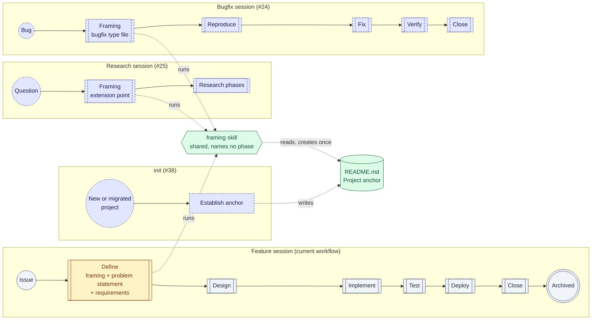
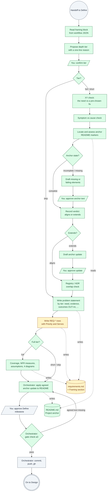
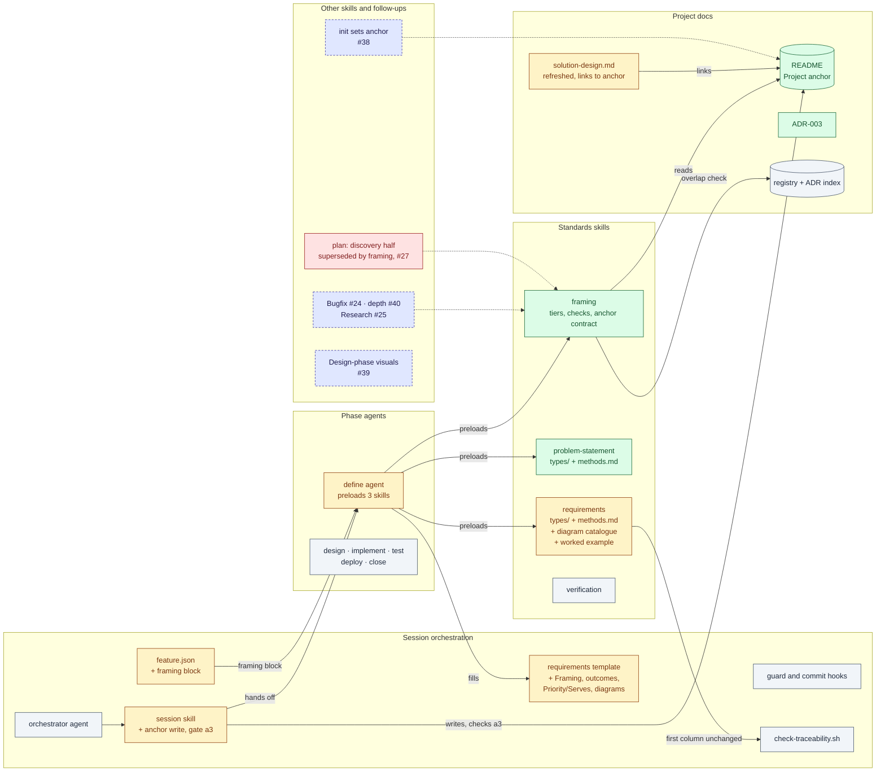
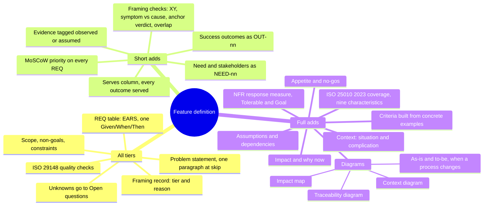

# Design: Define phase depth — problem framing, per-type standards, project anchoring

> Phase: Design | Started: 2026-09-25 | Status: Draft (revised after Define reopen)
> Requirements: [`requirements.md`](requirements.md) · Session history: [`log.md`](log.md)

## Approach

Framing becomes its own skill, `framing`, which names no phase. Each session type declares what it plugs into framing through a `framing` block in its workflow JSON. Two standards skills, one per artifact section, pick their rules from per-type files: `problem-statement` (new) and `requirements` (existing, restructured). The project anchor is a labelled section of the root `README.md`, wrapped in markers so it can be found without judgement calls. The framing skill defines the contract that section must meet, and #38 (`init`) will reuse that contract.

Anchor writes stay out of phase agents. Define agrees the wording with the user and records it in `requirements.md`. The orchestrator writes that text to the README in the same commit as the decision. A new Define-gate check refuses the milestone until the README contains the agreed text. This keeps the phase-agent contract unchanged, as the Constraints require.

**Feature depth.** A Feature definition gets deeper by tier, through the content its standards require (see the detail under DES-011, DES-012 and DES-017):
- **Problem statement.** Full tier adds context, named stakeholders with their needs, tagged evidence, impact and why now, measurable success outcomes, and appetite with no-gos.
- **Requirements.** Rows gain a MoSCoW priority and an upward trace to outcomes. Full tier adds ISO/IEC 25010:2023 coverage, measurable non-functional requirements, assumptions and dependencies, and acceptance criteria built from concrete examples.
- **Diagrams.** Full tier adds four Mermaid diagrams.

Named frameworks are offered as templates for this content, never mandated (REQ-029). Every method used has a recorded verdict. The first column of the `REQ-*` table is unchanged, so `check-traceability.sh` keeps working.

Alternatives were put to the user and rejected, recorded in `log.md`:
- Define writing the README itself under a Close-style exception.
- A dedicated anchor agent.
- `docs/anchor.md`, or a configurable anchor location.
- Framing as a `session/reference` doc, or folded into the problem-statement skill.
- Per-type sections inside each SKILL.md.
- One combined research doc.

## Visual overview

Colours show each element's status compared with today:

- **Green:** new
- **Amber:** changed
- **Grey:** unchanged
- **Red:** superseded
- **Dashed blue:** planned in another issue

These are BPMN-style flowcharts drawn in Mermaid: circles are events, diamonds are gateways, parallelograms are user tasks and cylinders are data. They aren't strict BPMN 2.0; which formal notation the Design phase should use is tracked in #39.

### 1. Where it fits in the session lifecycle (SDLC)

The Feature workflow is unchanged apart from Define. Framing is one shared skill, and Bugfix, Research and `init` plug into it or into the anchor it reads.



### 2. Define phase, expanded

Each step's actor is in its label: steps starting "You:" are yours, steps starting "Orchestrator:" are the orchestrator's, and the rest are the Define agent's. Your answers are relayed by the orchestrator (`needs_input`, then `AskUserQuestion`).



Skip tier jumps straight to a one-paragraph problem statement: it runs no checks, anchor checks included. At a3, a session with no Framing section (from before this change) isn't checked (D6).

### 3. Where it fits in the project



### 4. What a Feature definition contains, by tier

Each tier includes everything in the tiers before it. Skip is the base, short adds to it, and full adds to short.



### What's new, changed, superseded and unchanged

| Status | Item | DES |
|---|---|---|
| New | `framing` skill: tiers, XY and symptom checks, anchor checks, overlap check | DES-001–005 |
| New | Anchor contract (`framing/reference/anchor-contract.md`) and the README `## Project anchor` section | DES-006, DES-014 |
| New | `problem-statement` skill. Feature content by tier: context, need and stakeholders, evidence, impact, success outcomes (`OUT-nn`), appetite and no-gos | DES-011 |
| New | Feature requirements depth: MoSCoW priority, Serves trace, 25010:2023 coverage, NFR measures, assumptions and dependencies, example-based criteria | DES-012 |
| New | Diagram catalogue: 4 required at full tier, 6 optional, all Mermaid, with rendering rules | DES-017 |
| New | Worked full-tier Feature example | DES-018 |
| New | Orchestrator anchor write and Define-gate check a3 | DES-009 |
| New | ADR-003 | DES-016 |
| Changed | `feature.json` gets a `framing` block | DES-007 |
| Changed | Requirements template: Framing section, problem statement split into sections by tier, Success outcomes, Priority and Serves columns, Quality coverage, Assumptions and dependencies, Diagrams | DES-008 |
| Changed | `agents/define.md`: preloads three skills and reads the per-type files | DES-010 |
| Changed | `requirements` skill split into per-type files, a methods record, the diagram catalogue and the worked example. ID rules and first column unchanged | DES-012, DES-013 |
| Changed | Methods records built from the verdicts already researched, with a column naming the outcome REQ each method serves | DES-013 |
| Changed | compass-labs README and `solution-design.md`: full refresh, linked to the anchor | DES-014, DES-015 |
| Superseded | `plan` skill's discovery half (Phase 0, Q1, Q2) for session work. It isn't removed here; retirement is tracked in #27 | — |
| Superseded | REQ-012, asking for a project purpose every session (never built) | — |
| Unchanged | Orchestrator agent, hooks, `check-traceability.sh`, verification skill, the other phase agents and Close fold-back | — |

## Components / layers

Each design item names the `REQ-*` it covers. Paths are plugin paths unless marked as consuming-repo paths. DES-011, DES-012, DES-013 and DES-017 have detail sections below the table.

| ID | Component / layer | Covers | Notes |
|---|---|---|---|
| DES-001 | `skills/framing/SKILL.md`: the framing step's definition | REQ-001, REQ-002 | The phase-agnostic procedure: propose a tier, run the checks for that tier, record the outcomes in the type's framing artifact. It names no phase. Its section **"What a session type supplies"** lists: the `framing` block fields (DES-007), meaning the artifact framing produces, the standards skills that apply, the per-type file name, and the tiers allowed; and, in each standards skill, a `types/{type}.md` with a tier × section table. It checks this list against Research: a type that supplies these needs no change to `framing`. |
| DES-002 | Depth tiers in `framing` | REQ-003, REQ-004 | Framing proposes full, short or skip with a one-line reason, drawn from the issue and the size of the work, and asks the user through the agent's `needs_input`. The confirmed tier and reason are recorded. `framing` has a check × tier table with no cell left blank. Skip runs no checks, anchor ones included. Artifact sections × tier are defined by each type file's tier table (DES-011, DES-012, DES-017), which REQ-004's "framing standard" includes for that type. |
| DES-003 | Problem checks in `framing`: solution-first (XY) and symptom-vs-cause | REQ-005, REQ-006 | Full and short tiers only. **XY:** if the issue names a fix, record the need behind it, and either get the user to confirm the fix *is* the need or move it to "Candidate solutions". **Symptom/cause:** record the observed symptom separately from the cause, and record the cause as "unknown" when it isn't known yet. For Feature, the XY output becomes the `NEED-nn` rows and the symptom/cause output feeds the Evidence tags (DES-011). |
| DES-004 | Anchor checks in `framing`: locate, assess, verdict | REQ-010, REQ-020, REQ-021, REQ-022 | Full and short tiers only. **Locate:** the root `README.md` between the markers (DES-006). **Assess** against the contract checklist, with three outcomes: *complete* means use it as is and ask no anchor questions (REQ-022); *incomplete* means draft only the missing or failing elements and leave the existing wording untouched (REQ-021); *missing* (no README, or no markers) means draft vision, mission and scope, plus non-goals if the user states any (REQ-020). A README with anchor-like wording but no markers counts as *missing*, and the draft offers to reuse that wording. **Verdict:** exactly one of aligns or extends, citing the scope and non-goal lines it rests on. An *extends* verdict drafts the anchor change. In every write case, the agreed text goes into the artifact's anchor-update block and is written by the orchestrator (DES-009). |
| DES-005 | Registry/ADR overlap check in `framing` | REQ-013 | Full and short tiers only, and only where `docs/registry/index.md` or ADRs exist. The check searches the registry's "Does" column and the ADR index for overlaps with existing work and conflicts with recorded decisions. It records each one found, or "none found". The aligns/extends verdict cites only the anchor. |
| DES-006 | `skills/framing/reference/anchor-contract.md`: the anchor contract | REQ-018, REQ-019 | **Location:** the consuming repo's root `README.md`. **Form:** a `## Project anchor` heading with `### Vision`, `### Mission`, `### Scope` and optionally `### Non-goals`, between `<!-- compass:anchor -->` and `<!-- /compass:anchor -->`. There is exactly one marker pair. **Checklist:** markers present exactly once; vision, mission and scope present and non-empty; non-goals present or not applicable; no restatement elsewhere in the README, or in any doc the README links to, that differs from the anchor without linking to it. It's stack-agnostic and assumes no `docs/` layout. #38 writes to this same contract. |
| DES-007 | `skills/session/workflows/feature.json`: add a `framing` block | REQ-001, REQ-002 | `"framing": {"run_in_phase": "define", "produces": "requirements.md", "standards": ["compass-labs:problem-statement", "compass-labs:requirements"], "type_file": "feature", "tiers": ["full", "short", "skip"]}`, with `$comment` updated to match. The phase is named here, never in the framing definition. Neither the guard hook nor `tests/session/workflow_test.sh` reads this key. The Bugfix block is #24's job. |
| DES-008 | `skills/session/templates/requirements.md`: restructured template | REQ-003, REQ-005, REQ-006, REQ-009, REQ-010, REQ-013, REQ-032, REQ-033, REQ-035, REQ-039–042 | Section order and tier marks are shown under **DES-008 detail**. Each section carries a `<!-- tier: … -->` comment, and Define deletes the sections its confirmed tier doesn't require. The Requirements table gains **Priority** and **Serves** columns after Requirement. `ID` stays the first column (D7). Existing sessions keep their old layout and stay valid (D6). |
| DES-009 | `skills/session/SKILL.md`: the orchestrator's anchor write and Define-gate check | REQ-011, REQ-020, REQ-021 | **Anchor write**, in main-loop step 3: when Define returns a `decision` entry for an anchor update, the orchestrator writes the anchor-update text into `README.md` between the markers. It creates the README, or appends the section, if either is missing, and never changes wording outside the elements being updated. It then commits the decision, `requirements.md` and `README.md` together. **Gate check** "a3 — Define milestone only": if the Framing section shows full or short tier and an anchor-update action other than "none", the README's marked section must contain that text and pass the DES-006 checklist. Otherwise the milestone is refused and the gap shown. A session with no Framing section gets no check. |
| DES-010 | `agents/define.md` | REQ-001, REQ-007, REQ-008 | Preload `compass-labs:framing`, `compass-labs:problem-statement` and `compass-labs:requirements`, and read the `framing` block from the session type's workflow. Read `types/{type_file}.md` in each standards skill, and read `requirements/reference/diagrams.md` and the worked example at full tier. Keep the existing fallback: read a SKILL.md from disk if its preload isn't visible. The description becomes "frames the problem and writes requirements". Contract text is unchanged. |
| DES-011 | `skills/problem-statement/`: `SKILL.md`, `types/feature.md`, `types/bugfix.md`, `reference/methods.md` | REQ-005, REQ-007, REQ-023–029 | See **DES-011 detail**. SKILL.md holds the rules shared by every type: no solution talk (XY), claims tagged, who is affected. `types/feature.md` holds the tier table, the required content of each element, an optional template for each element, and bad and good one-line examples. `types/bugfix.md` stays at REQ-006–008 depth (#40). |
| DES-012 | `skills/requirements/` (restructured): `SKILL.md`, `types/feature.md`, `types/bugfix.md`, `reference/methods.md` | REQ-008, REQ-009, REQ-029–037 | See **DES-012 detail**. SKILL.md keeps the rules shared by every type: `REQ-*` IDs never reused, struck-through rows, `ID` as the first column, one Given/When/Then per row, and the 29148 checks. `types/feature.md` adds priority, the Serves trace, quality coverage, NFR measures, assumptions and dependencies, and example-based criteria. The "deeper research tracked in #32" line is removed. |
| DES-013 | Methods records: `skills/problem-statement/reference/methods.md`, `skills/requirements/reference/methods.md` | REQ-014, REQ-015, REQ-046 | See **DES-013 detail**. The verdicts were already researched and agreed in Define (reopened). **Implement writes them up**: rationale, the condition under which each applies, the outcome REQ each serves, and the Bugfix column. It does no new research. |
| DES-014 | compass-labs `README.md`: anchor and full refresh | REQ-016 | This is the first anchor written to DES-006. Implement drafts vision, mission, scope and non-goals, gets the user's approval through the orchestrator, and puts them between the markers. The title and body use the plugin's name from `plugin.json`, never "Systematic Dev Kit", and drop the full-stack framing. Every `skills/*/SKILL.md` and `agents/*.md` gets an entry, including new `framing` and `problem-statement`, and nothing is listed that doesn't exist (for example the tree currently omits `adr`, `doc-maintainer`, `post-hook-validator` and `task-executor`). The command prefix is documented as it is today (#34). |
| DES-015 | compass-labs `docs/explanation/solution-design.md`: full refresh | REQ-017, REQ-019 | "What It Does" and "Who It's For" link to the README anchor instead of restating it. The name is fixed, and the domain map covers every `skills/*` directory, adding `framing`, `problem-statement`, `adr`, `post-hook-validator`, `task-executor` and any others found. |
| DES-016 | `docs/registry/decisions/003-framing-and-project-anchor.md` plus an index row | REQ-001, REQ-018 | Written in Implement. It records D1–D11 below as one decision. |
| DES-017 | `skills/requirements/reference/diagrams.md`: the diagram catalogue and Mermaid rules | REQ-039–045 | See **DES-017 detail**. Four diagrams required at full tier, six optional at any tier, none required at short or skip. Each entry gives the Mermaid diagram type, what the diagram must show, the check that proves it, and a small example that renders. The Feature type files point here for the diagrams each one owns (D9). |
| DES-018 | `skills/requirements/examples/feature-full.md`: worked full-tier Feature definition | REQ-038, REQ-044 | A complete `requirements.md` for a small invented feature that doesn't depend on any tech stack: **self-service password reset for a team wiki** (D11). It exercises an existing process that changes (the admin resets passwords by hand today, so it needs as-is/to-be flows), an external email system (context diagram), and security and performance NFRs (25010 coverage, Tolerable/Goal). It meets REQ-023–037 and REQ-039–042, and Test checks it item by item. It doubles as the REQ-009 test fixture: `tests/session/check_traceability_test.sh` gets a case that runs the parser on its 5-column table with a matching `verification.md`. |

### DES-008 detail: requirements template

| Section in `requirements.md` | Skip | Short | Full | Filled by |
|---|---|---|---|---|
| `## Framing`: tier and reason; XY outcome and candidate solutions; symptom and cause; anchor state, verdict and citations; anchor-update block; overlaps | tier and reason only | all | all | DES-002–005 |
| `## Problem statement`: one paragraph at skip; at short and full, `###` subsections as in DES-011 | paragraph | subsections | subsections | DES-011 |
| `## Scope`, `### Non-goals`, `## Constraints` (unchanged) | ✓ | ✓ | ✓ | — |
| `## Assumptions and dependencies` | — | — | ✓ | DES-012 |
| `## Requirements`: table `ID \| Requirement \| Priority \| Serves \| Acceptance criterion` | ✓ (Priority and Serves may be "—") | ✓ | ✓ | DES-012 |
| `### Quality coverage (ISO/IEC 25010:2023)`: 9-row table | — | — | ✓ | DES-012 |
| `## Diagrams`: impact map, context, traceability, and as-is/to-be when a process changes | — | — | ✓ | DES-017 |
| `## Open questions` (unchanged) | ✓ | ✓ | ✓ | REQ-037 |

### DES-011 detail: Feature problem statement (`problem-statement/types/feature.md`)

The section structure of `types/feature.md` itself:
1. Tier table.
2. One subsection per element: what it must contain, how it's checked, the optional template, and a bad and good example.
3. The diagrams this section owns (impact map, context, as-is/to-be, plus the optional journey and opportunity solution tree), pointing to DES-017.
4. Methods applied, linking to `reference/methods.md`.
5. A link to the worked example (DES-018).

What it requires in a Feature `requirements.md`:

| Element (heading under `## Problem statement`) | Skip | Short | Full | Must contain | Optional template (verdict) | REQ |
|---|---|---|---|---|---|---|
| (one paragraph) | ✓ | — | — | What's wrong, for whom, and why it matters: today's template line | — | REQ-004 |
| `### Context` | — | — | ✓ | **Situation**: what's true today. **Complication**: what has changed or gone wrong. Each gets at least one sentence of its own. | SCQ/Minto (adopt). The "question" is left implicit, because the XY check has already turned it into the need. | REQ-023 |
| `### Need and stakeholders` | — | ✓ | ✓ | One `NEED-nn` line per need: a named stakeholder group (not just "users"), when the need arises, the need, and the outcome they want. A pre-chosen fix moves to Framing's candidate solutions. | Job story (adopt): "When ⟨situation⟩, ⟨group⟩ wants to ⟨need⟩, so they can ⟨outcome⟩." XY check (adopt). | REQ-024 |
| `### Evidence` | — | ✓ | ✓ | Every claim about the problem is tagged `[observed: source]` (issue, report, data or quote) or `[assumed]`. None is untagged. | Observed/assumed evidence (adopt). Symptom-vs-cause (adopt): the symptom is observed, and the cause stays assumed until shown. | REQ-025 |
| `### Impact and why now` | — | — | ✓ | Who or what is affected if nothing changes, and how, plus at least one reason it's timely now. | None mandated. SCQ's complication often supplies the "why now". | REQ-026 |
| `### Success outcomes` | — | ✓ | ✓ | A table `Outcome \| Signal \| Target \| Checked when \| For need`, with rows `OUT-01`, `OUT-02`, and so on. No bare goals like "better UX". | Impact Mapping goal level (adapt): the "why" made measurable. Opportunity Solution Tree desired outcome (adapt, optional). | REQ-027 |
| `### Appetite and no-gos` | — | — | ✓ | Appetite as an amount of effort or time (a budget, not an estimate). No-gos listed, or "see Non-goals". | Shape Up appetite and no-gos (adapt) | REQ-028 |

**Templates, not mandates (REQ-029).** Each template sits under "Optional template". The checklist tests only the "Must contain" column, so plain prose that has the content passes.

**Bugfix (`types/bugfix.md`)** keeps REQ-006–008 depth: the observed symptom with reproduction steps, expected vs actual behaviour, impact, and the cause (named, or "unknown"). Its methods are XY, symptom-vs-cause, 5 Whys and observed/assumed evidence, each adopted for Bugfix (DES-013). Deeper Bugfix content is #40.

### DES-012 detail: Feature requirements (`requirements/types/feature.md`)

The section structure of `types/feature.md`: tier table; the table columns; NFR form; quality coverage; assumptions and dependencies; example-based criteria; the extended checklist; the diagram this section owns (traceability, plus the optional story map, quality utility tree, priority quadrant and example map, pointing to DES-017); methods applied; and a link to the worked example.

| Element | Skip | Short | Full | Must contain | Template or method (verdict) | REQ |
|---|---|---|---|---|---|---|
| Requirement sentence | ✓ | ✓ | ✓ | One EARS sentence per row (unchanged) | EARS, 5 patterns (adopt). User and job stories (adapt): a story may be the source of a row, but the row is written in EARS. | REQ-008 |
| **Priority** column | — | ✓ | ✓ | Exactly one of `Must`, `Should`, `Could` or `Won't`. A requirement decided as Won't for this session is struck through with the reason "Won't (this session)" (D8). | MoSCoW (adopt) | REQ-032 |
| **Serves** column | — | ✓ | ✓ | One or more `OUT-nn` or `NEED-nn` IDs, each of which exists in the problem statement | 29148 "necessary" made traceable (adopt) | REQ-033 |
| Outcome coverage | — | ✓ | ✓ | Every `OUT-nn` appears in at least one Serves cell. It's a checklist item, and at full tier the traceability diagram shows it too. | Story mapping (adapt, optional story map) | REQ-034 |
| NFR form | — | — | ✓ | The Requirement cell reads: EARS condition (While/When: trigger and environment), then the response, then `Measure: ⟨scale⟩; Tolerable ⟨x⟩; Goal ⟨y⟩`. Tolerable and Goal are required when the measure is numeric. | SEI quality-attribute scenario (adapt: source, stimulus and environment collapse into the condition). Planguage (adapt: Scale, Tolerable and Goal only). | REQ-031 |
| `### Quality coverage (ISO/IEC 25010:2023)` | — | — | ✓ | A table `Characteristic \| Covered by \| Not applicable because`, with nine rows using the 2023 names: functional suitability, performance efficiency, compatibility, interaction capability, reliability, security, maintainability, flexibility and safety. Rows start with the characteristic, never with `REQ-`. | ISO/IEC 25010:2023 (adopt). Quality utility tree (optional diagram). | REQ-030 |
| `## Assumptions and dependencies` | — | — | ✓ | Two lists, each non-empty or "none". Each dependency names what relies on it (for example "relied on by REQ-004"). | — | REQ-035 |
| Acceptance criterion | ✓ | ✓ | ✓ (concrete) | One Given/When/Then per row (unchanged). At full tier it's built from one concrete example with specific values or states. | Given/When/Then (adopt). Example Mapping (adapt: rule = row, example = criterion, questions go to Open questions). Specification by Example (adapt: the example is the criterion). | REQ-036 |
| Unknowns | ✓ | ✓ | ✓ | An unanswerable case goes to Open questions, and no criterion asserts a result for it. REQ-037 has no tier limit. | Example Mapping's red cards (adapt) | REQ-037 |
| Checklist | ✓ | ✓ | ✓ | The six 29148 checks, plus: priority present (short and full), Serves valid (short and full), concrete example (full) | ISO/IEC/IEEE 29148 (adopt) | REQ-008 |

**Templates, not mandates (REQ-029)** applies here too. The checklist tests content, not form.

**How the table stays parseable (REQ-009).** `check-traceability.sh` takes a requirement's ID only from the first column of a line matching `^\| *REQ-[0-9]+`, and reads no other columns. It reads `verification.md`'s columns 2 and 4 (Covers and Result), which don't change. So:
- **Extra columns are safe.** Priority and Serves sit after `ID`.
- **Struck-through rows** (`| ~~REQ-nnn~~ |`) don't match, so dropped and Won't rows are correctly left out.
- **Other tables don't clash.** Quality coverage, success outcomes and assumptions never start a row with `REQ-`. Serves holds `OUT-`/`NEED-` IDs, which the parser ignores (D7).

DES-018's fixture test proves this.

**Bugfix (`types/bugfix.md`)** stays at REQ-008 depth: corrected-behaviour rows, usually in the "If ⟨trigger⟩, then … shall" pattern, each with a Given/When/Then that reproduces the original failure as a regression check. Its methods are EARS, 29148 and Given/When/Then, each adopted for Bugfix.

### DES-013 detail: methods records

**Format.** Each file has one row per candidate with these columns: `Method | Group | Feature verdict | Rationale | Applies when | Serves (REQ-023–045) | Bugfix verdict | Bugfix rationale / applies when`.
- A Feature verdict is adopt, adapt or reject. A Bugfix verdict is adopt, adapt, reject or "deferred to #40" (REQ-014). A deferral needs no rationale or condition.
- An "Additions" table allows at most 3 per file, each naming the gap it fills (REQ-015).
- A "Deferred" list gives each further proposal a follow-up issue number.

**Starting verdicts** (Feature verdicts from the Define (reopened) decision; the Serves and Bugfix columns are proposed here, and Implement confirms them and writes the rationale):

| File | Method | Feature | Serves | Bugfix (proposed) |
|---|---|---|---|---|
| problem-statement | XY problem | adopt | REQ-024 | adopt |
| problem-statement | SCQ/Minto | adopt | REQ-023, REQ-026 | deferred to #40 |
| problem-statement | Job stories (JTBD) | adopt | REQ-024 | deferred to #40 |
| problem-statement | Observed/assumed evidence | adopt | REQ-025 | adopt |
| problem-statement | Symptom-vs-cause (Genchi Genbutsu/RCA) | **adopt (gap: not in the recorded verdicts)** | REQ-025 | adopt |
| problem-statement | 5 Whys | reject (it belongs to Bugfix) | — | adopt |
| problem-statement | Impact Mapping | adapt | REQ-027, REQ-039 | deferred to #40 |
| problem-statement | Opportunity Solution Tree | adapt | REQ-027, REQ-043 | deferred to #40 |
| problem-statement | Shape Up appetite and no-gos | adapt | REQ-028 | deferred to #40 |
| problem-statement | PR-FAQ | reject | — | deferred to #40 |
| requirements | EARS | adopt | REQ-031 | adopt |
| requirements | ISO/IEC/IEEE 29148 checks | adopt | REQ-033, REQ-037 | adopt |
| requirements | User and job stories | adapt | REQ-024, REQ-033 | deferred to #40 |
| requirements | Story mapping | adapt | REQ-034, REQ-043 | deferred to #40 |
| requirements | Use cases | reject | — | deferred to #40 |
| requirements | ISO/IEC 25010:2023 | adopt | REQ-030 | deferred to #40 |
| requirements | SEI quality-attribute scenarios | adapt | REQ-031 | deferred to #40 |
| requirements | Planguage | adapt | REQ-031 | deferred to #40 |
| requirements | FURPS+ | reject | — | deferred to #40 |
| requirements | Given/When/Then | adopt | REQ-036 | adopt |
| requirements | Example Mapping | adapt | REQ-036, REQ-037, REQ-043 | deferred to #40 |
| requirements | Specification by Example | adapt | REQ-036, REQ-038 | deferred to #40 |
| requirements | MoSCoW | adopt | REQ-032 | deferred to #40 |
| requirements | Kano | reject (at requirement level) | — | deferred to #40 |
| requirements | RICE | reject (at requirement level) | — | deferred to #40 |
| requirements | WSJF | reject (at requirement level) | — | deferred to #40 |

Every method the Bugfix type files list (DES-011, DES-012) has a Bugfix adopt verdict, as REQ-007 and REQ-008 require. No additions are proposed, so the limit of three is unused.

### DES-017 detail: diagram catalogue (`requirements/reference/diagrams.md`)

| Diagram | Tier | Mermaid type | Must show | Check | Owned by | REQ |
|---|---|---|---|---|---|---|
| Impact map | full | `mindmap` | Root = the feature → each `OUT-nn` → stakeholder group → behaviour change → `REQ-nnn`. A REQ may appear under more than one branch. | Every OUT is present, each has at least one stakeholder and behaviour change, and each behaviour change has at least one REQ. | problem-statement | REQ-039 |
| Context diagram | full | `flowchart LR` | The work in scope as a central subgraph, every stakeholder group (from the `NEED-nn` rows) and every external system named in the problem statement or requirements, each with a labelled interaction edge | Every named group and system appears | problem-statement | REQ-040 |
| Traceability diagram | full | `flowchart LR` | `OUT-nn` nodes → `REQ-nnn` nodes, with one edge per Serves link. REQ nodes are coloured by priority (`classDef` must, should, could). `NEED-nn` nodes appear only where a REQ serves a need alone. | Every OUT and non-dropped REQ appears, and every Serves link is an edge | requirements | REQ-041 |
| As-is / to-be | full, when an existing process changes | `flowchart` ×2 (or one diagram with two subgraphs) | The same step IDs in both. Changed, added and removed steps are styled with `classDef` changed, new and removed. | Every step that differs is visible | problem-statement | REQ-042 |
| Customer journey | optional | `journey` | Stages, steps and satisfaction scores for a stakeholder | — | problem-statement | REQ-043 |
| Opportunity solution tree | optional | `mindmap` | Outcome → opportunities → candidate solutions | — | problem-statement | REQ-043 |
| Story map | optional | `flowchart TB` with one subgraph per activity | Activities (backbone) → stories → release slice | — | requirements | REQ-043 |
| Quality utility tree | optional | `mindmap` | Utility → 25010 characteristic → refinement → scenario REQ | — | requirements | REQ-043 |
| Priority quadrant | optional | `quadrantChart` | REQs placed by value against effort | — | requirements | REQ-043 |
| Example map | optional | `mindmap` | Rule (REQ) → examples → questions | — | requirements | REQ-043 |

**Tiers (REQ-045).** The short and skip rows of both type files' tier tables list no diagrams.

**Rendering rules (REQ-044):**
- Each diagram goes in its own ` ```mermaid ` fence.
- Use only the types in this catalogue. GitHub renders all of them.
- Node IDs are alphanumeric (`R001`, `O01`), and the label carries the real ID (`R001["REQ-001"]`). This matters because a hyphen in a flowchart node ID can break parsing.
- Quote any label that contains punctuation, and never use a bare `end` as a flowchart node ID.
- Mindmap hierarchy comes from indentation alone, so node text has no brackets or parentheses.

Each catalogue example, the worked example (DES-018) and this design's own diagrams are rendered with mermaid-cli during Test (the Test phase runs `npx -y @mermaid-js/mermaid-cli`; the plugin doesn't ship it). In consuming repos, the Define checklist asks the agent to follow these rules. There's no render check at run time (see Risks).

## Current vs new standards

### Feature problem statement

| Aspect | Today | New |
|---|---|---|
| Standard | None. The template has one placeholder line: "What's wrong, for whom, and why it matters. 2–4 sentences." The `requirements` skill covers only the Requirements section. | `problem-statement` skill with `types/feature.md` (DES-011) |
| Depth by tier | One size | Skip: one paragraph. Short: need, evidence and outcomes. Full: adds context, impact and why now, and appetite. |
| Context | — | Situation and complication (SCQ template) |
| Who | "for whom" | Named stakeholder groups, with each need as a `NEED-nn` (job-story template) |
| Evidence | — | Every claim tagged observed (with source) or assumed |
| Solution-first and symptom checks | — | XY and symptom/cause checks at short and full tier (DES-003) |
| Success | — | `OUT-nn`: signal, target and when it's checked |
| Why it matters | "why it matters" | Impact if unsolved, and why now |
| Effort bounds | — | Appetite and no-gos |
| Diagrams | — | Impact map, context diagram and as-is/to-be (full tier) |
| Frameworks | — | Offered as templates, never required |
| Project fit | — | Aligns/extends verdict against the anchor (DES-004) |

### Feature requirements

| Aspect | Today | New |
|---|---|---|
| Syntax | EARS, 5 patterns | Unchanged. NFRs use a set form: condition, response, measure. |
| Table | `ID \| Requirement \| Acceptance criterion` | `ID \| Requirement \| Priority \| Serves \| Acceptance criterion`, with `ID` still first |
| Acceptance criteria | One Given/When/Then per row | Same, and at full tier built from a concrete example. Unknowns go to Open questions at every tier. |
| Quality checks | The six 29148 checks | The six, plus priority present, Serves valid and concrete example |
| Priority | — | MoSCoW on every row (short and full). Won't rows are struck through with a reason. |
| Traceability | Downward only (DES and VER name REQ) | Also upward: each REQ serves an `OUT-nn`/`NEED-nn`, and every OUT is served |
| NFRs | No guidance | 25010:2023 coverage table (nine characteristics, each covered or N/A with a reason), and a response measure with Tolerable/Goal |
| Assumptions and dependencies | — | Two lists, each "none" if empty (full tier) |
| Diagrams | — | Traceability diagram (full tier). Optional: story map, utility tree, priority quadrant and example map. |
| Session types | One standard, with Feature implied | `types/feature.md` and `types/bugfix.md` |
| Worked example | None | A full-tier Feature example (DES-018) |
| Methods record | "Deeper research tracked in #32" | `reference/methods.md` with verdicts and the outcome REQ each serves |

## Decisions

The ADR is [ADR-003](../../registry/decisions/003-framing-and-project-anchor.md), written in Implement (DES-016). D1–D5 were agreed with the user on 2026-09-25. D6–D11 are proposed and need confirming at the gate.

| # | Decision | Notes |
|---|---|---|
| D1 | The orchestrator applies every anchor write. Define only drafts it, and a Define-gate check (a3) enforces REQ-011. | This keeps the phase-agent contract unchanged. The guard hook doesn't cover paths outside `docs/sessions/`, so the contract text is the only guard there. Keeping anchor writes in the orchestrator avoids a second unenforced exception like Close's. |
| D2 | The anchor is a `## Project anchor` section in the root README, between `compass:anchor` markers. | The README is where a newcomer looks first, and every repo has one or can have one. The markers make detection mechanical (REQ-018, REQ-022). |
| D3 | Framing is its own skill. Session types plug in through a `framing` block in `workflows/<type>.json`. | The phase is named only in the workflow (REQ-001). Research (#25) adds a block and type files, nothing else (REQ-002). |
| D4 | There is one standards skill per artifact section (`problem-statement`, `requirements`), each with `types/{feature,bugfix}.md` read on demand. | A session loads only its own type. `requirements` keeps its name, so existing preloads don't break. |
| D5 | Each section's methods verdicts live beside its standard in `reference/methods.md`. Implement writes them up from the verdicts already researched. | The limit of three additions is counted per section (REQ-015). The standards cite verdicts next to them (REQ-007, REQ-008). |
| D6 | Pre-change sessions are grandfathered. The new template sections, the extra columns and gate check a3 apply only to sessions created with the new template. | This satisfies the "existing sessions stay valid" constraint. |
| D7 | Outcomes and needs get IDs local to `requirements.md` (`OUT-nn`, `NEED-nn`). Priority and Serves become columns 3 and 4 of the REQ table. | Serves can then be checked mechanically (REQ-033, REQ-034) and the traceability diagram drawn from the table. `ID` stays first, so the parser is unaffected (REQ-009). The D1 ID set (REQ, DES, VER) is unchanged, because the new IDs never leave `requirements.md`. |
| D8 | A requirement decided as Won't for this session is struck through with the reason "Won't (this session)", not kept as a live row. | A live Won't row would need a passing VER at the Test gate. A struck row is skipped by the parser and counts as dropped under REQ-032's criterion. |
| D9 | One diagram catalogue at `requirements/reference/diagrams.md`, with each diagram owned by the type file of the section it illustrates | The rendering rules live in one place. It avoids a third standards skill for a section that is only diagrams. |
| D10 | The traceability diagram is a `flowchart LR`, not a `requirementDiagram`. | **This departs from the research lean.** `requirementDiagram` needs a block with fields for every REQ, gets unreadable with 20 or more rows, and its relationship types (satisfies, verifies and so on) don't model "REQ serves outcome". A flowchart renders compactly and can be coloured by priority. |
| D11 | The worked example's subject is self-service password reset for a team wiki. | It needs no particular tech stack, and it exercises every full-tier element, including an as-is/to-be process change, an external system, and security and performance NFRs. |

## Risks

| Risk | Mitigation |
|---|---|
| Hand edits, or other tooling, break or duplicate the anchor markers in a README. | DES-006's checklist requires exactly one marker pair. Framing reports a broken pair as *incomplete* and drafts a repair, which goes through D1 like any other anchor write. |
| Preloading three skills into Define adds token load, and `skills:` preload has an unconfirmed gap. | The type files, the diagram catalogue and the worked example are read on demand. Keep define.md's read-from-disk fallback for every preloaded skill (DES-010). |
| Full tier becomes heavy, and Define takes longer. | Tiers are proposed per session and the user confirms them. Short tier needs only need, evidence, outcomes, priority and Serves. Frameworks are optional (REQ-029). |
| The 25010 "not applicable" column gets rubber-stamped. | A reason is required on every N/A row, and the checklist rejects an empty or generic one ("n/a"). |
| Could rows that aren't delivered fail the Test gate, like Won't rows would (D8). | The standard says a Could that's dropped later is struck through by a logged decision, which is the existing frozen-artifact route. |
| Diagrams in consuming repos aren't render-checked at run time (REQ-044). | The rendering rules only allow diagram types GitHub renders. Test renders every diagram the plugin ships. A run-time render check can be a follow-up issue if failures show up. |
| Large impact maps and traceability diagrams become unreadable. | The catalogue allows splitting into one diagram per `OUT-nn`. |
| Restructuring `requirements` breaks how `check-traceability.sh` reads requirements. | Only the first column is parsed, and it's unchanged. DES-018's fixture test runs the parser on a 5-column table (REQ-009). |
| Adding a `framing` key to `feature.json` breaks the hooks or tests that read it. | The hook and `workflow_test.sh` read only `phases[]` and `session_level`. Run `tests/run.sh` after the change. |
| The orchestrator's anchor write overwrites the user's wording. | DES-009 writes only the elements named in the agreed anchor-update block. REQ-021's criterion becomes a VER check. |

## Open questions

All questions resolved. Confirm at the gate: D6–D11, especially D10 (it departs from the research lean) and the Feature verdict for symptom-vs-cause in DES-013 (missing from the recorded verdicts; adopt proposed). The user approves compass-labs' vision and mission wording during Implement (DES-014).
