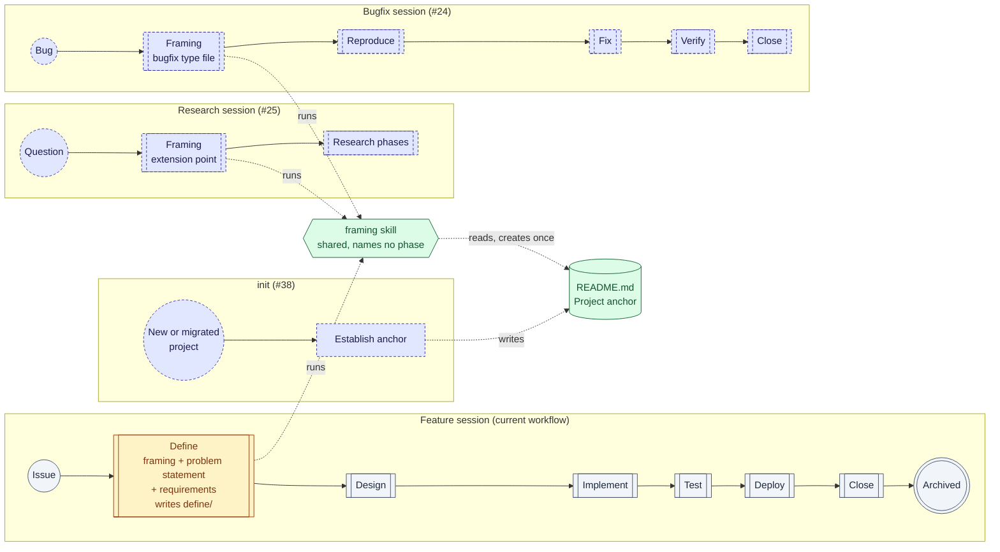
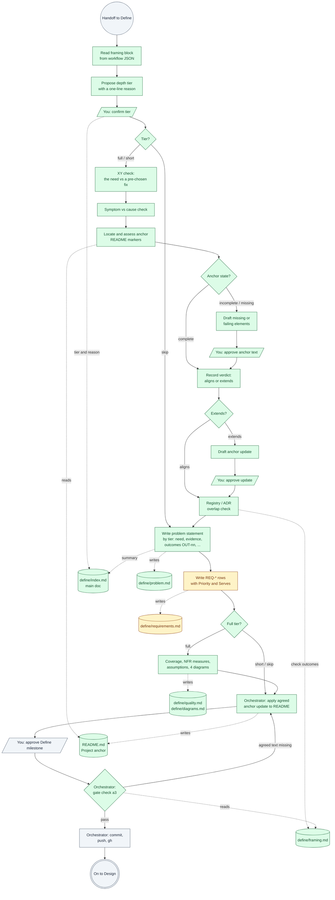
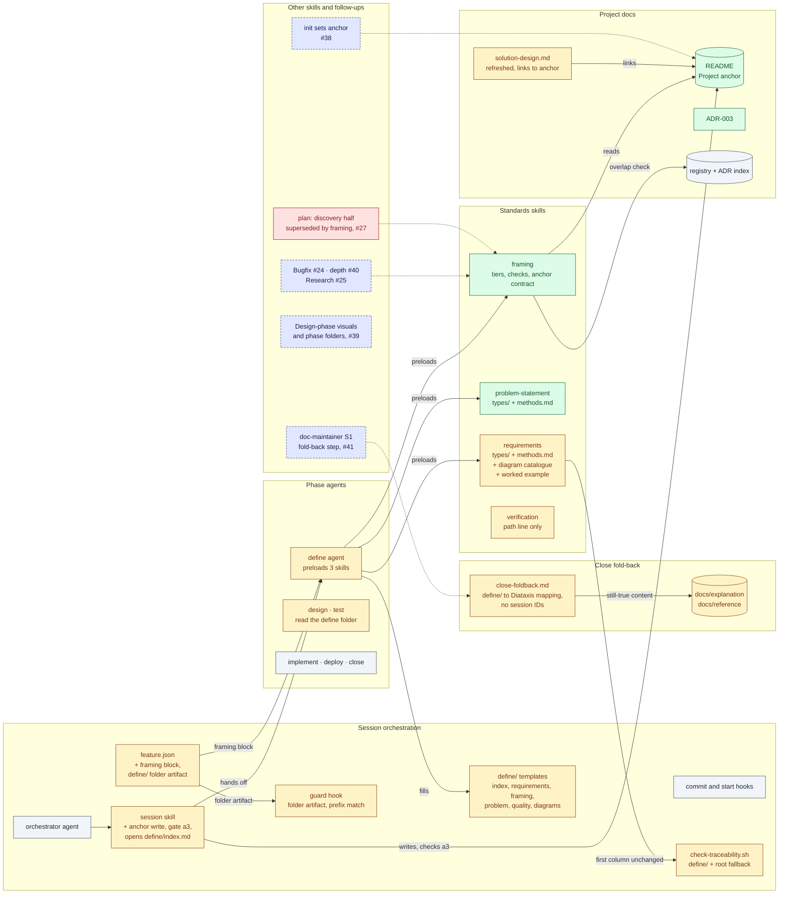
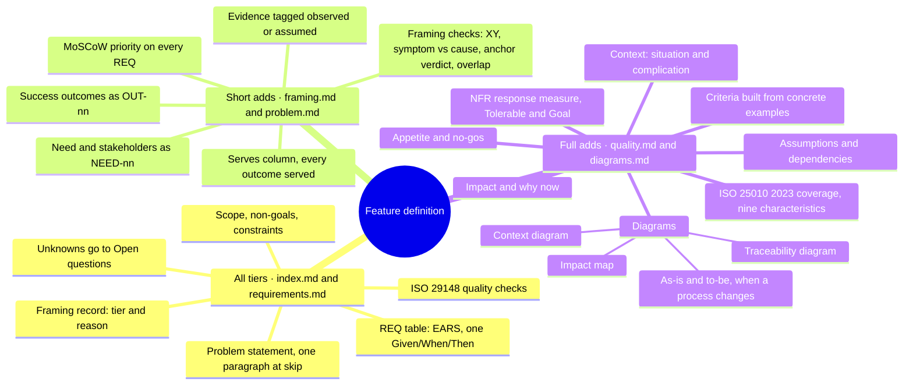

# Design: Define phase depth — problem framing, per-type standards, project anchoring

> Phase: Design | Started: 2026-09-25 | Status: Draft (ready for Design milestone)
> Requirements: [`requirements.md`](requirements.md) · Session history: [`log.md`](log.md)

## Approach

Framing becomes its own skill, `framing`, which names no phase. Each session type declares what it plugs into framing through a `framing` block in its workflow JSON. Two standards skills, one per artifact section, pick their rules from per-type files: `problem-statement` (new) and `requirements` (existing, restructured). The project anchor is a labelled section of the root `README.md`, wrapped in markers so it can be found without judgement calls. The framing skill defines the contract that section must meet, and #38 (`init`) will reuse that contract.

Anchor writes stay out of phase agents. Define agrees the wording with the user and records it in `define/framing.md`. The orchestrator writes that text to the README in the same commit as the decision. A new Define-gate check refuses the milestone until the README contains the agreed text. This keeps the phase-agent contract unchanged, as the Constraints require.

**Feature depth.** A Feature definition gets deeper by tier, through the content its standards require (see the detail under DES-011, DES-012 and DES-017):
- **Problem statement.** Full tier adds context, named stakeholders with their needs, tagged evidence, impact and why now, measurable success outcomes, and appetite with no-gos.
- **Requirements.** Rows gain a MoSCoW priority and an upward trace to outcomes. Full tier adds ISO/IEC 25010:2023 coverage, measurable non-functional requirements, assumptions and dependencies, and acceptance criteria built from concrete examples.
- **Diagrams.** Full tier adds four Mermaid diagrams.

Named frameworks are offered as templates for this content, never mandated (REQ-029). Every method used has a recorded verdict.

**Defaults, not rigid rules.** Real work doesn't fit a framework neatly. The standards give defaults and judgement calls, not hard rules, which extends REQ-029 from frameworks to everything the standards suggest:
- **Defaults.** Table layouts, tag syntax, section order and sentence counts are suggestions. A definition that has the required content passes, whatever form it takes.
- **The tier is a floor, not a ceiling.** Define may include an element from a higher tier when the work calls for it and the user agrees. The file that holds it then exists (D12).
- **A reviewer's call.** Where a check asks whether something is good enough (a specific stakeholder, a real N/A reason, a readable diagram), the checklist asks the question and Define or the reviewer answers it.
- **Mechanical checks stay mechanical where a gate or tool depends on them.** These are the `ID` first column and the `REQ-*` table rules that `check-traceability.sh` parses, REQ → VER traceability, the anchor markers and gate check a3, the guard's file set and layout rules, and the Mermaid rendering rules.

**Define's output becomes a folder** (D12, D13). All that depth would crowd one file, so Define writes a `define/` folder: one main doc, `define/index.md`, linking to focused sub-docs, and a sub-doc exists only when the confirmed tier needs it. The `REQ-*` table lives in `define/requirements.md` with its first column unchanged. `check-traceability.sh` reads that file and falls back to the root `requirements.md` for sessions from before this change, which are never bulk-migrated (D6, DES-019). The workflow declares `define/` as a folder artifact, and the guard hook owns and freezes it as a unit (DES-020). At Close, the sections still true after shipping are folded into the Diátaxis docs, with no session IDs, and the rest stays in the archive (D14, DES-023). See the Artifact view below.

Alternatives were put to the user and rejected, recorded in `log.md`:
- Define writing the README itself under a Close-style exception.
- A dedicated anchor agent.
- `docs/anchor.md`, or a configurable anchor location.
- Framing as a `session/reference` doc, or folded into the problem-statement skill.
- Per-type sections inside each SKILL.md.
- One combined research doc.
- Keeping the root `requirements.md` as the main doc with a `define/` folder beside it (D13).
- Flat sibling files at the session root (D13).

## Artifact view

What Define produces today, what it produces after this change, and how each artifact differs.

### Define's artifacts, today and after

| Artifact | Status | Today | After | Tiers |
|---|---|---|---|---|
| `define/` | New | — | Define's whole output. One artifact, owned by `compass-labs:define`, frozen as a unit at Define complete (DES-020). | all |
| `define/index.md` | New | Its content is spread through the root `requirements.md` | The **main doc**: title and status, a contents list linking each sub-doc that exists, the framing summary, the problem summary, Scope, Non-goals, Constraints and Open questions | all |
| `define/requirements.md` | Changed (moved from the session root and narrowed) | The root `requirements.md` holds everything Define writes | Only the Requirements section: the EARS preface, the glossary, the `REQ-*` table (which gains Priority and Serves columns) and a `## Deferred` table for requirements moved to later work (D8) | all |
| `define/framing.md` | New | — | The framing checks: XY outcome and candidate solutions, symptom and cause, anchor state, verdict and citations, the anchor-update block, and overlaps | short, full |
| `define/problem.md` | New | One paragraph under `## Problem statement` | The problem statement's subsections: need and stakeholders, evidence and success outcomes at short tier, plus context, impact and why now, and appetite and no-gos at full tier | short, full |
| `define/quality.md` | New | — | ISO/IEC 25010:2023 coverage, NFR measures, assumptions and dependencies | full |
| `define/diagrams.md` | New | — | The four required diagrams at full tier. At short or skip tier it exists only if the user picks an optional diagram (REQ-043). | full (optional otherwise) |
| Root `requirements.md` | Superseded for new sessions | The one file Define writes | Past sessions keep it: they're never bulk-migrated, and the tools still read them (D6). A new session can't create it (DES-020). | — |
| README `## Project anchor` (project doc) | New | — | Created, completed or extended from `define/framing.md`'s anchor-update block. The orchestrator writes it (D1, DES-009). | short, full |
| `design.md`, `tasks.md`, `verification.md`, `release.md`, `log.md` | Unchanged | Flat files at the session root | Same place. Only their links to Define's output change (DES-021). | — |

`design.md` stays a flat file. Whether other phases get folders is #39's question.

### Files by tier

```text
skip                     short                    full
define/                  define/                  define/
├── index.md             ├── index.md             ├── index.md
└── requirements.md      ├── requirements.md      ├── requirements.md
                         ├── framing.md           ├── framing.md
                         └── problem.md           ├── problem.md
                                                  ├── quality.md
                                                  └── diagrams.md
```

These are the defaults for each tier. At short and skip tier, `diagrams.md` is added only when an optional diagram is chosen. A file from a higher tier is added when Define and the user agree one of its elements is worth including (see "Defaults, not rigid rules" in the Approach).

### Worked before and after: this session

This is an illustration only. This session isn't migrated, and neither is any other past session (D6): it keeps its root `requirements.md`, and the tools still read it.

**Before (today).**

```text
docs/sessions/2026-09-25-define-phase-depth/
├── requirements.md     148 lines: everything Define wrote
├── design.md
└── log.md
```

**After, at the tier this session would get (full).** Framing would propose full: the work changes framing for every session type, adds two skills and a project-level contract, and touches the guard hook.

```text
docs/sessions/2026-09-25-define-phase-depth/
├── define/
│   ├── index.md          main doc
│   ├── requirements.md   REQ-001..046
│   ├── framing.md
│   ├── problem.md
│   ├── quality.md
│   └── diagrams.md
├── design.md
└── log.md
```

**Where today's sections go.**

| Section in today's `requirements.md` (lines) | Goes to | What changes |
|---|---|---|
| Title and status (1–4) | `index.md` | Unchanged. Each sub-doc gets a one-line header linking back to `index.md`. |
| `## Problem statement`, one paragraph (6–8) | `index.md` and `problem.md` | `index.md` keeps a short summary that names the `NEED-nn` and `OUT-nn` IDs. The detail becomes `problem.md`'s subsections. |
| `## Scope`, items 1–9 (10–57) | `index.md` | Items 1–8 unchanged. Item 9 restates REQ-023–045 almost line for line, so it shrinks to one line linking to those rows in `requirements.md`. |
| `### Non-goals` (59–70) | `index.md` | Unchanged. `problem.md`'s no-gos link here (REQ-028). |
| `## Constraints` (72–82) | `index.md` | Unchanged |
| `## Requirements` preface and glossary (84–92) | `requirements.md` | Unchanged. The "session artifact" line is read as the `define/` folder (see below). |
| `REQ-*` table, 46 rows (94–141) | `requirements.md` | Gains Priority and Serves columns. REQ-012 stays struck through. |
| `## Open questions` (143–148) | `index.md` | Unchanged |

**New content, none of which exists today.**

- **`index.md`:** a contents list linking the five sub-docs, and a framing summary: "Tier: full", its one-line reason, and the verdict in one line, linking to `framing.md`.
- **`framing.md`:**
  - The XY outcome: the need behind the fixes the issue proposes, with the fixes recorded as candidate solutions.
  - Symptom and cause: the symptom is requirements that are precise about the wrong thing. The cause is framing that takes the issue's wording at face value.
  - Anchor state *missing*, because compass-labs' README has no markers. Vision, mission and scope would be drafted here, in Define, instead of in Implement, where Scope item 8 and DES-014 put them today because the anchor step didn't exist yet. The verdict is then recorded against that draft.
  - Overlaps: the `plan` skill's discovery half (#27).
- **`problem.md`:**
  - Context. Situation: sessions are framed from the issue's wording. Complication: Bugfix and Research sessions are coming (#24, #25).
  - `NEED-nn` rows for the people who run sessions, the downstream phase agents, and consuming-repo maintainers.
  - Evidence, with every claim tagged observed or assumed.
  - Impact and why now.
  - `OUT-nn` success outcomes. This session has none today.
  - Appetite, and no-gos pointing to `index.md`'s Non-goals.
- **`requirements.md`:** Priority and Serves filled in for REQ-001 to REQ-046.
- **`quality.md`:**
  - The nine 25010 rows. For example, compatibility is covered by REQ-009, maintainability by REQ-001 and REQ-002, and safety is N/A with a reason.
  - NFR measures. This session has no numeric NFRs, so the table would say so.
  - Assumptions, and dependencies such as GitHub's Mermaid rendering, relied on by REQ-044.
- **`diagrams.md`:**
  - The impact map.
  - A context diagram of the user, the orchestrator, the phase agents, the consuming repo's README and GitHub.
  - `OUT` → `REQ` traceability. With 45 live rows this would be a `flowchart LR`, probably split per outcome (D10). A trace this size is also the prompt D10 names for asking the user whether the feature should have been two.
  - The Define phase as-is and to-be. Visual overview diagram 2 below is the to-be half.

### At Close: what leaves the archive (D14)

At Close, anything in `define/` that's still true once the feature has shipped is rewritten into the Diátaxis docs tree. Anything about how we got there stays in the archived session. No `REQ-*`, `DES-*` or `VER-*` ID goes into as-built docs: the `Origin: #{issue}` line is the only way back to the session. The full mapping is under **DES-023 detail**.

| Define file | Status at Close | Goes to |
|---|---|---|
| `index.md`, `framing.md` | Stay in the archive | — (an anchor change is already in the README from Define, D1) |
| `problem.md` | Partly folded | Context, needs and outcomes go to the domain's `docs/explanation/<domain>/overview.md`. The rest stays. |
| `requirements.md` | Partly folded | Live rows become current-fact behaviour in `docs/reference/<domain>/`. Struck rows and the Deferred table stay, and each deferred row's follow-up issue carries it forward. |
| `quality.md` | Partly folded | NFR measures go to `docs/reference/<domain>/`, and still-true assumptions go to the domain overview. The rest stays. |
| `diagrams.md` | Partly folded | The context and to-be diagrams go to the domain overview. The rest stays. |

**For this session**, the Close fold-back would write:
- **Reference.** The live REQ rows become current fact in `docs/reference/session/workflow-and-artifacts.md` (the `define/` layout, gate check a3) and in a new `docs/reference/framing/` doc (tiers, the anchor contract).
- **Explanation.** The outcomes and needs become "why this exists and who it's for" in a new `docs/explanation/framing/overview.md`. The context diagram goes to `docs/explanation/session/overview.md`.

This session keeps the root layout (D6: no migration), so Close applies the same mapping to the matching sections of its root `requirements.md`.

### How Design reads the glossary

`requirements.md` defines "session artifact" as "the file the framing step owns in the session folder (for Feature sessions, `requirements.md`)". Design reads this as the `define/` folder, with `requirements.md` inside it. The folder is one artifact with one owner, frozen as one unit (DES-020). Every REQ that says "the session artifact records …" (REQ-003, REQ-006, REQ-010, REQ-013) is met by the file in `define/` that holds that content. No REQ changes.

## Visual overview

Colours show each element's status compared with today:

- **Green:** new
- **Amber:** changed
- **Grey:** unchanged
- **Red:** superseded
- **Dashed blue:** planned in another issue

These are BPMN-style flowcharts drawn in Mermaid: circles are events, diamonds are gateways, parallelograms are user tasks and cylinders are data. They aren't strict BPMN 2.0; which formal notation the Design phase should use is tracked in #39.

### 1. Where it fits in the session lifecycle (SDLC)

The Feature workflow is unchanged apart from Define. Framing is one shared skill, and Bugfix, Research and `init` plug into it or into the anchor it reads.



### 2. Define phase, expanded

Each step's actor is in its label: steps starting "You:" are yours, steps starting "Orchestrator:" are the orchestrator's, and the rest are the Define agent's. Your answers are relayed by the orchestrator (`needs_input`, then `AskUserQuestion`). The cylinders show which file in `define/` each step writes.



Skip tier jumps straight to a one-paragraph problem statement in `index.md`: it runs no checks, anchor checks included, and writes only `index.md` and `requirements.md`. At a3, a session with no `define/` folder (from before this change) isn't checked (D6).

### 3. Where it fits in the project



### 4. What a Feature definition contains, by tier

Each tier includes everything in the tiers before it. Skip is the base, short adds to it, and full adds to short. Each branch names the files that tier adds to `define/`.



### What's new, changed, superseded and unchanged

| Status | Item | DES |
|---|---|---|
| New | `framing` skill: tiers, XY and symptom checks, anchor checks, overlap check | DES-001–005 |
| New | Anchor contract (`framing/reference/anchor-contract.md`) and the README `## Project anchor` section | DES-006, DES-014 |
| New | `problem-statement` skill. Feature content by tier: context, need and stakeholders, evidence, impact, success outcomes (`OUT-nn`), appetite and no-gos | DES-011 |
| New | Feature requirements depth: MoSCoW priority, Serves trace, 25010:2023 coverage, NFR measures, assumptions and dependencies, example-based criteria | DES-012 |
| New | Diagram catalogue: 4 required at full tier, 6 optional, all Mermaid, with rendering rules | DES-017 |
| New | Worked full-tier Feature example, as a `define/` folder | DES-018 |
| New | Orchestrator anchor write and Define-gate check a3 | DES-009 |
| New | ADR-003 | DES-016 |
| New | Define's output as a `define/` folder: a main doc plus sub-docs by tier, from six templates in `skills/session/templates/define/` | DES-008 |
| Changed | `feature.json`: a `framing` block, and `define/` as a folder artifact with a fixed file list and a legacy path | DES-007, DES-020 |
| Changed | `hooks/session-guard.sh`: allowlists, owns and freezes a folder artifact by prefix, and keeps the root layout working for past sessions, which aren't migrated | DES-020 |
| Changed | `check-traceability.sh`: reads `define/requirements.md`, falling back to the root `requirements.md` | DES-019 |
| Changed | Path and link updates: design and test agents, `session` SKILL.md, the design, verification, release and log templates, `close-foldback.md`, the requirements and verification skills | DES-021 |
| Changed | As-built session docs describe the `define/` folder (Close fold-back) | DES-022 |
| Changed | `close-foldback.md`: a section-by-section mapping from `define/` into the Diátaxis docs tree, and no session IDs in as-built docs | DES-023 |
| Changed | `agents/define.md`: preloads three skills, reads the per-type files and writes `define/` | DES-010 |
| Changed | `requirements` skill split into per-type files, a methods record, the diagram catalogue and the worked example. ID rules and first column unchanged | DES-012, DES-013 |
| Changed | Methods records built from the verdicts already researched, with a column naming the outcome REQ each method serves | DES-013 |
| Changed | compass-labs README and `solution-design.md`: full refresh, linked to the anchor | DES-014, DES-015 |
| Superseded | `skills/session/templates/requirements.md`, replaced by `templates/define/` and removed. New sessions can't create a root `requirements.md`. Past sessions keep theirs, because nothing is bulk-migrated (D6). | DES-008, DES-020 |
| Superseded | `plan` skill's discovery half (Phase 0, Q1, Q2) for session work. It isn't removed here; retirement is tracked in #27 | — |
| Superseded | REQ-012, asking for a project purpose every session (never built) | — |
| Unchanged | Orchestrator agent; `session-commit-guard.sh`, `session-start.sh` and `hooks/lib/`; the `gh-*` and `archive-session.sh` scripts; the implement, deploy and close agents (`agents/close.md` names no Define path, and its `blocked` example still applies); `doc-maintainer`'s Step 2.S1, which still reads the old plan-format `overview.md` (#41); the location and flat form of `design.md`, `tasks.md`, `verification.md`, `release.md` and `log.md` (other phases' folders are #39's question) | — |

## Components / layers

Each design item names the `REQ-*` it covers. Paths are plugin paths unless marked as consuming-repo paths. DES-008, DES-011, DES-012, DES-013, DES-017, DES-020 and DES-023 have detail sections below the table.

| ID | Component / layer | Covers | Notes |
|---|---|---|---|
| DES-001 | `skills/framing/SKILL.md`: the framing step's definition | REQ-001, REQ-002 | The phase-agnostic procedure: propose a tier, run the checks for that tier, record the outcomes in the type's framing artifact. It names no phase. Its section **"What a session type supplies"** lists: the `framing` block fields (DES-007), meaning the artifact framing produces (a file or a folder), the standards skills that apply, the per-type file name, and the tiers allowed; and, in each standards skill, a `types/{type}.md` with a tier × section table. It checks this list against Research: a type that supplies these needs no change to `framing`. |
| DES-002 | Depth tiers in `framing` | REQ-003, REQ-004 | Framing proposes full, short or skip with a one-line reason, drawn from the issue and the size of the work, and asks the user through the agent's `needs_input`. The confirmed tier and reason are recorded in `define/index.md`. `framing` has a check × tier table with no cell left blank. Skip runs no checks, anchor ones included. Artifact sections × tier are defined by each type file's tier table (DES-011, DES-012, DES-017), which REQ-004's "framing standard" includes for that type. Which files exist at each tier follows from that (DES-008). |
| DES-003 | Problem checks in `framing`: solution-first (XY) and symptom-vs-cause | REQ-005, REQ-006 | Full and short tiers only. **XY:** if the issue names a fix, record the need behind it, and either get the user to confirm the fix *is* the need or move it to "Candidate solutions" in `define/framing.md`. **Symptom/cause:** record the observed symptom separately from the cause, and record the cause as "unknown" when it isn't known yet. For Feature, the XY output becomes the `NEED-nn` rows and the symptom/cause output feeds the Evidence tags, both in `define/problem.md` (DES-011). |
| DES-004 | Anchor checks in `framing`: locate, assess, verdict | REQ-010, REQ-020, REQ-021, REQ-022 | Full and short tiers only. **Locate:** the root `README.md` between the markers (DES-006). **Assess** against the contract checklist, with three outcomes: *complete* means use it as is and ask no anchor questions (REQ-022); *incomplete* means draft only the missing or failing elements and leave the existing wording untouched (REQ-021); *missing* (no README, or no markers) means draft vision, mission and scope, plus non-goals if the user states any (REQ-020). A README with anchor-like wording but no markers counts as *missing*, and the draft offers to reuse that wording. **Verdict:** exactly one of aligns or extends, citing the scope and non-goal lines it rests on. An *extends* verdict drafts the anchor change. In every write case, the agreed text goes into `define/framing.md`'s anchor-update block and is written by the orchestrator (DES-009). |
| DES-005 | Registry/ADR overlap check in `framing` | REQ-013 | Full and short tiers only, and only where `docs/registry/index.md` or ADRs exist. The check searches the registry's "Does" column and the ADR index for overlaps with existing work and conflicts with recorded decisions. It records each one found, or "none found", in `define/framing.md`. The aligns/extends verdict cites only the anchor. |
| DES-006 | `skills/framing/reference/anchor-contract.md`: the anchor contract | REQ-018, REQ-019 | **Location:** the consuming repo's root `README.md`. **Form:** a `## Project anchor` heading with `### Vision`, `### Mission`, `### Scope` and optionally `### Non-goals`, between `<!-- compass:anchor -->` and `<!-- /compass:anchor -->`. There is exactly one marker pair. **Checklist:** markers present exactly once; vision, mission and scope present and non-empty; non-goals present or not applicable; no restatement elsewhere in the README, or in any doc the README links to, that differs from the anchor without linking to it. It's stack-agnostic and assumes no `docs/` layout. #38 writes to this same contract. |
| DES-007 | `skills/session/workflows/feature.json`: add a `framing` block | REQ-001, REQ-002 | `"framing": {"run_in_phase": "define", "produces": "define/", "standards": ["compass-labs:problem-statement", "compass-labs:requirements"], "type_file": "feature", "tiers": ["full", "short", "skip"]}`, with `$comment` updated to match. `produces` is the define phase's `artifact` (DES-020). The phase is named here, never in the framing definition. Neither the guard hook nor `tests/session/workflow_test.sh` reads this key. The Bugfix block is #24's job. |
| DES-008 | `skills/session/templates/define/`: the Define folder template | REQ-003, REQ-004, REQ-005, REQ-006, REQ-009, REQ-010, REQ-013, REQ-032, REQ-033, REQ-035, REQ-039–042 | Six templates: `index.md`, `requirements.md`, `framing.md`, `problem.md`, `quality.md` and `diagrams.md`. Files, tiers and sections are shown under **DES-008 detail**. Each template opens with a `<!-- tier: … -->` comment. By default, Define creates only the files its confirmed tier needs (D12), and within a file it deletes the sections the tier doesn't need (for example `problem.md`'s full-tier subsections at short tier). It may keep a higher-tier element, or add a section the template lacks, when the work calls for it. Every sub-doc's header links back to `index.md`, and `index.md` lists only the sub-docs that exist. The `REQ-*` table in `requirements.md` keeps `ID` as its first column (D7). `templates/requirements.md` is removed, and its sections are split between `index.md` and `requirements.md`. Past sessions keep their root layout and aren't migrated (D6). |
| DES-009 | `skills/session/SKILL.md`: the orchestrator's anchor write and Define-gate check | REQ-011, REQ-020, REQ-021 | **Anchor write**, in main-loop step 3: when Define returns a `decision` entry for an anchor update, the orchestrator writes the anchor-update text from `define/framing.md` into `README.md` between the markers. It creates the README, or appends the section, if either is missing, and never changes wording outside the elements being updated. It then commits the decision, `define/framing.md` and `README.md` together. **Gate check** "a3 — Define milestone only": if `define/index.md` records full or short tier and `define/framing.md`'s anchor-update action is anything but "none", the README's marked section must contain that text and pass the DES-006 checklist. Otherwise the milestone is refused and the gap shown. A session with no `define/` folder gets no check. |
| DES-010 | `agents/define.md` | REQ-001, REQ-007, REQ-008 | Preload `compass-labs:framing`, `compass-labs:problem-statement` and `compass-labs:requirements`, and read the `framing` block from the session type's workflow. Read `types/{type_file}.md` in each standards skill, and read `requirements/reference/diagrams.md` and the worked example at full tier. Keep the existing fallback: read a SKILL.md from disk if its preload isn't visible. The artifact becomes `{session-path}/define/`, filled from `templates/define/` by tier (DES-008). The description becomes "frames the problem and writes requirements. Writes define/ only". Contract text is unchanged. |
| DES-011 | `skills/problem-statement/`: `SKILL.md`, `types/feature.md`, `types/bugfix.md`, `reference/methods.md` | REQ-005, REQ-007, REQ-023–029 | See **DES-011 detail**. SKILL.md holds the rules shared by every type: no solution talk (XY), claims tagged, who is affected. `types/feature.md` holds the tier table, the required content of each element, an optional template for each element, and bad and good one-line examples. `types/bugfix.md` stays at REQ-006–008 depth (#40). |
| DES-012 | `skills/requirements/` (restructured): `SKILL.md`, `types/feature.md`, `types/bugfix.md`, `reference/methods.md` | REQ-008, REQ-009, REQ-029–037 | See **DES-012 detail**. SKILL.md keeps the rules shared by every type: `REQ-*` IDs never reused, struck-through rows, `ID` as the first column, one Given/When/Then per row, and the 29148 checks. Its template pointer becomes `templates/define/requirements.md`, and its Constraints pointer becomes `define/index.md`. `types/feature.md` adds priority, the Serves trace, the Deferred table (D8), quality coverage, NFR measures, assumptions and dependencies, and example-based criteria. The "deeper research tracked in #32" line is removed. |
| DES-013 | Methods records: `skills/problem-statement/reference/methods.md`, `skills/requirements/reference/methods.md` | REQ-014, REQ-015, REQ-046 | See **DES-013 detail**. The verdicts were already researched and agreed in Define (reopened). **Implement writes them up**: rationale, the condition under which each applies, the outcome REQ each serves, and the Bugfix column. It does no new research. |
| DES-014 | compass-labs `README.md`: anchor and full refresh | REQ-016 | This is the first anchor written to DES-006. Implement drafts vision, mission, scope and non-goals, gets the user's approval through the orchestrator, and puts them between the markers. The title and body use the plugin's name from `plugin.json`, never "Systematic Dev Kit", and drop the full-stack framing. Every `skills/*/SKILL.md` and `agents/*.md` gets an entry, including new `framing` and `problem-statement`, and nothing is listed that doesn't exist (for example the tree currently omits `adr`, `doc-maintainer`, `post-hook-validator` and `task-executor`). The session-folder row lists `define/` instead of `requirements.md`. The command prefix is documented as it is today (#34). |
| DES-015 | compass-labs `docs/explanation/solution-design.md`: full refresh | REQ-017, REQ-019 | "What It Does" and "Who It's For" link to the README anchor instead of restating it. The name is fixed, and the domain map covers every `skills/*` directory, adding `framing`, `problem-statement`, `adr`, `post-hook-validator`, `task-executor` and any others found. |
| DES-016 | `docs/registry/decisions/003-framing-and-project-anchor.md` plus an index row | REQ-001, REQ-018 | Written in Implement. It records D1–D14 below as one decision. It notes that D13 refines [ADR-002](../../registry/decisions/002-session-lifecycle.md): each phase still owns exactly one artifact, but that artifact may be a folder with a fixed file set, so ADR-002's "bounded folder" NFR still holds. |
| DES-017 | `skills/requirements/reference/diagrams.md`: the diagram catalogue and Mermaid rules | REQ-039–045 | See **DES-017 detail**. Four diagrams required at full tier, six optional at any tier, none required at short or skip. All of them go in `define/diagrams.md`. Each entry gives the Mermaid diagram type, or the choice of types with guidance, what the diagram must show, the check that proves it, and a small example that renders. The traceability diagram is a `requirementDiagram` or a `flowchart LR`, whichever is easier to review (D10). The Feature type files point here for the diagrams each one owns (D9). |
| DES-018 | `skills/requirements/examples/feature-full/`: worked full-tier Feature definition | REQ-038, REQ-044 | A complete `define/` folder (all six files) for a small invented feature that doesn't depend on any tech stack: **self-service password reset for a team wiki** (D11). It exercises an existing process that changes (the admin resets passwords by hand today, so it needs as-is/to-be flows), an external email system (context diagram), and security and performance NFRs (25010 coverage, Tolerable/Goal). It meets REQ-023–037 and REQ-039–042, and Test checks it item by item. It doubles as the REQ-009 test fixture: `tests/session/check_traceability_test.sh` copies it in as a session's `define/`, adds a matching `verification.md`, and runs the parser on its 5-column table (DES-019). |
| DES-019 | `skills/session/scripts/check-traceability.sh`: reads `define/requirements.md` | REQ-009 | The script reads `{session}/define/requirements.md` if it exists. Otherwise it reads `{session}/requirements.md`, for past sessions, which are never migrated (D6). If neither exists, it exits 1 naming both paths. Parsing is unchanged: the first column of `^\| *REQ-[0-9]+` rows. REQ-009 is still met, because a requirements file written under the new standard still parses the same way. **Fixture cases** in `tests/session/check_traceability_test.sh`: (a) the existing cases 1–4 stay as the root-layout fallback; (b) the same content under `define/requirements.md` gives the same exit code and the same missing IDs; (c) DES-018's 5-column example passes; (d) with neither file, the script exits 1; (e) a `## Deferred` row (D8) with no VER row doesn't show up as missing. `docs/reference/session/hooks-and-scripts.md` gets the new path at Close (DES-022). |
| DES-020 | Folder artifacts: `feature.json` and `hooks/session-guard.sh` | — (D13; Constraints: existing sessions stay valid, phase-agent contract unchanged) | See **DES-020 detail**. The workflow declares `define/` as the define phase's artifact, with a fixed list of the six files and `requirements.md` as the legacy path. The guard hook allowlists files one level inside a declared folder, resolves ownership and freezing by the folder prefix, so the folder is owned by `compass-labs:define` and frozen as a unit, and keeps a past session's root `requirements.md` working, since past sessions aren't migrated (D6). A session uses one layout, never both. `tests/hooks/session_guard_test.sh` and `tests/session/workflow_test.sh` get matching cases. |
| DES-021 | Path and link updates in plugin files | REQ-009 | Every plugin file that points at the root `requirements.md` points at `define/` instead, and names the root file as the fallback for past sessions where it reads requirements. See the list under **DES-020 detail**, "Ripple". Done in Implement. |
| DES-022 | As-built session docs, at Close fold-back | REQ-009 | Close's `doc-maintainer` pass updates `docs/reference/session/workflow-and-artifacts.md`, `docs/reference/session/hooks-and-scripts.md`, `docs/explanation/session/overview.md` and `docs/explanation/plan/overview.md` to describe the `define/` folder. That includes rewriting workflow-and-artifacts.md's line saying that an artifact may grow into a folder *next to* its Markdown file: D13 puts the main doc inside the folder instead. The README's session row is part of DES-014. The same pass applies D14's ID ban to these files (see DES-023 detail, "IDs in today's docs"). |
| DES-023 | `skills/session/reference/close-foldback.md`: folding `define/` back into the Diátaxis docs tree | — (D14; the Non-goals reading under DES-023 detail) | See **DES-023 detail**. Step 1 reads the frozen `define/` folder, or the root `requirements.md` in a past session (D6). Step 2 gains the section-by-section mapping: a section still true once the feature has shipped is rewritten as current fact in `docs/explanation/<domain>/` or `docs/reference/<domain>/`, and anything about how we got there stays in the archive. Step 2 also bans `REQ-*`, `DES-*` and `VER-*` IDs from as-built docs, and the existing `Origin: #{issue}` line stays the only link back. `agents/close.md` is unchanged. `doc-maintainer`'s Step 2.S1 still reads the old plan-format `overview.md`. Fixing that is out of scope and tracked in #41. |

### DES-008 detail: Define folder template (`skills/session/templates/define/`)

| File and its sections | Skip | Short | Full | Filled by |
|---|---|---|---|---|
| **`index.md`** (the main doc) | ✓ | ✓ | ✓ | — |
| · Header: phase, started, status, relates-to issue | ✓ | ✓ | ✓ | — |
| · `## Contents`: one line and a link per sub-doc that exists | ✓ | ✓ | ✓ | — |
| · `## Framing`: tier and reason; at short and full, the verdict in one line with a link to `framing.md` | tier and reason | + verdict line | + verdict line | DES-002, DES-004 |
| · `## Problem statement`: one paragraph at skip; at short and full, a short summary naming the `NEED-nn` and `OUT-nn` IDs, linking to `problem.md` | paragraph | summary | summary | DES-011 |
| · `## Scope`, `### Non-goals`, `## Constraints` (unchanged) | ✓ | ✓ | ✓ | — |
| · `## Open questions` (unchanged) | ✓ | ✓ | ✓ | REQ-037 |
| **`requirements.md`** | ✓ | ✓ | ✓ | DES-012 |
| · `## Requirements`: EARS preface, glossary, and the table `ID \| Requirement \| Priority \| Serves \| Acceptance criterion` | ✓ (Priority and Serves may be "—") | ✓ | ✓ | DES-012 |
| · `## Deferred`: `Follow-up \| Was \| Requirement \| Reason`, one row per requirement moved to later work, or "None" | ✓ | ✓ | ✓ | D8 |
| **`framing.md`** | — | ✓ | ✓ | DES-003–005 |
| · `## Problem checks`: XY outcome and candidate solutions; symptom and cause | — | ✓ | ✓ | DES-003 |
| · `## Anchor`: state, verdict and citations, and the anchor-update block (action and agreed text, or "none") | — | ✓ | ✓ | DES-004 |
| · `## Overlaps`: each one found, or "none found" | — | ✓ | ✓ | DES-005 |
| **`problem.md`**: `###` subsections as in DES-011 | — | need, evidence, outcomes | all six | DES-011 |
| **`quality.md`** | — | — | ✓ | DES-012 |
| · `## Quality coverage (ISO/IEC 25010:2023)`: 9-row table | — | — | ✓ | DES-012 |
| · `## NFR measures`: `Requirement \| Scale \| Tolerable \| Goal` per NFR | — | — | ✓ | DES-012 |
| · `## Assumptions and dependencies` | — | — | ✓ | DES-012 |
| **`diagrams.md`**: impact map, context, traceability, and as-is/to-be when a process changes; optional diagrams under their own headings | only if an optional diagram is chosen | only if an optional diagram is chosen | ✓ | DES-017 |

**Links.** Sub-docs link back with `[index](index.md)`. Downstream artifacts link to `define/index.md`, or to `define/requirements.md` where they cite `REQ-*` rows. Links from inside `define/` to the rest of the session use `../` (for example `../log.md`).

**Keeping the main doc short.** `index.md` summarises and links, and it doesn't restate a sub-doc's content. Its problem summary cites IDs rather than repeating the `NEED-nn` and `OUT-nn` rows (D1: IDs link instead of repeating). Scope items that a set of REQ rows states in full shrink to a line linking to those rows.

### DES-011 detail: Feature problem statement (`problem-statement/types/feature.md`)

The section structure of `types/feature.md` itself:
1. Tier table.
2. One subsection per element: what it must contain, how it's checked, the optional template, and a bad and good example.
3. The diagrams this section owns (impact map, context, as-is/to-be, plus the optional journey and opportunity solution tree), pointing to DES-017.
4. Methods applied, linking to `reference/methods.md`.
5. A link to the worked example (DES-018).

What it requires in a Feature `define/` folder. The skip-tier paragraph goes in `index.md`, and every other element is a heading in `problem.md`:

| Element | Skip | Short | Full | Must contain | Optional template (verdict) | REQ |
|---|---|---|---|---|---|---|
| One paragraph, in `index.md` | ✓ | — | — | What's wrong, for whom, and why it matters: today's template line | — | REQ-004 |
| `### Context` | — | — | ✓ | **Situation**: what's true today. **Complication**: what has changed or gone wrong. Each gets at least one sentence of its own. | SCQ/Minto (adopt). The "question" is left implicit, because the XY check has already turned it into the need. | REQ-023 |
| `### Need and stakeholders` | — | ✓ | ✓ | One `NEED-nn` line per need: a named stakeholder group (not just "users"), when the need arises, the need, and the outcome they want. A pre-chosen fix moves to `framing.md`'s candidate solutions. | Job story (adopt): "When ⟨situation⟩, ⟨group⟩ wants to ⟨need⟩, so they can ⟨outcome⟩." XY check (adopt). | REQ-024 |
| `### Evidence` | — | ✓ | ✓ | Every claim about the problem is tagged observed, with its source (issue, report, data or quote), or assumed. None is untagged. The suggested tag form is `[observed: source]` and `[assumed]`. | Observed/assumed evidence (adopt). Symptom-vs-cause (adopt): the symptom is observed, and the cause stays assumed until shown. | REQ-025 |
| `### Impact and why now` | — | — | ✓ | Who or what is affected if nothing changes, and how, plus at least one reason it's timely now. | None mandated. SCQ's complication often supplies the "why now". | REQ-026 |
| `### Success outcomes` | — | ✓ | ✓ | Outcomes with IDs `OUT-01`, `OUT-02` and so on, each naming a signal, a target, when it's checked and the need it serves. No bare goals like "better UX". The default layout is a table `Outcome \| Signal \| Target \| Checked when \| For need`. | Impact Mapping goal level (adapt): the "why" made measurable. Opportunity Solution Tree desired outcome (adapt, optional). | REQ-027 |
| `### Appetite and no-gos` | — | — | ✓ | Appetite as an amount of effort or time (a budget, not an estimate). No-gos listed, or "see Non-goals" linking to `index.md`. | Shape Up appetite and no-gos (adapt) | REQ-028 |

**Templates, not mandates (REQ-029).** Each template sits under "Optional template". The checklist tests only the "Must contain" column, so plain prose that has the content passes. Any layout the "Must contain" column mentions (a table's columns, a tag's syntax) is a default, not part of the check. Judgements such as whether a stakeholder group is specific enough are the reviewer's call, not a string test.

**Bugfix (`types/bugfix.md`)** keeps REQ-006–008 depth: the observed symptom with reproduction steps, expected vs actual behaviour, impact, and the cause (named, or "unknown"). Its methods are XY, symptom-vs-cause, 5 Whys and observed/assumed evidence, each adopted for Bugfix (DES-013). Deeper Bugfix content, and which files a Bugfix framing folder holds, is #40 and #24.

### DES-012 detail: Feature requirements (`requirements/types/feature.md`)

The section structure of `types/feature.md`: tier table; the table columns; NFR form; quality coverage; assumptions and dependencies; example-based criteria; the extended checklist; the diagram this section owns (traceability, plus the optional story map, quality utility tree, priority quadrant and example map, pointing to DES-017); methods applied; and a link to the worked example.

| Element | Skip | Short | Full | Must contain | Template or method (verdict) | REQ |
|---|---|---|---|---|---|---|
| Requirement sentence | ✓ | ✓ | ✓ | One EARS sentence per row (unchanged) | EARS, 5 patterns (adopt). User and job stories (adapt): a story may be the source of a row, but the row is written in EARS. | REQ-008 |
| **Priority** column | — | ✓ | ✓ | Exactly one of `Must`, `Should`, `Could` or `Won't`. A Won't is never a live row (D8). A Won't meaning "never" is struck through in the table with its reason. A Won't meaning "not this session, later" moves to the `## Deferred` table with its follow-up issue. | MoSCoW (adopt) | REQ-032 |
| `## Deferred` table | ✓ | ✓ | ✓ | One row per requirement moved to later work: `Follow-up \| Was \| Requirement \| Reason`. The follow-up issue link (`#nnn`) is required and comes first. `Was` holds the requirement's ID in this session. The table says "None" when it's empty. | Repo rule: deferred work becomes a linked GitHub issue (session SKILL.md, "Follow-up issue creation") | REQ-032 |
| **Serves** column | — | ✓ | ✓ | One or more `OUT-nn` or `NEED-nn` IDs, each of which exists in `problem.md` | 29148 "necessary" made traceable (adopt) | REQ-033 |
| Outcome coverage | — | ✓ | ✓ | Every `OUT-nn` appears in at least one Serves cell. It's a checklist item, and at full tier the traceability diagram shows it too. | Story mapping (adapt, optional story map) | REQ-034 |
| NFR form | — | — | ✓ | The Requirement cell states the condition (trigger and environment) and the response. The default form is an EARS While/When clause, then the response, then `Measure: see quality.md`. `quality.md`'s NFR measures table gives the row's scale, Tolerable and Goal. Tolerable and Goal are required when the measure is numeric. | SEI quality-attribute scenario (adapt: source, stimulus and environment collapse into the condition). Planguage (adapt: Scale, Tolerable and Goal only). | REQ-031 |
| Quality coverage, in `quality.md` | — | — | ✓ | Each of the nine 2023 characteristics (functional suitability, performance efficiency, compatibility, interaction capability, reliability, security, maintainability, flexibility and safety), either covered by a REQ or not applicable with a reason. The default layout is a table `Characteristic \| Covered by \| Not applicable because`. | ISO/IEC 25010:2023 (adopt). Quality utility tree (optional diagram). | REQ-030 |
| Assumptions and dependencies, in `quality.md` | — | — | ✓ | Two lists, each non-empty or "none". Each dependency names what relies on it (for example "relied on by REQ-004"). | — | REQ-035 |
| Acceptance criterion | ✓ | ✓ | ✓ (concrete) | One Given/When/Then per row (unchanged). At full tier it's built from one concrete example with specific values or states. | Given/When/Then (adopt). Example Mapping (adapt: rule = row, example = criterion, questions go to Open questions). Specification by Example (adapt: the example is the criterion). | REQ-036 |
| Unknowns | ✓ | ✓ | ✓ | An unanswerable case goes to `index.md`'s Open questions, and no criterion asserts a result for it. REQ-037 has no tier limit. | Example Mapping's red cards (adapt) | REQ-037 |
| Checklist | ✓ | ✓ | ✓ | The six 29148 checks, plus: priority present (short and full), Serves valid (short and full), concrete example (full) | ISO/IEC/IEEE 29148 (adopt) | REQ-008 |

**Templates, not mandates (REQ-029)** applies here too. The checklist tests content, not form. The exceptions are the REQ table's `ID` first column and the Deferred table's column order, because `check-traceability.sh` depends on them.

**How the table stays parseable (REQ-009).** `check-traceability.sh` reads one file, `define/requirements.md` (or the root `requirements.md` in a past session, DES-019). It takes a requirement's ID only from the first column of a line matching `^\| *REQ-[0-9]+`, and reads no other columns. It reads `verification.md`'s columns 2 and 4 (Covers and Result), which don't change. So:
- **Extra columns are safe.** Priority and Serves sit after `ID`.
- **Struck-through rows** (`| ~~REQ-nnn~~ |`) don't match, so dropped and "never" Won't rows are correctly left out.
- **Deferred rows** start with the follow-up issue (`| #nnn |`), with the requirement's ID in the second column, so they don't match either. A deferred requirement needs no VER, the same as a struck row (D8). A fixture case proves it (DES-019).
- **Other tables can't clash.** The success outcomes, quality coverage, NFR measures and assumptions all live in other files, which the parser never reads, so `quality.md`'s NFR measures table can start its rows with `REQ-nnn`. Inside `requirements.md`, the `REQ-*` table is the only table whose rows start with `REQ-`. Serves holds `OUT-`/`NEED-` IDs, which the parser ignores (D7).

DES-018's fixture test proves this.

**Bugfix (`types/bugfix.md`)** stays at REQ-008 depth: corrected-behaviour rows, usually in the "If ⟨trigger⟩, then … shall" pattern, each with a Given/When/Then that reproduces the original failure as a regression check. Its methods are EARS, 29148 and Given/When/Then, each adopted for Bugfix.

### DES-013 detail: methods records

**Format.** Each file has one row per candidate with these columns: `Method | Group | Feature verdict | Rationale | Applies when | Serves (REQ-023–045) | Bugfix verdict | Bugfix rationale / applies when`.
- A Feature verdict is adopt, adapt or reject. A Bugfix verdict is adopt, adapt, reject or "deferred to #40" (REQ-014). A deferral needs no rationale or condition.
- An "Additions" table allows at most 3 per file, each naming the gap it fills (REQ-015).
- A "Deferred" list gives each further proposal a follow-up issue number.

**Starting verdicts** (Feature verdicts from the Define (reopened) decision. The Serves and Bugfix columns, and the symptom-vs-cause Feature verdict, were accepted with the design at the Design gate. Implement writes the rationale):

| File | Method | Feature | Serves | Bugfix |
|---|---|---|---|---|
| problem-statement | XY problem | adopt | REQ-024 | adopt |
| problem-statement | SCQ/Minto | adopt | REQ-023, REQ-026 | deferred to #40 |
| problem-statement | Job stories (JTBD) | adopt | REQ-024 | deferred to #40 |
| problem-statement | Observed/assumed evidence | adopt | REQ-025 | adopt |
| problem-statement | Symptom-vs-cause (Genchi Genbutsu/RCA) | adopt (added at the Design gate, because it was missing from the recorded verdicts) | REQ-025 | adopt |
| problem-statement | 5 Whys | reject (it belongs to Bugfix) | — | adopt |
| problem-statement | Impact Mapping | adapt | REQ-027, REQ-039 | deferred to #40 |
| problem-statement | Opportunity Solution Tree | adapt | REQ-027, REQ-043 | deferred to #40 |
| problem-statement | Shape Up appetite and no-gos | adapt | REQ-028 | deferred to #40 |
| problem-statement | PR-FAQ | reject | — | deferred to #40 |
| requirements | EARS | adopt | REQ-031 | adopt |
| requirements | ISO/IEC/IEEE 29148 checks | adopt | REQ-033, REQ-037 | adopt |
| requirements | User and job stories | adapt | REQ-024, REQ-033 | deferred to #40 |
| requirements | Story mapping | adapt | REQ-034, REQ-043 | deferred to #40 |
| requirements | Use cases | reject | — | deferred to #40 |
| requirements | ISO/IEC 25010:2023 | adopt | REQ-030 | deferred to #40 |
| requirements | SEI quality-attribute scenarios | adapt | REQ-031 | deferred to #40 |
| requirements | Planguage | adapt | REQ-031 | deferred to #40 |
| requirements | FURPS+ | reject | — | deferred to #40 |
| requirements | Given/When/Then | adopt | REQ-036 | adopt |
| requirements | Example Mapping | adapt | REQ-036, REQ-037, REQ-043 | deferred to #40 |
| requirements | Specification by Example | adapt | REQ-036, REQ-038 | deferred to #40 |
| requirements | MoSCoW | adopt | REQ-032 | deferred to #40 |
| requirements | Kano | reject (at requirement level) | — | deferred to #40 |
| requirements | RICE | reject (at requirement level) | — | deferred to #40 |
| requirements | WSJF | reject (at requirement level) | — | deferred to #40 |

Every method the Bugfix type files list (DES-011, DES-012) has a Bugfix adopt verdict, as REQ-007 and REQ-008 require. No additions are proposed, so the limit of three is unused.

### DES-017 detail: diagram catalogue (`requirements/reference/diagrams.md`)

Every diagram, required or optional, goes in `define/diagrams.md` under its own heading.

| Diagram | Tier | Mermaid type | Must show | Check | Owned by | REQ |
|---|---|---|---|---|---|---|
| Impact map | full | `mindmap` | Root = the feature → each `OUT-nn` → stakeholder group → behaviour change → `REQ-nnn`. A REQ may appear under more than one branch. | Every OUT is present, each has at least one stakeholder and behaviour change, and each behaviour change has at least one REQ. | problem-statement | REQ-039 |
| Context diagram | full | `flowchart LR` | The work in scope as a central subgraph, every stakeholder group (from the `NEED-nn` rows) and every external system named in the problem statement or requirements, each with a labelled interaction edge | Every named group and system appears | problem-statement | REQ-040 |
| Traceability diagram | full | `requirementDiagram` or `flowchart LR`, whichever is easier to review (D10, see below) | Each `OUT-nn` linked to the `REQ-nnn` that serve it, with one link per Serves entry. `NEED-nn` appears only where a REQ serves a need alone. Priority is shown where the form makes that easy, for example `classDef` must, should and could in a flowchart. | Every OUT and every live REQ appears, and every Serves link is drawn. Deferred and struck rows are left out. | requirements | REQ-041 |
| As-is / to-be | full, when an existing process changes | `flowchart` ×2 (or one diagram with two subgraphs) | The same step IDs in both. Changed, added and removed steps are styled with `classDef` changed, new and removed. | Every step that differs is visible | problem-statement | REQ-042 |
| Customer journey | optional | `journey` | Stages, steps and satisfaction scores for a stakeholder | — | problem-statement | REQ-043 |
| Opportunity solution tree | optional | `mindmap` | Outcome → opportunities → candidate solutions | — | problem-statement | REQ-043 |
| Story map | optional | `flowchart TB` with one subgraph per activity | Activities (backbone) → stories → release slice | — | requirements | REQ-043 |
| Quality utility tree | optional | `mindmap` | Utility → 25010 characteristic → refinement → scenario REQ | — | requirements | REQ-043 |
| Priority quadrant | optional | `quadrantChart` | REQs placed by value against effort | — | requirements | REQ-043 |
| Example map | optional | `mindmap` | Rule (REQ) → examples → questions | — | requirements | REQ-043 |

**Choosing the traceability form (D10).** This is guidance, not a threshold:
- **`requirementDiagram`** suits a simple set: a handful of outcomes, requirements that each serve one or two of them, and few crossing links. Each REQ is a `requirement` block (`id`, `text`), each outcome is an `element`, and each Serves link is a `traces` relation. Its blocks show the requirement text, which helps a reviewer when there are few of them.
- **`flowchart LR`** suits a complicated set: many requirements, many-to-many Serves links, or a set where colouring by priority helps. Its nodes carry only IDs and short labels, so it stays compact.
- **Readability decides.** If one form is hard to read, try the other, or split the trace into one diagram per `OUT-nn`.
- **Too big to review is a signal.** If the trace is still too big to review after splitting, Define takes that as a prompt to ask the user (through `needs_input`) whether the feature should be split into two sessions. The user decides. Define records the answer under `index.md`'s Open questions, or in the framing summary.

**Tiers (REQ-045).** The short and skip rows of both type files' tier tables list no diagrams.

**Rendering rules (REQ-044):**
- Each diagram goes in its own ` ```mermaid ` fence.
- Use only the types in this catalogue. GitHub renders all of them.
- Node IDs are alphanumeric (`R001`, `O01`), and the label carries the real ID (`R001["REQ-001"]`). This matters because a hyphen in a flowchart node ID can break parsing.
- Quote any label that contains punctuation, and never use a bare `end` as a flowchart node ID.
- Mindmap hierarchy comes from indentation alone, so node text has no brackets or parentheses.
- In a `requirementDiagram`, block names are alphanumeric (`R001`), the `id` field carries the real ID, and `text` is quoted.

Each catalogue example, the worked example (DES-018) and this design's own diagrams are rendered with mermaid-cli during Test (the Test phase runs `npx -y @mermaid-js/mermaid-cli`; the plugin doesn't ship it). In consuming repos, the Define checklist asks the agent to follow these rules. There's no render check at run time (see Risks).

### DES-020 detail: folder artifacts in the workflow and the guard hook

**`feature.json` after the change** (only the changed keys):

```json
"session_level": {
  "file_allowlist": ["define/", "requirements.md", "design.md", "tasks.md", "verification.md", "release.md", "log.md", "assets/"]
},
"phases": [
  {
    "phase": "define",
    "artifact": "define/",
    "artifact_files": ["index.md", "requirements.md", "framing.md", "problem.md", "quality.md", "diagrams.md"],
    "legacy_artifact": "requirements.md"
  }
]
```

- An `artifact` ending in `/` is a folder artifact. `artifact_files` is its fixed file set, so ADR-002's "bounded folder" still holds.
- `legacy_artifact` is the root path past sessions use. It stays in the allowlist because past sessions are never migrated (D6).
- `$comment` is updated to explain both keys.
- `framing.produces` is `"define/"` (DES-007).

**`hooks/session-guard.sh`**, replacing today's steps from the "unknown subdirectory" block (around line 155) to the ownership lookup (around line 193):

1. **`assets/`** is handled first, unchanged.
2. **Depth.** A path more than one folder deep (`*/*/*` inside the session) is blocked as an unknown subdirectory, as today. Folder artifacts are one level deep.
3. **Load the workflow earlier.** Reading the frontmatter and loading the workflow move above the subdirectory check. If the workflow can't be read, a path with a `/` is still blocked as an unknown subdirectory (today's behaviour), and a top-level path fails open (also today's behaviour).
4. **`log.md`**: rule unchanged.
5. **Resolve the artifact key.**
   - For a path `dir/file`, `dir/` must be in the allowlist and be some phase's `artifact`, and `file` must be in that phase's `artifact_files`. If `dir/` isn't a folder artifact, the write is blocked as an unknown subdirectory. If `file` isn't in the set, it's blocked with "not one of define/'s files". The key is `dir/`.
   - A top-level file matches the allowlist exactly, as today. The key is the file name.
6. **Ownership** becomes `.phases[] | select(.artifact == $k or .legacy_artifact == $k)`. Every file in `define/` resolves to the same key, so it gets the same owner (`compass-labs:define`) and the same `order`. The folder is owned and frozen as a unit: a prefix match on the folder.
7. **One layout per session (D6).**
   - If the key is a phase's `legacy_artifact` and that file doesn't exist in the session, the write is blocked: "new sessions write define/".
   - If the key is a folder artifact and its phase's `legacy_artifact` already exists at the session root, the write is blocked: "this session uses the root layout".
   - So a past session that's still open keeps editing its root `requirements.md` under today's rules, and a new session can only use `define/`. Nothing converts one layout into the other (D6).
8. **Frozen check**: unchanged. It uses the order from step 6.

The existing block messages keep their wording ("not in this workflow's session file set", "owned by", "frozen", "unknown subdirectory"), so the current assertions still hold.

**Tests.**

`tests/hooks/session_guard_test.sh`:
- Cases 9 and 10 (frozen, with and without a decision) get a root `requirements.md` in the fixture, so they test the legacy path.
- Case 13 is repointed to `./define/requirements.md`.
- New cases:
  - the define agent writes `define/index.md` in a new session → allowed
  - `define/notes.md` → blocked
  - `define/sub/x.md` → blocked (unknown subdirectory)
  - the design agent writes `define/requirements.md` → blocked (owned by)
  - after the define milestone, a subagent writes `define/problem.md` → blocked (frozen), and the main session with an uncommitted decision → allowed
  - a new session creates a root `requirements.md` → blocked
  - a legacy session writes `define/index.md` → blocked
  - `define/../notes.txt` → blocked by the allowlist
  - an unreadable workflow with `define/index.md` → blocked (unknown subdirectory)

`tests/session/workflow_test.sh`:
- Check 3: for an artifact ending in `/`, `templates/define/` is a directory and every `artifact_files` entry has a template there.
- Check 4: the allowlist includes `define/` and `requirements.md`.

`tests/hooks/session_commit_guard_test.sh` writes its fixture files directly, not through the guard, so it's unaffected.

**Ripple (DES-021): plugin files that name the root `requirements.md`.**

| File | Change |
|---|---|
| `agents/define.md` | Artifact `{session-path}/define/`, templates from `templates/define/`, "Writes define/ only" (DES-010) |
| `agents/design.md` | "Read the frozen `define/` output, starting at `define/index.md` (in a past session, the root `requirements.md`)" |
| `agents/test.md` | Reads `REQ-*` acceptance criteria from `define/requirements.md` (root `requirements.md` in a past session) |
| `skills/session/SKILL.md` | New-session step 3 creates a thin `define/index.md` from `templates/define/index.md`, and Define creates the rest by tier. Milestone-gate step d: the Define artifact is the `define/` folder. `git add docs/sessions/{slug}/{artifact}` already stages every file in it, so the string `session_skill_test.sh` checks is unchanged. Gate check a3 and the anchor-write commit read `define/index.md` and `define/framing.md` (DES-009). |
| `skills/session/templates/design.md`, `verification.md`, `release.md` | Header link `Requirements: [define/index.md](define/index.md)` |
| `skills/session/templates/log.md` | Artifacts line links `define/index.md` in place of `requirements.md` |
| `skills/session/reference/close-foldback.md` | Step 1 reads "the frozen `define/` folder (or the root `requirements.md` in a past session)", plus the step 2 mapping (DES-023) |
| `skills/requirements/SKILL.md` | Template path and Constraints pointer (DES-012) |
| `skills/verification/SKILL.md` | "Every `REQ-*` in `define/requirements.md`", with the fallback noted |
| `docs/…` session docs and README | Close fold-back (DES-022) and DES-014 |

### DES-023 detail: Close fold-back of `define/`

**The rule.** A section that's still true once the feature has shipped goes into docs, rewritten as current fact. Anything about how we got there stays in the archived session folder. As-built docs never cite a session ID. The `Origin: #{issue}` line already on each touched doc is the only way back to the session.

| Define doc and section | Destination | Diátaxis |
|---|---|---|
| `index.md` (the main doc) | Stays in the archive. The issue link and the `Origin` lines point back. | — |
| `framing.md`: tier, XY, anchor verdict, overlaps | Stays in the archive. An anchor change is already in the README from Define (D1). | — |
| `problem.md`: context, needs and stakeholders, success outcomes | Rewritten as "why this exists and who it's for" in the domain's `docs/explanation/<domain>/overview.md` | Explanation |
| `problem.md`: evidence, impact and why now, appetite | Stays in the archive, because it's time-bound | — |
| `requirements.md`: live REQ rows | The behaviour, stated as current fact, in `docs/reference/<domain>/*.md`. Matching construct files in `docs/reference/constructs/` get functional requirements. | Reference |
| `requirements.md`: struck rows ("never" Won'ts and dropped rows) | Stay in the archive | — |
| `requirements.md`: the Deferred table | Stays in the archive. Each row's follow-up issue carries the requirement forward, and a later session writes it afresh. | — |
| `quality.md`: NFRs with their measures | `docs/reference/<domain>/`, as limits and targets | Reference |
| `quality.md`: 25010 N/A reasons, assumptions | Stay in the archive, except still-true assumptions, which go to the domain overview's Dependencies or Gotchas | Explanation |
| `diagrams.md`: context diagram, to-be process | The domain overview's architecture and "How it works" sections | Explanation |
| `diagrams.md`: as-is, impact map, traceability | Stay in the archive. The as-is is superseded, and the others are tied to session IDs. | — |
| Tutorials and how-to guides | Not produced from Define. A how-to comes from Implement's `tasks.md` when there's a repeatable procedure. | How-to |

**Past sessions (D6).** A past session still open when this change lands keeps its root layout. Close maps its root `requirements.md` by section: the problem statement is treated like `problem.md`, the REQ table like `requirements.md`, and the rest like `index.md`.

**IDs in today's docs.** The #22 fold-back was thought to have leaked REQ IDs into `docs/reference/session/*.md` and `docs/explanation/session/overview.md`. Design searched `docs/` outside `docs/sessions/` and found no numbered `REQ-`, `DES-` or `VER-` IDs. Those files name the ID *scheme* (`REQ-*`, `REQ-nnn`, "REQ → DES → task → VER"), which is current fact about the session system and belongs in its reference docs. So the ban is on citing a specific session's IDs, not on naming the scheme. This session's Close checks the same files again, with nothing expected to remove.

**Follow-up, out of scope.** `skills/doc-maintainer/SKILL.md` Step 2.S1, the session fold-back step Close preloads, still reads the old plan-format `overview.md`. That's tracked in #41. Until it's fixed, `close-foldback.md`'s mapping is what Close follows for sessions run through the lifecycle.

**Non-goals reading.** `requirements.md` lists "Changing Close's fold-back" as a non-goal, with the reason "Anchor updates happen at framing time, so Close's handling of the README is unchanged." Design reads that non-goal as covering Close's handling of the anchor and README, which DES-023 leaves unchanged: `framing.md` stays archived, and the anchor is already in the README. DES-023 changes only how Define's other content is mapped into docs. The user agreed to this addition at the Design gate. If the gate reads the non-goal literally instead, it needs a logged decision amending the frozen `requirements.md`.

## Current vs new standards

### Feature problem statement

| Aspect | Today | New |
|---|---|---|
| Standard | None. The template has one placeholder line: "What's wrong, for whom, and why it matters. 2–4 sentences." The `requirements` skill covers only the Requirements section. | `problem-statement` skill with `types/feature.md` (DES-011) |
| Where it lives | One paragraph in the root `requirements.md` | A summary in `define/index.md`, with the detail in `define/problem.md` (short and full tier) |
| Depth by tier | One size | Skip: one paragraph. Short: need, evidence and outcomes. Full: adds context, impact and why now, and appetite. |
| Context | — | Situation and complication (SCQ template) |
| Who | "for whom" | Named stakeholder groups, with each need as a `NEED-nn` (job-story template) |
| Evidence | — | Every claim tagged observed (with source) or assumed |
| Solution-first and symptom checks | — | XY and symptom/cause checks at short and full tier, recorded in `define/framing.md` (DES-003) |
| Success | — | `OUT-nn`: signal, target and when it's checked |
| Why it matters | "why it matters" | Impact if unsolved, and why now |
| Effort bounds | — | Appetite and no-gos |
| Diagrams | — | Impact map, context diagram and as-is/to-be (full tier) |
| Frameworks | — | Offered as templates, never required |
| Project fit | — | Aligns/extends verdict against the anchor (DES-004) |

### Feature requirements

| Aspect | Today | New |
|---|---|---|
| Where it lives | The root `requirements.md`, with everything else Define writes | `define/requirements.md`, which holds only the Requirements section |
| Syntax | EARS, 5 patterns | Unchanged. NFRs use a set form: condition, response, measure. |
| Table | `ID \| Requirement \| Acceptance criterion` | `ID \| Requirement \| Priority \| Serves \| Acceptance criterion`, with `ID` still first |
| Acceptance criteria | One Given/When/Then per row | Same, and at full tier built from a concrete example. Unknowns go to Open questions at every tier. |
| Quality checks | The six 29148 checks | The six, plus priority present, Serves valid and concrete example |
| Priority | — | MoSCoW on every row (short and full). A "never" Won't is struck through with its reason. A "later" Won't moves to the Deferred table with its follow-up issue. |
| Traceability | Downward only (DES and VER name REQ) | Also upward: each REQ serves an `OUT-nn`/`NEED-nn`, and every OUT is served |
| NFRs | No guidance | 25010:2023 coverage table (nine characteristics, each covered or N/A with a reason), and a response measure with Tolerable/Goal, in `define/quality.md` |
| Assumptions and dependencies | — | Two lists, each "none" if empty (full tier), in `define/quality.md` |
| Diagrams | — | Traceability diagram (full tier). Optional: story map, utility tree, priority quadrant and example map. All in `define/diagrams.md`. |
| Session types | One standard, with Feature implied | `types/feature.md` and `types/bugfix.md` |
| Worked example | None | A full-tier Feature example as a `define/` folder (DES-018) |
| Methods record | "Deeper research tracked in #32" | `reference/methods.md` with verdicts and the outcome REQ each serves |

## Decisions

The ADR is [ADR-003](../../registry/decisions/003-framing-and-project-anchor.md), written in Implement (DES-016). D1–D5 were agreed with the user on 2026-09-25. D12's principle, D13's layout and D14's fold-back mapping were agreed with the user on 2026-09-27. At the Design gate the same day, D7, D9, D11, D12, D13 and D14 were approved as they stand, along with the layout refinements in DES-008, DES-020 and DES-023. D6, D8 and D10 were revised to the user's answers (see `log.md`, "Design gate answers (D6–D14)").

| # | Decision | Notes |
|---|---|---|
| D1 | The orchestrator applies every anchor write. Define only drafts it, and a Define-gate check (a3) enforces REQ-011. | This keeps the phase-agent contract unchanged. The guard hook doesn't cover paths outside `docs/sessions/`, so the contract text is the only guard there. Keeping anchor writes in the orchestrator avoids a second unenforced exception like Close's. |
| D2 | The anchor is a `## Project anchor` section in the root README, between `compass:anchor` markers. | The README is where a newcomer looks first, and every repo has one or can have one. The markers make detection mechanical (REQ-018, REQ-022). |
| D3 | Framing is its own skill. Session types plug in through a `framing` block in `workflows/<type>.json`. | The phase is named only in the workflow (REQ-001). Research (#25) adds a block and type files, nothing else (REQ-002). |
| D4 | There is one standards skill per artifact section (`problem-statement`, `requirements`), each with `types/{feature,bugfix}.md` read on demand. | A session loads only its own type. `requirements` keeps its name, so existing preloads don't break. |
| D5 | Each section's methods verdicts live beside its standard in `reference/methods.md`. Implement writes them up from the verdicts already researched. | The limit of three additions is counted per section (REQ-015). The standards cite verdicts next to them (REQ-007, REQ-008). |
| D6 | No bulk migration. The new standard applies to new sessions: the `define/` layout, the new sections and columns, and gate check a3. Past sessions, archived or finished, are never migrated. When a future feature touches an existing feature, it brings that feature's material up to the standard as part of its own work, which means the feature's as-built docs, because archived sessions are read-only. On the technical side, the guard and `check-traceability.sh` still read the root `requirements.md` layout (DES-019, DES-020), and each session uses one layout. | A repo a year into compass-labs has many historical features. Migrating them session by session is impractical and gains nothing, since the as-built docs, not the archive, are what later work reads. This also meets the "existing sessions stay valid" constraint. This session isn't migrated either. |
| D7 | Outcomes and needs get IDs local to the Define output (`OUT-nn`, `NEED-nn`), defined in `define/problem.md`. Priority and Serves become columns 3 and 4 of the REQ table. | Serves can then be checked mechanically (REQ-033, REQ-034) and the traceability diagram drawn from the table. `ID` stays first, so the parser is unaffected (REQ-009). The D1 ID set (REQ, DES, VER) is unchanged, because the new IDs never leave `define/`. |
| D8 | A Won't is never a live row, but it has two forms. A Won't meaning "we will never do this" is struck through in the REQ table with its reason. A Won't meaning "not this session, later" moves to a `## Deferred` table in `define/requirements.md`: `Follow-up \| Was \| Requirement \| Reason`, where the follow-up issue link is required and comes first (DES-012). | A live Won't row would need a passing VER at the Test gate. Neither form matches the parser's `^\| *REQ-` pattern, so neither needs a VER, and both count as dropped under REQ-032's criterion. A "later" Won't mustn't disappear: the repo rule is that deferred work becomes a linked GitHub issue. The orchestrator creates the issue (session SKILL.md, "Follow-up issue creation"), so Define asks for it through `needs_input` and records the number. At Close the Deferred table stays in the archive, and the issue carries the requirement forward (D14). |
| D9 | One diagram catalogue at `requirements/reference/diagrams.md`, with each diagram owned by the type file of the section it illustrates | The rendering rules live in one place. It avoids a third standards skill for a section that is only diagrams. |
| D10 | The traceability diagram's form is chosen case by case, whichever is easier to review and understand. A simple set uses `requirementDiagram`, and a complicated one uses `flowchart LR`. That's guidance, not a threshold (DES-017). A trace too big to review is a prompt for Define to ask the user whether the feature should be split into two. | `requirementDiagram` shows each requirement's text, which helps with a few rows, but it grows fast. A flowchart stays compact with many rows and many-to-many links, and it can be coloured by priority. The check (every OUT, every live REQ, every Serves link) is the same for either form. |
| D11 | The worked example's subject is self-service password reset for a team wiki. | It needs no particular tech stack, and it exercises every full-tier element, including an as-is/to-be process change, an external system, and security and performance NFRs. Refining the Compass artifact repository as a bench test and eval is follow-up #42. |
| D12 | Don't overcrowd the Define document. Define's output is one **main doc** linking to focused sub-docs, and a sub-doc exists only when the confirmed tier needs it (or, for `diagrams.md`, when an optional diagram is chosen). | Today's root `requirements.md` is 148 lines mixing framing, problem, a long Scope, constraints and 46 REQ rows, and full tier would add about six more sections. Splitting by concern lets each reader open what they need (Test reads only `requirements.md`), and a skip-tier session stays at two short files. It's called the "main doc", never "anchor doc", because "project anchor" already means the README's vision and mission (D2). |
| D13 | Everything Define writes goes in a `define/` folder in the session: `index.md` (the main doc), `requirements.md`, `framing.md`, `problem.md`, `quality.md` and `diagrams.md`, created by tier (DES-008). The workflow declares the folder as one artifact with a fixed file set, and the guard owns and freezes it as a unit (DES-020). | The user's choice. **Rejected: keeping the root `requirements.md` as the main doc with a `define/` folder beside it.** It would change fewer files (the parser and the allowlist entry stay put), but it splits Define's output across two places, and a file named "requirements" would hold framing, problem and scope. **Rejected: flat sibling files at the session root** (`framing.md`, `problem.md` and so on). This needs no subdirectory rule in the guard, but it puts up to six Define files beside five other phases' artifacts, and each needs its own allowlist and ownership entry. `design.md` stays flat, and other phases' folders are #39's question. |
| D14 | At Close, each section of `define/` that's still true once the feature has shipped is rewritten as current fact in the Diátaxis docs tree: explanation for why it exists and who it's for, reference for behaviour and limits. Anything about how we got there stays in the archive. `REQ-*`, `DES-*` and `VER-*` IDs never appear in as-built docs, and the `Origin: #{issue}` line is the only way back (DES-023). | Agreed with the user at the Design gate. Session IDs only mean something inside their session, and archived IDs from different sessions collide (every session has a REQ-001). The folder split (D13) makes the mapping mechanical: most sub-docs either stay in the archive or map to one Diátaxis type. How-to guides come from Implement, not Define. |

## Risks

| Risk | Mitigation |
|---|---|
| Hand edits, or other tooling, break or duplicate the anchor markers in a README. | DES-006's checklist requires exactly one marker pair. Framing reports a broken pair as *incomplete* and drafts a repair, which goes through D1 like any other anchor write. |
| Preloading three skills into Define adds token load, and `skills:` preload has an unconfirmed gap. | The type files, the diagram catalogue and the worked example are read on demand. Keep define.md's read-from-disk fallback for every preloaded skill (DES-010). |
| Full tier becomes heavy, and Define takes longer. | Tiers are proposed per session and the user confirms them. Short tier needs only need, evidence, outcomes, priority and Serves. Frameworks are optional (REQ-029). |
| The 25010 "not applicable" column gets rubber-stamped. | A reason is required on every N/A row (REQ-030). The checklist asks the reviewer whether the reason actually says why, rather than testing its wording. |
| Could rows that aren't delivered fail the Test gate, like live Won't rows would (D8). | A Could dropped later is struck through, or moved to the Deferred table with its follow-up issue, by a logged decision. That's the existing frozen-artifact route. |
| A "later" Won't loses its trail, or a Deferred row is left without an issue. | The Deferred table's follow-up column is required and comes first, so an empty one is obvious. The checklist asks for a real `#nnn` on every row. The issue carries the requirement past Close (D8, D14). |
| Softening checks to defaults lets thin definitions through. | Only form becomes a default. The content each REQ requires is still checked, and the mechanical checks the gates depend on are unchanged ("Defaults, not rigid rules" in the Approach). |
| Past sessions stay in the old standard, so a feature built before this change looks thinner than a new one. | By design (D6). The next feature that touches it brings its as-built docs up to the standard, which is where later work reads it from. |
| Diagrams in consuming repos aren't render-checked at run time (REQ-044). | The rendering rules only allow diagram types GitHub renders. Test renders every diagram the plugin ships. A run-time render check can be a follow-up issue if failures show up. |
| Large impact maps and traceability diagrams become unreadable. | The traceability form is chosen for readability (D10), and the catalogue allows splitting into one diagram per `OUT-nn`. A trace that's still too big prompts Define to ask the user whether the feature should be split into two. |
| Moving requirements into `define/` breaks how `check-traceability.sh` finds them, or it silently reads the wrong file. | DES-019 reads `define/requirements.md` and falls back to the root file only when the folder file is missing. The guard stops a session holding both (DES-020). Fixture cases cover both layouts, equivalent content in each, and the 5-column table (REQ-009). |
| The guard's folder rule opens a hole: nested paths, stray files, or traversal into or out of `define/`. | Only one level inside a declared folder, only the fixed `artifact_files`, and the existing lexical path normalisation. Each case has a test (DES-020). |
| A session ends up with both layouts, so readers and the parser disagree about which requirements count. | The guard's one-layout rule (DES-020, step 7): a new session can't create the root file, and a past session can't create `define/`. |
| A downstream agent or doc still reads only the root `requirements.md` and misses the requirements. | DES-021 lists every plugin file that names it. Test greps the plugin (outside `docs/sessions/` and the fallback code) for any remaining bare root path. |
| Define's output is spread across files, so a reader misses content, or the main doc and a sub-doc drift apart. | `index.md` lists every sub-doc that exists and summarises by ID without restating (DES-008). Sub-docs exist only when the tier needs them (D12). |
| Relative links break inside or out of `define/`. | The templates carry the correct `index.md` and `../` links (DES-008). Test checks every link in the templates and the worked example. |
| Adding a `framing` key and folder-artifact keys to `feature.json` breaks the hooks or tests that read it. | The guard reads `artifact_files` and `legacy_artifact` only for the phase that declares them. `workflow_test.sh` is updated with them (DES-020). Run `tests/run.sh` after the change. |
| Fold-back carries session narrative or session IDs into as-built docs, or drops a still-true requirement. | DES-023's mapping names a destination for every section, and anything unmapped stays archived. Close greps each touched doc for `(REQ\|DES\|VER)-[0-9]` before returning `done`. A live REQ with no sensible docs home is still a `blocked` return, as today. |
| Close keeps following `doc-maintainer`'s outdated Step 2.S1, which reads a plan-format `overview.md`, and misses `define/`. | `close-foldback.md` states the mapping itself and takes precedence for lifecycle sessions. The S1 fix is tracked in #41. |
| The orchestrator's anchor write overwrites the user's wording. | DES-009 writes only the elements named in the agreed anchor-update block. REQ-021's criterion becomes a VER check. |

## Open questions

All questions resolved. After this revision, D6–D14 are confirmed at the gate:
- D7, D9, D11, D12, D13 and D14 were approved as they stand.
- D6 (no bulk migration), D8 (the Deferred table) and D10 (traceability form chosen per case) were revised to the user's answers.
- The symptom-vs-cause Feature verdict (adopt) and the Bugfix verdict column are accepted with the design.
- The layout refinements are accepted: the fixed file list, NFR measures and assumptions in `quality.md`, Scope, Non-goals and Constraints in `index.md`, one layout per session, and ADR-003 covering D12–D14.
- The "defaults, not rigid rules" principle is in the Approach.

Recorded with D14 and confirmed with the milestone:
- **The Non-goals reading.** "Changing Close's fold-back" is read as covering the README and anchor only (DES-023 detail).
- **The ID ban covers specific IDs only.** No numbered IDs were found in today's docs, so this session's Close has nothing to clean up.
- **Constraints and non-goals in `index.md` stay in the archive**, as the agreed mapping says.

Follow-ups: #41 (doc-maintainer Step 2.S1) and #42 (the Compass artifact repository as a bench test and eval). The user approves compass-labs' vision and mission wording during Implement (DES-014).
