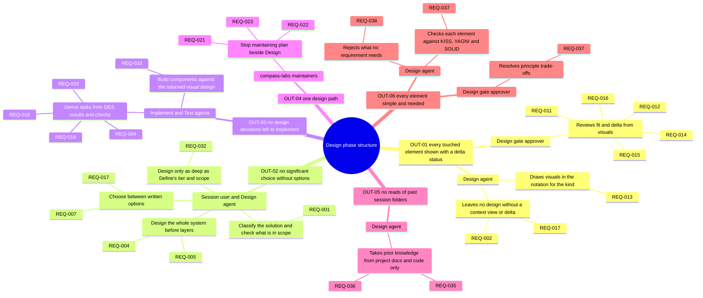
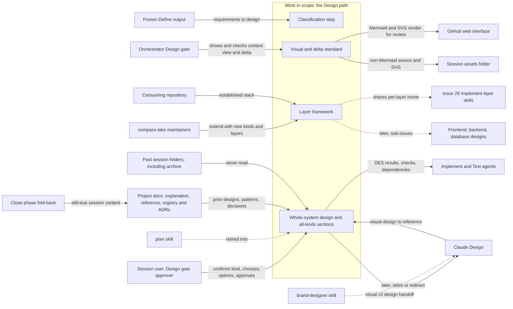

<!-- tier: full -->
# Diagrams: Design phase structure, with layered design skills and visual deltas

> Part of [index](index.md) · Define

## Impact map

## Context diagram

## Traceability

A 30-requirement set with many-to-many Serves links, so a `flowchart LR` coloured by priority is easier to review than a `requirementDiagram`. NEED nodes appear only where a REQ serves a need and no outcome. The deferred rows REQ-025 to REQ-031 and REQ-034 are left out.

```mermaid
flowchart LR
  classDef must fill:#DCFCE7,stroke:#166534
  classDef should fill:#FEF3C7,stroke:#92400E
  O01["OUT-01"]
  O02["OUT-02"]
  O03["OUT-03"]
  O04["OUT-04"]
  O05["OUT-05"]
  O06["OUT-06"]
  N02["NEED-02"]
  N04["NEED-04"]
  R001["REQ-001"]:::must --> O02
  R002["REQ-002"]:::must --> O01
  R003["REQ-003"]:::must --> N04
  R004["REQ-004"]:::must --> O02
  R004 --> O03
  R005["REQ-005"]:::must --> O02
  R006["REQ-006"]:::must --> N04
  R007["REQ-007"]:::must --> O02
  R008["REQ-008"]:::must --> N02
  R009["REQ-009"]:::must --> N02
  R010["REQ-010"]:::should --> N04
  R011["REQ-011"]:::must --> O01
  R012["REQ-012"]:::must --> O01
  R013["REQ-013"]:::must --> O01
  R014["REQ-014"]:::must --> O01
  R015["REQ-015"]:::must --> O01
  R016["REQ-016"]:::should --> O01
  R017["REQ-017"]:::should --> O01
  R017 --> O02
  R018["REQ-018"]:::must --> O03
  R019["REQ-019"]:::must --> O03
  R020["REQ-020"]:::should --> O03
  R021["REQ-021"]:::must --> O04
  R022["REQ-022"]:::must --> O04
  R023["REQ-023"]:::should --> O04
  R024["REQ-024"]:::must --> N04
  R032["REQ-032"]:::must --> O02
  R033["REQ-033"]:::must --> O03
  R035["REQ-035"]:::must --> O05
  R036["REQ-036"]:::must --> O05
  R037["REQ-037"]:::must --> O06
  R038["REQ-038"]:::must --> O06
```

## As-is and to-be

How a Feature session's design is produced. The same step IDs appear in both.

```mermaid
flowchart TD
  classDef changed fill:#FEF3C7,stroke:#92400E
  classDef new fill:#DCFCE7,stroke:#166534
  classDef removed fill:#FEE2E2,stroke:#991B1B
  subgraph ASIS["As-is"]
    A0["S0 plan writes its own overview spec, outside the session"]:::removed
    A1["S1 Design agent reads frozen Define output"]
    A3["S3 agent fills the five-section design template"]
    A6["S6 user approves at the Design gate from prose and tables"]
    A7["S7 Implement turns the design into tasks"]
    A1 --> A3 --> A6 --> A7
  end
  subgraph TOBE["To-be"]
    B1["S1 Design agent reads frozen Define output, project docs and code, never past sessions"]:::changed
    B2["S2 name the primary kind and scope checklist, user confirms"]:::new
    B3["S3 whole-system design at Define's depth, principles-checked, user approves"]:::changed
    B4["S4 layer designs through the layer framework, visual UI handed to Claude Design"]:::new
    B5["S5 context view and delta list, rendered for GitHub"]:::new
    B6["S6 user approves at the Design gate, which shows and checks the visuals"]:::changed
    B7["S7 Implement derives tasks from DES results, checks and order"]:::changed
    B1 --> B2 --> B3 --> B4 --> B5 --> B6 --> B7
  end
```

