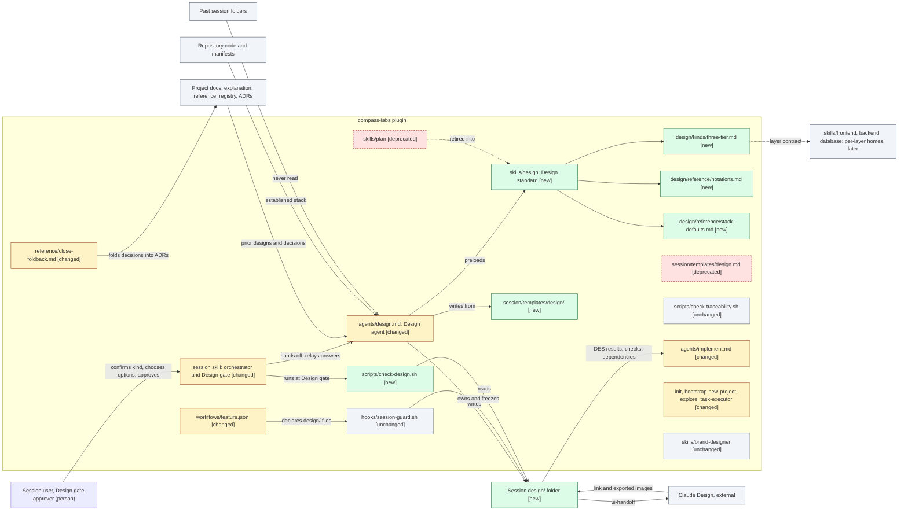

# Design: Design phase structure, with layered design skills and visual deltas

> Phase: Design | Started: 2026-09-28 | Status: Ready for the Design gate (Q1–Q11 answered by the user)
> Requirements: [`define/index.md`](define/index.md) · Session history: [`log.md`](log.md)
> Relates to: #27 (primary), #39; follow-ups #46–#54

This session's own Design runs before the new Design path exists, so it uses the current template (constraint; REQ-024). It adds the new path's cheap parts: classification, a context view, a delta list, options for each significant choice, and a principles check.

## Prior knowledge

- **Read:** `docs/explanation/solution-design.md`, `docs/explanation/session/overview.md`, `docs/explanation/plan/overview.md`, `docs/reference/session/workflow-and-artifacts.md`, `docs/registry/index.md` (no constructs), `docs/registry/patterns.md`, ADR-002, ADR-003, and the code (`agents/`, `hooks/session-guard.sh`, `skills/session/`, `skills/plan/`, `skills/requirements/`, `skills/adr/`, `tests/`).
- **Not read:** any past session folder, including `archive/` (REQ-035).

## Classification (confirmed by the user, Q1)

- **Primary kind:** plugin/tooling. Everything this session builds is skills, agents, a workflow file, a gate script and tests.
- **In-depth path:** none exists for plugin/tooling yet (#51), so this design uses only the all-kinds sections (the spirit of REQ-002).

| Area | In scope? | Reason |
|---|---|---|
| Plugin/tooling (primary) | in | New `design` skill, Design agent, gate script, `plan` retirement |
| Process/workflow | in | The Feature session's Design step, its gate and its artifact shape change |
| Frontend, backend, database | out | No application code. The layer framework is designed; the layer designs are #46–#48 |
| Infrastructure | out | Nothing is deployed; the plugin runs locally |
| Visual UI design | out | No UI. Only the Claude Design *handoff* is designed (REQ-033) |

## Approach

Build the Design path the way ADR-003 built Define:

- **One standard skill,** `skills/design/`, preloaded by the Design agent. Its `SKILL.md` holds the procedure and the sections every kind of design has. On-demand files hold the rest: a kind catalogue with one file per in-depth path (`kinds/three-tier.md` now), a notation catalogue (`reference/notations.md`), and the single source of stack defaults (`reference/stack-defaults.md`).
- **Layer designs plug in from a per-layer home** (`skills/{frontend,backend,database}/`) that #28's Implement skills share. This session writes only the contract; #46–#48 fill it.
- **The design artifact becomes a `design/` folder,** like `define/`. The layout alone tells new sessions from old ones, so the new gate check (`check-design.sh`) skips past sessions for free (REQ-017, REQ-024).
- **`plan` is deleted.** Its capabilities are carried into Design or into #46–#48, or dropped with a reason (see the carry-over map).
- **The Design agent gets Bash** (user decision, Q6). It uses Bash only to render non-Mermaid sources to SVG in `assets/` and to check that visuals render. It still writes only `design/` and `assets/`.

This is preferred over a workflow-JSON-driven design and over keeping `plan` as a redirect, because it reuses patterns this repo already has and tests: a standard skill with on-demand files, a folder artifact, and a gate script. Each rejected alternative is in [Decisions](#decisions).

## Context view

*Notation: C4 component view of the plugin, drawn as a Mermaid `flowchart` with the delta styling proposed in D4. Colour and the `[status]` label suffix both carry the delta.*

## Delta list

Each element this design touches has exactly one status, compared with `main` today.

| Element | Status | DES | Note |
|---|---|---|---|
| `skills/design/SKILL.md` | new | DES-001, 002, 003, 006, 013 | The Design standard |
| `skills/design/kinds/three-tier.md` | new | DES-004, 005 | The first in-depth path, plus the layer contract |
| `skills/design/reference/notations.md` | new | DES-008 | Notation catalogue, delta styling, render route |
| `skills/design/reference/stack-defaults.md` | new | DES-007 | Single source of the stack defaults |
| `skills/session/templates/design/` (`index.md`, `solution.md`, `ui-handoff.md`) | new | DES-009, 012, 013 | Templates for the folder artifact |
| `skills/session/templates/design.md` | deprecated | DES-009 | Kept only for past sessions still in Design |
| `skills/session/scripts/check-design.sh` | new | DES-011 | The Design-gate check |
| `skills/session/workflows/feature.json` | changed | DES-010 | Design artifact `design/`, `legacy_artifact: design.md` |
| `skills/session/SKILL.md` | changed | DES-011 | Design gate step a4 |
| `agents/design.md` | changed | DES-014 | Preloads `compass-labs:design`, writes `design/`, gains Bash for rendering, TODO removed |
| `agents/implement.md` | changed | DES-012 | Points at `design/index.md`; how it derives tasks stays #52 |
| `skills/session/reference/close-foldback.md` | changed | DES-017 | Reads `design/`; decisions go into ADRs |
| `skills/plan/` (SKILL, template, example) | deprecated | DES-015 | Deleted; see the carry-over map |
| `.claude-plugin/marketplace.json` | changed | DES-015 | `plan` out, `design` in |
| `skills/init`, `skills/bootstrap-new-project` | changed | DES-007, 015 | Link to the stack defaults; no `/compass:plan` next step |
| `skills/explore`, `skills/task-executor` | changed | DES-015 | No longer name `plan` as a caller or fallback |
| `README.md`, `docs/reference/session/*`, `docs/explanation/{session,plan}/*`, `docs/explanation/solution-design.md` | changed | DES-016 | The Design path is described; `plan` is marked retired |
| `tests/` (workflow, guard, phase agents, marketplace, docs; new `check_design_test.sh`) | changed | the Check column of each DES | |
| `hooks/session-guard.sh` | unchanged | DES-010 | Folder support is already generic, and the `overview.md` exception is kept |
| `skills/session/scripts/check-traceability.sh` | unchanged | — | Doesn't read the design |
| `skills/brand-designer/` | unchanged | — | #53 |
| `docs/reference/constructs/ConstructName.md` (`planned_in`) | unchanged | — | Design writes no stubs (D8) |

## Components / layers

Each item names the `REQ-*` it covers, the result Implement must produce, the check that shows it's done, and its dependencies (the spirit of REQ-019 and REQ-020).

| ID | Component / layer | Covers | Result | Check | Depends on |
|---|---|---|---|---|---|
| DES-001 | Design standard: procedure and all-kinds sections (`skills/design/SKILL.md`) | REQ-001, REQ-002, REQ-032 | A skill whose procedure is: prior knowledge → primary kind and scope checklist, confirmed through `needs_input` → the kind's in-depth path (or the all-kinds sections plus the follow-up issue) → visuals and delta → principles check. The depth follows Define's tier and scope, with no Design tiers. It lists the all-kinds sections: Classification, Scope checklist, Context view, Delta list, Components (DES), Decisions, Principles check, Risks, Open questions. | Walking the REQ-001, REQ-002 and REQ-032 criteria through the skill reaches every stated result; `grep` finds no Design tier | — |
| DES-002 | Prior-knowledge rule (section of DES-001) | REQ-035, REQ-036 | Reads `docs/explanation`, `docs/reference`, `docs/registry` (index, patterns, decisions) and the code, and never `docs/sessions/**` outside the current session. Ignores any `planned_in` pointer into `docs/sessions/`. With no docs, it records "no project documentation found; designed from the Define output and the code". | Inspecting the section against REQ-035 and REQ-036; the template has the no-docs sentence | DES-001 |
| DES-003 | Kind catalogue and kind contract (DES-001 plus `skills/design/kinds/`) | REQ-002, REQ-003 | A table: kind → in-depth path file, or the follow-up issue written as a full `dkoenawan/compass-labs#nn` reference (#49, #50, #51; frontend, backend and database → #46–#48), so it resolves in a consuming repo. A "what a kind supplies" list: `kinds/{kind}.md` (sections that refine `design/solution.md`), catalogue rows in `notations.md`, a catalogue row here. | Following the contract for #50 needs no edit to the classification step, the scope checklist or the all-kinds sections | DES-001 |
| DES-004 | Three-tier in-depth path (`skills/design/kinds/three-tier.md`) | REQ-004, REQ-007, REQ-032 | The whole-system design in `design/solution.md`: each layer marked changing or unchanged, the contracts between changing layers, and a C4 L1 and L2 view. The user approves it through `needs_input` before any layer file is written. | The notification-preferences example in the file satisfies the REQ-004 and REQ-032 criteria | DES-003, DES-008 |
| DES-005 | Layer contract and per-layer home (section of DES-004) | REQ-005, REQ-006 | A layer supplies `skills/{layer}/SKILL.md` plus `reference/design.md`: inputs (the whole-system item it refines), required sections, and output `design/{layer}.md`. #28's Implement guidance sits in the same home. When a layer's standard is missing, the fallback is DES-003. Nothing is created under `skills/{layer}/` now. | Checking #46–#48 against the contract: each is delivered by adding files in its home only | DES-004 |
| DES-006 | Significant choices and principles check (section of DES-001) | REQ-007, REQ-037, REQ-038 | Each significant choice records at least two options with pros and cons, the chosen option and the reason, and the user chooses. Each DES item and choice gets a principles row: KISS and YAGNI always; SOLID ×5 on software elements, marked *met*, *traded off* with a reason, or *n/a* with a reason. Anything no live REQ needs goes into a "Rejected under YAGNI" list. | The template's tables have these columns; the REQ-037 and REQ-038 examples are reproducible | DES-001 |
| DES-007 | Stack defaults and established-stack detection (`skills/design/reference/stack-defaults.md`) | REQ-008, REQ-009, REQ-010 | For each stack area: the default (React + TS; Node.js + CQRS + Scalar; Postgres + Prisma; Terraform) and the files that signal an established stack, which always wins. `init`, `bootstrap-new-project` and the README link to it, and none names a different default. | A `grep` of `skills/`, `agents/` and `README.md` for default-stack statements: each is the source or links to it | — |
| DES-008 | Notation catalogue, delta styling and rendering (`skills/design/reference/notations.md`) | REQ-011, REQ-012, REQ-013, REQ-014, REQ-015 | Kind → notation (see [Notation catalogue](#notation-catalogue-initial)). Four delta classDefs plus a `[status]` label suffix. A caption rule (notation and C4 level). Mermaid rendering rules (shared with `requirements/reference/diagrams.md` by link). The non-Mermaid route: source and SVG side by side in `assets/`, with the BPMN command given (`npx bpmn-to-image {name}.bpmn:{name}.svg`, checked once during Implement; the fallback is "Export SVG" in bpmn.io or Camunda Modeler). The Design agent runs it with Bash. An optional render check (mermaid-cli, writing only to a temp directory outside the repo) comes before the gate. The route for Claude Design's HTML export is in DES-013. | Every example in the file renders with mermaid-cli in `tests/`; the BPMN route names a tool and steps | — |
| DES-009 | `design/` folder templates (`skills/session/templates/design/`) | REQ-011, REQ-012, REQ-036, REQ-037 | `index.md` (the main doc: every all-kinds section, with context-view and delta-list slots), `solution.md` (the kind's in-depth design) and `ui-handoff.md`. Layer file templates come from each layer home (#46–#48). The old `design.md` template stays for past sessions. | The template headings match the headings `check-design.sh` looks for | DES-001, DES-006, DES-008, DES-012, DES-013 |
| DES-010 | Workflow: `design/` as a folder artifact (`feature.json`) | REQ-024 | Design `artifact: "design/"`, `artifact_files: [index.md, solution.md, frontend.md, backend.md, database.md, ui-handoff.md]`, `legacy_artifact: "design.md"`; `design/` added to the allowlist. The guard code is unchanged. | Guard tests: a new session writes `design/index.md` but not a root `design.md`; a session with `design.md` keeps it and can't start `design/`; ownership and freezing resolve by folder. `workflow_test.sh` is updated. | DES-009 |
| DES-011 | Design gate: views and check (`SKILL.md` step a4, `check-design.sh`) | REQ-016, REQ-017, REQ-024 | The gate message embeds or links `design/index.md#context-view` and `#delta-list` before approve/adjust/rethink. Before recording the milestone, `check-design.sh {session}` runs: if `design/index.md` exists, it requires the Classification, Scope checklist, Context view and Delta list headings and prints e.g. "delta list missing" (exit 1); if there is only a legacy `design.md`, it exits 0 with "legacy layout: no check". | `check_design_test.sh` covers each missing heading, a complete index and the legacy layout | DES-010 |
| DES-012 | Design → Implement handoff contract | REQ-018, REQ-019, REQ-020 | The DES table columns are `ID \| Component \| Covers \| Result \| Check \| Depends on`. Every live REQ is in at least one Covers cell. `agents/implement.md` reads `design/index.md`, or `design.md` in a past session; deriving tasks from these columns stays #52. | The template has the columns; Design's own coverage self-check lists no uncovered live REQ | DES-001 |
| DES-013 | Claude Design handoff (section of DES-001 plus `ui-handoff.md`) | REQ-033 | When visual UI design is in scope: the screens and components, the REQs they serve, their states, and the behaviour constraints from the frontend design; no colour, font or spacing values. A "Returned visual design" slot (D11) holds three things. First, the Claude Design HTML zip, stored as-is at `assets/ui-design.zip` and linked, never unzipped into the repo. Second, one PNG screenshot per screen at `assets/ui-{screen}.png`, embedded so reviewers see it on GitHub, which can't render HTML inline. Third, the Claude Design project link, if there is one. `notations.md` documents the screenshot route: open `index.html` from the unzipped export in a temp directory, then capture it with a headless-browser command via Bash, or take the screenshot by hand. | The template reproduces the REQ-033 example; a `grep` for colour, font and spacing values in the template finds none | DES-001 |
| DES-014 | Design agent (`agents/design.md`) | REQ-035, REQ-021, REQ-015 | `skills: [compass-labs:design]`, with the "read it yourself if the preload isn't visible" fallback. It writes `design/` (or a past session's `design.md`). Tools: Read, Glob, Grep, Write, Edit, **Bash** (Q6). A Bash rule in the agent file: only render and verify commands; outputs go only to the session's `assets/` or a temp directory outside the repo; never `git`, never files outside those paths, never reading `docs/sessions/**` outside the session. The TODO is removed. | `phase_agents_test.sh` checks the preload, the tools (Bash now expected for design) and the absence of the TODO; a `grep` finds the Bash rule | DES-001, DES-010 |
| DES-015 | Retire `plan` | REQ-021, REQ-022 | `skills/plan/` deleted, and the `marketplace.json` entry swapped for `skills/design`. `task-executor`'s "no spec → invoke `/compass:plan`" and `init`'s "next: run `/compass:plan`" point to `/compass-labs:session`. `explore`'s description no longer names `plan`. The carry-over map below is the REQ-022 record. | No file in `skills/`, `agents/` or `.claude-plugin/` invokes `plan`; `marketplace_test.sh` passes | DES-014, DES-007 |
| DES-016 | Documentation | REQ-023 | The README describes the Design path and says `plan` was retired into Design. `workflow-and-artifacts.md` and `session/overview.md` describe the `design/` folder and gate a4. `plan/overview.md` is removed and its domain-map row marked retired. | `docs_test.sh`, and a `grep` for `plan` as a live skill in `README.md` and `docs/` | DES-010, DES-011, DES-015 |
| DES-017 | Close reads `design/` (`close-foldback.md`) | REQ-035, REQ-024 | Step 1 reads `design/`, or a past session's `design.md`. A short mapping: decisions flagged "ADR" become ADRs in `docs/registry/decisions/` (D2); the context view and solution design go into the domain overview; everything else stays in the archive. | Inspection against the fold-back table; no session IDs in as-built docs (the existing grep rule) | DES-010 |

**Coverage:** all 30 live REQs appear above. REQ-001–REQ-024, REQ-032, REQ-033 and REQ-035–REQ-038 each have at least one DES item. The deferred rows need none.

**Implementation order** (from Depends on): DES-007 and DES-008 → DES-001 → DES-002, 003, 006, 012, 013 → DES-004 → DES-005 → DES-009 → DES-010 → DES-011, DES-014, DES-017 → DES-015 → DES-016.

### Shape of a new session's `design/` folder (D5)

| File | Holds | When |
|---|---|---|
| `index.md` | The main doc: every all-kinds section, including the context view and the delta list the gate shows | always |
| `solution.md` | The kind's in-depth design (for three-tier, the whole-system design approved before any layer) | when the kind has an in-depth path |
| `frontend.md`, `backend.md`, `database.md` | Layer designs, to the layer home's standard (#46–#48) | when that layer changes and its standard exists |
| `ui-handoff.md` | The Claude Design handoff and the returned visual design | when visual UI design is in scope |

### Notation catalogue (initial)

| Kind or area | Notation | Mermaid form | Refined by |
|---|---|---|---|
| Three-tier application | C4: L1 context and L2 container (L3 optional) | `flowchart` with C4 abstractions | this session |
| Database layer | Entity-relationship | `erDiagram` | #48 |
| Frontend layer | Component hierarchy and routes | `flowchart TB` | #46 |
| Backend layer | Commands, queries and API sequence | `sequenceDiagram`, `flowchart` | #47 |
| Process/workflow | BPMN 2.0 (SVG route); a simple flow may use a Mermaid `flowchart` | — / `flowchart` | #49 |
| Infrastructure | C4 deployment | `flowchart` | #50 |
| Plugin/tooling | C4 component view | `flowchart` | #51 |
| Other | Context view and delta list only | `flowchart` | — |

## Carry-over map (REQ-022, approved by the user, Q9)

| `plan` capability | Destination | Note |
|---|---|---|
| Registry read before designing (Phase 0) | Carried: DES-002 | Widened to all project docs; never past sessions (REQ-035) |
| Explore for "extends existing" | Dropped as a call | Design reads docs and code itself. `explore`'s Tier 1 sweeps `docs/`, which can reach `docs/sessions/` |
| Adaptive depth (complexity signals) | Replaced: DES-001 | Define's tier and scope set the depth (REQ-032) |
| Tradeoff surfacing (Option A/B format) | Carried: DES-006 | Generalised to every significant choice (REQ-007) |
| The six named tension patterns | #46 (real-time vs simple fetch), #47 (frontend-heavy + auth, bulk without pagination, file-upload storage), #48 (many-to-many delete, extend vs new model) | Layer-specific |
| Entities, relationships, constraints, Prisma models | #48 | |
| CQRS naming, API shapes, error scenarios | #47; the whole-system design names the contracts now (DES-004) | |
| Routes, component hierarchy, UI patterns, state | #46 | Visual design stays with Claude Design (REQ-033) |
| Implementation order | Carried: DES-012 | Replaced by DES dependencies (REQ-020) |
| Approval gate | Carried: existing Design gate plus DES-011 | |
| Spec on disk from the first answer | Carried: the phase-agent contract | The artifact is on disk and state lives in the folder |
| "No Prisma schema found" handling | Carried: DES-007 | Established-stack detection |
| Registry construct stubs (`status: planned`, `planned_in`) | Dropped (D8) | The Design agent writes only its artifact, and Close adds the constructs a session built |
| `template.md`, the user-management example | Dropped | Replaced by the `design/` templates and the kind file's example |

## Decisions

The user chose every decision below (Q1–Q11, relayed 2026-09-28). The chosen option is marked **(chosen)**. The user took the recommendation everywhere except Q6 (Bash granted) and Q11 (Claude Design returns an HTML zip).

**D1: This session's primary kind (Q1).**

| Option | Pros | Cons |
|---|---|---|
| **Plugin/tooling (chosen)** | Matches the deliverables (skills, agents, scripts) | No in-depth path yet (#51), so only the all-kinds sections apply |
| Process/workflow | The session process does change | Most of the work isn't process notation; BPMN would add a non-Mermaid source for no reviewer gain |

**D2: ADRs, inline or linked (Q2).**

| Option | Pros | Cons |
|---|---|---|
| **The design records the options and the choice (needed for REQ-007 and the gate) and links existing ADRs; new decisions are flagged "ADR", and Close writes them into `docs/registry/decisions/` (chosen)** | ADRs stay grouped in the registry; they record only what shipped (fits REQ-035's "true now"); no exception to "write only your own artifact"; numbering is settled at Close, so parallel sessions don't clash | A new ADR is visible to other sessions only after Close |
| The Design agent writes a *Proposed* ADR during Design and links it | Linked from day one | Breaks the one-artifact rule; records decisions that may still change; numbers clash between parallel sessions |
| Implement writes the ADR as a task | Earlier than Close | Test can still change the decision; it's an Implement change (#52 territory) |

For this session: ADR-004 at Close records the Design path and extends ADR-003's "Renderable" NFR (Mermaid, or a committed SVG beside a non-Mermaid source) to Design. The `design/` folder refines ADR-002 the way ADR-003 did.

**D3: Where each kind's notation is declared (Q3).**

| Option | Pros | Cons |
|---|---|---|
| **One catalogue in `skills/design/reference/notations.md`, which kind files point to (chosen)** | One place, like ADR-003 D9's diagram catalogue; holds examples and render rules | A kind's author edits two files (kind file and catalogue row) |
| A `design` block in `workflows/feature.json` | Machine-readable | Wrong axis: workflow files are per *session type*, but notation is per *solution kind*; JSON can't hold examples |
| The Design agent's file | Always loaded | The agent stays a thin wrapper (C8) |

**D4: How the delta is encoded (Q4).**

| Option | Pros | Cons |
|---|---|---|
| **C4 abstractions drawn as a Mermaid `flowchart`, four classDefs (`new`, `changed`, `deprecated`, `unchanged`), a `[status]` label suffix, and the delta list table as the text source of truth (chosen)** | Reuses Define's as-is/to-be classDef convention; readable without colour; renders reliably; C4 doesn't depend on a notation | Not Mermaid's literal `C4Context` syntax, so the caption must name the C4 level |
| Mermaid's native `C4Context` and `C4Container` with `UpdateElementStyle` per element | Literal C4 diagram types | Mermaid marks C4 experimental; no tags or legend; one style line per element; weak layout control; GitHub rendering unverified here |

**D5: `design/` folder or flat `design.md` (Q5).**

| Option | Pros | Cons |
|---|---|---|
| **A `design/` folder with a fixed file set, `design.md` as its legacy artifact (chosen)** | Mirrors `define/` (ADR-003 D12, no overcrowding). Layer files are pre-declared, so #46–#48 add only files in their layer home (REQ-005). The layout alone tells old from new, so `check-design.sh` skips past sessions (REQ-017, REQ-024). The guard already handles folders generically. | Changes `feature.json`, a few guard tests, and one-line pointers in `agents/implement.md` and `close-foldback.md` |
| Flat `design.md` with layer sections | No workflow or guard change | Needs a marker to tell new sessions from old for REQ-017 (an agent can omit it). A three-tier design with three layers in one file overcrowds. Moving to a folder later means doing it twice. |

The gate check is a small script (`check-design.sh`), like the Test gate's `check-traceability.sh`, so the Test phase can verify it with bash tests.

**D6: SVG rendering, and Bash for the Design agent (Q6).**

| Option | Pros | Cons |
|---|---|---|
| No Bash: `notations.md` documents the route, and the user or the main-session orchestrator runs it before the gate | Narrow toolset for a conversational agent | A manual step before the gate for every non-Mermaid visual; nothing checks that visuals render |
| **Grant Bash to the Design agent, for rendering and render checks only (chosen, user decision)** | Design produces the SVG itself (`npx bpmn-to-image {name}.bpmn:{name}.svg`) and can check that Mermaid parses (mermaid-cli into a temp directory) and take screenshots of the Claude Design export (D11). `notations.md` still documents every command, so a user without the tooling can run it by hand. | Bash writes bypass the Write/Edit guard (see Risks); the renderers need Node tooling on the machine |

**How the contract still holds with Bash.** Design still writes only `design/` and `assets/`. The guard still enforces ownership on Write and Edit. For Bash, the simplest mitigation is two layers, with no new hook:
1. **A rule in `agents/design.md`** (DES-014). Bash is only for render and verify commands. Outputs go to the session's `assets/` or a temp directory outside the repo. No `git`, and no reads of past session folders.
2. **The Design gate's existing precondition** (`SKILL.md` step 4d). `git status --porcelain` may show only the phase's artifact, `log.md` and `assets/`, and the orchestrator surfaces anything else before the milestone commit. A stray Bash write is caught before it is committed or frozen.

A Bash-matching PreToolUse hook would enforce this mechanically, but it would have to parse shell commands. That is rejected for KISS, and it can be revisited if a stray write ever happens.

**D7: The per-layer home shared with #28 (Q7).**

| Option | Pros | Cons |
|---|---|---|
| **`skills/{layer}/`: one skill per layer, with `reference/design.md` (#46–#48) and `reference/implement.md` (#28) indexed by its `SKILL.md`; nothing created now (chosen)** | One home per layer (REQ-006); matches `agents/implement.md`'s existing pointer to `skills/{backend,frontend,database,infrastructure}/`; no empty stubs | Each layer becomes a user-invocable skill `/compass-labs:{layer}` |
| `skills/design/layers/{layer}.md`, with #28's skills elsewhere | Keeps design material together | Two homes per layer, which fails REQ-006 |
| Create stub homes now | Visible targets | YAGNI; stub bodies fail the Deploy completeness check |

**D8: What replaces `plan`'s `planned_in` session pointer (Q8).**

| Option | Pros | Cons |
|---|---|---|
| **Nothing: the Design path writes no construct stubs. Close adds the constructs a session built, with `Origin: #issue`, and Design ignores existing `planned_in` pointers into `docs/sessions/` (chosen)** | No pointer into session folders (REQ-035, ADR-003 D14); Design keeps to one artifact | Parallel sessions can't see planned constructs before Close |
| Implement writes planned stubs with `planned_in: "#<issue>"` | Planned constructs are visible early | An Implement change (#52); stubs go stale when designs change |

`planned_in` itself stays in the construct template for `init` and `explore`, which still write it. That field is outside this session.

**D9: Carry-over map, and how `plan` is retired (Q9).**

| Option | Pros | Cons |
|---|---|---|
| **Delete `skills/plan/` and repoint its callers (`task-executor`, `init`, `explore`, `marketplace.json`, README) (chosen)** | One design path (REQ-021, OUT-04); no dead skill | Anyone typing `/compass-labs:plan` gets "unknown skill" and learns from the README |
| Keep `plan` as a one-screen redirect to `/compass-labs:session` | Friendlier to muscle memory | A skill that only redirects; the Deploy check treats stub-like bodies as gaps |

**D10: The single source of the stack defaults (Q10).**

| Option | Pros | Cons |
|---|---|---|
| **`skills/design/reference/stack-defaults.md`, linked from `init`, `bootstrap-new-project` and the README (chosen)** | Beside its only consumer; resolves through `${CLAUDE_PLUGIN_ROOT}` in any repo | One more file to find |
| A README section | Visible to users | The README is user documentation holding the project anchor; agents would read an agent standard from it |

`init`'s "Default Stack" table describes what the scaffolding template contains. It keeps the table but links to the source and names no conflicting default.

**D11: The form of the returned visual design (Q11).**

| Option | Pros | Cons |
|---|---|---|
Claude Design returns an **HTML zip export** (user, Q11). GitHub can't render HTML inline, so reviewers need an image.

| Option | Pros | Cons |
|---|---|---|
| **Keep the zip as-is at `assets/ui-design.zip`, linked from `ui-handoff.md`, plus one PNG screenshot per screen at `assets/ui-{screen}.png`, embedded (chosen)** | One source file, exactly as Claude Design produced it; screenshots render on GitHub (REQ-014); the same source-plus-render pattern as REQ-015; the guard already allows non-Markdown files in `assets/` | Screenshots must be taken: by Design through Bash with a headless browser, or by hand, as documented in `notations.md` |
| Unzip into `assets/ui/` and link `index.html` | Browsable in a local checkout | Many files in the diff; GitHub still shows HTML as source; any `.md` inside the export would be blocked by the guard |
| Link to Claude Design only | No files | Doesn't render; needs claude.ai access; can rot |

The Claude Design project link, if there is one, is recorded beside the zip. The export is unzipped only into a temp directory outside the repo, to take the screenshots.

**D12: The skill's name (agent's call, user agreed).** `design` (`compass-labs:design`), as the Design agent's TODO anticipated. Skills and subagents are resolved separately, so the shared name with the `design` agent is kept unless it breaks preload. See Risks.

## Principles check

SOLID applies to software elements (skills, agents, scripts, workflow); documentation marks it *n/a*. Every mark is *met* unless noted.

| Item | KISS | YAGNI | SOLID |
|---|---|---|---|
| DES-001 | met: one skill, procedure plus a section list | met: REQ-001/002/032 | SRP met (standard only; the agent stays a wrapper). OCP met (kinds plug in via DES-003). LSP n/a (no substitutable types). ISP met (on-demand files). DIP met (the agent depends on the skill, not on kind files) |
| DES-002 | met | met: REQ-035/036 | SRP met; others n/a (a rule, not a module) |
| DES-003 | met: one table and one list | met: REQ-003; no kind stubs | OCP met; LSP met (every kind file honours the same contract); others n/a |
| DES-004 | met | met: only three-tier gets depth now (Q4 of Define) | SRP met; OCP met (layers plug in via DES-005) |
| DES-005 | met: a path convention, no folders | met: nothing created for #46–#48 | OCP met; ISP met (layer design and implement are separate files in one home) |
| DES-006 | traded off: seven marks per item is heavy. Reason: REQ-037 requires it; bare *met* marks keep it compact | met: REQ-007/037/038 | n/a (rules) |
| DES-007 | met | met: REQ-008–010 | SRP met (one source) |
| DES-008 | met: reuses Define's rendering rules by link | met: no render tooling built | SRP met |
| DES-009 | met | met: three templates; layer templates come with #46–#48 | SRP met (one concern per file) |
| DES-010 | met: a JSON edit; guard code unchanged | met: REQ-024 plus D5 | OCP met (the guard is untouched; data changes) |
| DES-011 | met: a heading check, like `check-traceability.sh` | met: REQ-016/017 | SRP met |
| DES-012 | met: three extra columns | met: REQ-018–020; Implement's use of them is #52 | ISP met |
| DES-013 | met: the zip kept as-is plus screenshots; nothing unzipped into the repo | met: REQ-033 | SRP met |
| DES-014 | met: a tools line and a short Bash rule | traded off: Bash goes beyond REQ-015's "documented route". Reason: the user chose Q6, so Design renders and checks its own visuals | SRP met (a thin wrapper, C8); ISP traded off (a broad tool, narrowed by the rule) |
| DES-015 | met: delete, don't redirect | met | n/a |
| DES-016 | met | met: REQ-023 | n/a (docs) |
| DES-017 | met: two mapping rows | met: without it, Design decisions never reach the registry that REQ-035 reads | SRP met |

The Design gate needs the user to resolve two *traded off* marks:
- **DES-006:** the weight of the principles check, which REQ-037 requires.
- **DES-014:** Bash, which the user already chose in Q6.

Approving at the gate resolves both.

**Rejected under YAGNI (or KISS):**
- Design depth tiers (REQ-032 forbids them).
- Stub layer or kind folders.
- A `design` block in the workflow JSON.
- A Bash-parsing PreToolUse hook (KISS; see D6).
- Unzipping the Claude Design export into the repo.
- Planned construct stubs.
- Migrating past `design.md` files (REQ-024).
- Rendering tooling shipped with the plugin.
- A second kind per solution (the scope checklist covers mixed solutions).

## Risks

| Risk | Mitigation |
|---|---|
| Two focused days is tight for 17 items | The Should REQs (010, 016, 017, 020, 023) go last in the implementation order; if the appetite runs out, cut DES-011's script to the gate prose and log a follow-up |
| The skill and the agent share the name `design`. Skills and subagents are resolved separately, so this should be fine, but it is unverified | `phase_agents_test.sh` checks the preload; the agent keeps the "read `SKILL.md` yourself" fallback, as Define does. Only if preload actually breaks, rename the skill `solution-design` (one frontmatter and one agent line) |
| **Bash writes bypass the guard.** `session-guard.sh` matches only Write, Edit and MultiEdit, so a Bash command could write outside `design/` and `assets/`, or into a frozen artifact | Simplest mitigation, with no new hook: the Bash rule in `agents/design.md` (render and verify only; outputs to `assets/` or a temp directory; no `git`), plus the Design gate's existing `git status --porcelain` precondition, which surfaces any file outside the artifact, `log.md` and `assets/` before the milestone commit. A Bash-parsing hook is the escalation if a stray write ever happens |
| Bash lets Design read past session folders (`cat`, `grep -r`), which the Read/Glob rule wouldn't catch | The same Bash rule forbids it (REQ-035). OUT-05's transcript check counts Bash reads as well |
| The render commands (`bpmn-to-image`, mermaid-cli, a headless-browser screenshot) are unverified, and Node tooling may be missing | Implement runs each once and records the exact commands in `notations.md`; a missing tool falls back to the documented manual route |
| `erDiagram` may not support classDef styling, so the database delta relies on the table | `notations.md` says the delta list is the source of truth; #48 picks the styling |
| Guard tests assume a root `design.md` (fixtures, "design/notes.md not a folder artifact") | Update those tests in DES-010; the legacy path keeps its tests |
| Deleting `plan` strands users of standalone `task-executor` who relied on `/compass:plan` | `task-executor`'s fallback points to `/compass-labs:session`; the README notes the retirement |
| `doc-maintainer` still expects plan-format `overview.md` (#41) | Unchanged here; #41 tracks it. The guard's `overview.md` exception is kept, so nothing that exists breaks |
| A consuming repo reads `#49`-style issue numbers as its own issues | Kind-catalogue follow-ups use full `dkoenawan/compass-labs#nn` references (DES-003) |

## Open questions

All questions resolved. Q1–Q11 were answered by the user on 2026-09-28 (see [Decisions](#decisions)).

Items that stay open elsewhere:
- **Follow-ups:** the layer designs (#46–#48), the other kinds (#49–#51), Implement consuming the handoff (#52), `brand-designer` (#53), the no-past-sessions rule for every phase (#54), and `doc-maintainer`'s plan-format step (#41).
- **To verify during Implement:** the render commands, and preload under the shared name `design` (see [Risks](#risks)).
