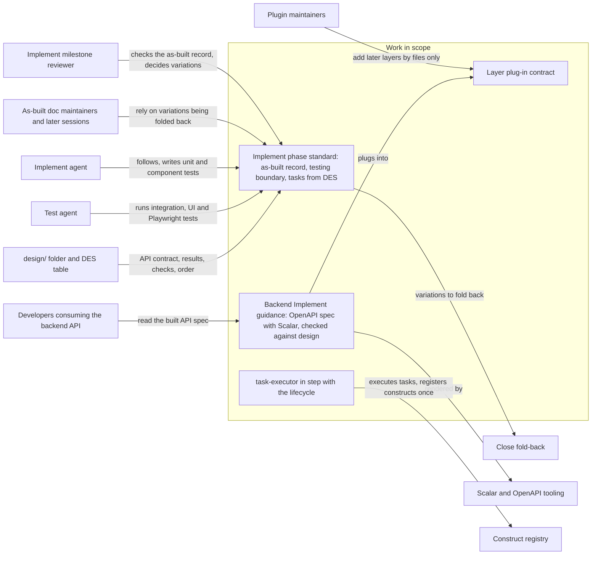

<!-- tier: full. Rendering rules: skills/requirements/reference/diagrams.md. The impact map and traceability diagrams are added once requirements are agreed. -->
# Diagrams: Implement phase — an as-built artifact, the backend API artifact and the testing boundary

> Part of [index](index.md) · Define · Explains [problem.md](problem.md)

## As-is and to-be

**The problem in one line:** Implement produces nothing reviewable besides code, so whether the build matches the design can't be checked, and design changes made while building never get back to Define or Design.

The same step IDs (S1 to S8) appear in both views. Legend: green is new, amber is changed, red dashed is a gap today, and grey is unchanged.

```mermaid
flowchart TD
  classDef changed fill:#FEF3C7,stroke:#92400E
  classDef new fill:#DCFCE7,stroke:#166534
  classDef removed fill:#FEE2E2,stroke:#991B1B
  classDef gap fill:#FEE2E2,stroke:#991B1B,stroke-dasharray:4 3
  classDef unchanged fill:#F1F5F9,stroke:#475569

  subgraph ASIS["As-is"]
    direction LR
    A1["S1 Define: define/ index, framing, problem, requirements"]:::unchanged
    A2["S2 Design: design/, ADR flags, visual deltas, DES table"]:::unchanged
    A3["S3 Implement: code, tests of no stated kind"]
    A4["S4 Implement artifact: none, only a task checklist ✗"]:::gap
    A5["S5 Layer artifact: none, built API never checked ✗"]:::gap
    A6["S6 Implement gate: reviewer sees code and commits"]
    A7["S7 Test: verification.md, unit, e2e or manual"]
    A8["S8 Close: folds back define/ and design/ only"]
    AV["Variation found while building"]:::gap
    A1 --> A2 --> A3 --> A6 --> A7 --> A8
    A3 -.->|"variation"| AV
    AV -.->|"goes nowhere ✗"| A8
  end

  subgraph TOBE["To-be"]
    direction LR
    B1["S1 Define: unchanged"]:::unchanged
    B2["S2 Design: unchanged, API contract in design/"]:::unchanged
    B3["S3 Implement: code plus unit and component tests"]:::changed
    B4["S4 Implement artifact: as-built record per DES-*, built as designed, deviated or not built, with reasons, and variations listed"]:::new
    B5["S5 Backend artifact: OpenAPI spec rendered with Scalar, checked against the design API"]:::new
    B6["S6 Implement gate: reviewer checks the as-built record, variations raised"]:::changed
    B7["S7 Test: verification.md, integration, UI and Playwright"]:::changed
    B8["S8 Close: folds back define/, design/ and the variations"]:::changed
    BF["Later layers, examples only: frontend component inventory and screenshots, database"]:::unchanged
    B1 --> B2 --> B3
    B3 -->|"records"| B4
    B3 -->|"generates"| B5
    B2 -.->|"design API"| B5
    B5 -->|"mismatches become variations"| B4
    B4 --> B6 --> B7 --> B8
    B8 -.->|"as-built docs, read by the next Design"| B2
    BF -.->|"same plug-in contract, own issues"| B5
  end
```

**The same diagram as plain text.**

| Step | As-is | To-be |
|---|---|---|
| S1 Define | `define/`: index, framing, problem, requirements | Unchanged |
| S2 Design | `design/`, ADR flags, visual deltas, the `DES-*` table | Unchanged. Its API contract is what S5 checks against |
| S3 Implement | Code, plus tests of no stated kind | Code plus **unit and component tests** (backend always both) |
| S4 Implement artifact | None, only a task checklist with free-prose deviations ✗ | **New:** an as-built record per `DES-*` (built as designed, deviated, not built, each with a reason), listing every variation |
| S5 Layer artifact | None. The built API is never checked ✗ | **New, backend:** an OpenAPI spec rendered with Scalar, generated with the code and checked against the design's API. A mismatch becomes a variation in S4. Frontend and database are later issues; a component inventory with screenshots is only an example |
| S6 Implement gate | The reviewer sees code and commits | The reviewer checks the as-built record, and **variations are raised** for the user to decide on |
| S7 Test | `verification.md`; methods unit, e2e or manual | `verification.md`: **integration, UI and Playwright** tests |
| S8 Close | Folds back `define/` and `design/` only | Also folds back the **variations**, so the as-built docs, which the next Design reads, match what was built |
| Variation path | Found while building → goes nowhere ✗ | Found while building → recorded in S4 → raised at S6 → folded back at S8 |

**Two kinds of testing.** Implement (S3) owns unit and component tests. Test (S7) owns integration, UI and Playwright tests.

## Context diagram

**As plain text:**
- The **work in scope** is the Implement phase standard, the backend Implement guidance, the layer plug-in contract and the `task-executor` fix.
- The **Implement reviewer** checks the as-built record and decides on variations.
- **Developers who consume the backend API** read the built spec.
- **As-built doc maintainers and later sessions** rely on Close folding variations back.
- The **Implement agent** follows the standard and writes unit and component tests. The **Test agent** runs integration, UI and Playwright tests.
- **Plugin maintainers** add later layers by adding files.
- The work reads the **`design/` folder** and writes to **Close's fold-back**.
- It uses **Scalar and OpenAPI tooling**.
- `task-executor` registers constructs in the **construct registry** exactly once.

## Impact map

To come once the requirements are agreed: each `OUT-nn` → stakeholder → behaviour change → `REQ-nnn`.

## Traceability

To come once the requirements are agreed.
