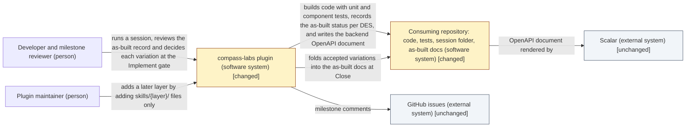
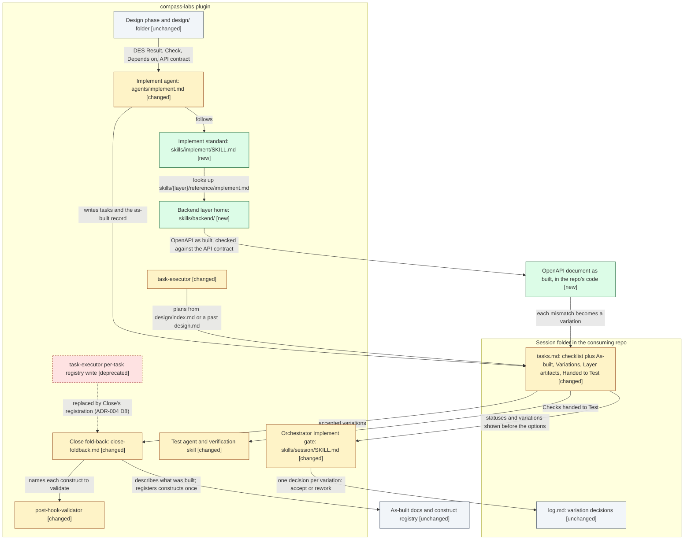

# Design: Implement phase — an as-built artifact, the backend API artifact and the testing boundary

> Phase: Design | Started: 2026-10-10 | Status: Ready for the Design milestone gate. The user confirmed the classification and scope and chose D1 to D7 (2026-10-10).
> Requirements: [`define/index.md`](../define/index.md) · Session history: [`log.md`](../log.md)

## Contents

This design is `index.md` only. The primary kind (plugin/tooling) has no in-depth path yet, so there's no `solution.md`. No layer design standard exists (#46, #47, #48), so there are no layer files. Visual UI design is out of scope, so there's no `ui-handoff.md`.

## Prior knowledge

- **Read:**
  - The registry and ADRs: `docs/registry/index.md` (empty, `construct_count: 0`), `docs/registry/patterns.md`, [ADR-002](../../../registry/decisions/002-session-lifecycle.md) (one artifact per phase, `REQ → DES → task → VER`) and [ADR-004](../../../registry/decisions/004-design-path.md) (D7: one home per layer, no stubs; D8: Close adds the constructs a session built; D10: stack defaults have one source).
  - Reference and explanation docs: `docs/reference/session/workflow-and-artifacts.md` and `docs/explanation/session/overview.md`.
  - Code:
    - The agents: `agents/implement.md`, `agents/test.md`, `agents/close.md` and `agents/design.md`.
    - The session skill: `skills/session/SKILL.md` (milestone gate), `skills/session/reference/close-foldback.md` and `phase-agent-contract.md`, `skills/session/workflows/feature.json`, and the templates `tasks.md`, `verification.md` and `design/index.md`.
    - Other skills: `skills/task-executor/SKILL.md` and its scripts `select-next-task.sh` and `find-active-plan.sh`, `skills/post-hook-validator/SKILL.md`, `skills/verification/SKILL.md`, and `skills/design/` (`SKILL.md`, `kinds/three-tier.md`, `reference/notations.md`, `reference/stack-defaults.md`).
    - Hooks, scripts, tests and manifests: `hooks/session-guard.sh`, `skills/session/scripts/check-traceability.sh`, `tests/session/phase_agents_test.sh`, `.claude-plugin/marketplace.json` and `plugin.json`.
  - This session: the frozen `define/` (all six files) and `log.md`.
- **Not read:** any past session folder, including `docs/sessions/archive/`. The archived `tasks.md` files of #22, #23 and #27 that REQ-020 names were not opened. Their shape is known only from `define/framing.md`.

## Classification

- **Primary kind:** plugin/tooling. Every live requirement changes this plugin's own agents, skills, templates and scripts (REQ-001 to REQ-019), and REQ-020 keeps its gates compatible. The backend work (REQ-011 to REQ-013) is guidance text that the plugin ships for consuming repos. It isn't a backend in this repository.
- **In-depth path:** none yet: dkoenawan/compass-labs#51, see Open questions.

The user confirmed the classification and the scope checklist below (2026-10-10).

## Scope checklist

| Area | In scope? | Reason |
|---|---|---|
| Plugin/tooling (agents, skills, templates, scripts, manifest) | in | The primary kind. It covers the Implement standard, `agents/implement.md`, the `tasks.md` template, the backend layer home, the orchestrator's Implement gate, Close's fold-back, `task-executor`, `post-hook-validator`, the Test agent and the `verification` skill (REQ-001 to REQ-020) |
| Process/workflow (who decides what, and when) | in | The Implement gate gains a decision on each variation (REQ-004, REQ-005), Close folds variations back (REQ-006), and Implement and Test split testing between them (REQ-007 to REQ-010). It's covered in the all-kinds sections. No in-depth path exists: dkoenawan/compass-labs#49 |
| Tests (the plugin's `tests/` harness) | in | Content assertions that keep `tests/run.sh` green while the files change, and that guard REQ-014, REQ-017, REQ-018 and REQ-020 |
| Backend (a backend in this repo) | out | The plugin has no backend service. The backend *guidance* it ships for consuming repos is plugin content, under plugin/tooling. `stack-defaults.md` is linked, not applied here |
| Frontend | out | Deferred to #57 (REQ-021). No stub folder (ADR-004 D7) |
| Database | out | Deferred to #58 (REQ-022). No stub folder |
| AI-agent layer | out | Deferred to #59 (REQ-023) |
| Infrastructure | out | Deferred to #50 (REQ-025). Infrastructure is a Design kind, not a layer |
| Visual UI design | out | No screen or UI changes |
| As-built docs (`docs/`) | out | Close folds this session back. Design and Implement don't write `docs/` |
| Session folder schema (`feature.json`, guard hook, gate scripts) | out | Unchanged: under D1, `tasks.md` stays Implement's only artifact, and under D6 the gate scripts don't change |

## Context view

*Notation: C4 L1 context view, drawn as a Mermaid `flowchart` with delta styling.*

**The changed plugin, one level down.** This view shows which parts of the plugin each `DES-*` item changes, and the path a variation takes, from the build through the gate to the as-built docs.

*Notation: C4 L3 component view (the plugin/tooling notation), drawn as a Mermaid `flowchart` with delta styling.*

## Delta list

Each element this design touches has exactly one status. Every visual matches this list.

| Element | Status | DES | Note |
|---|---|---|---|
| Implement standard, `skills/implement/SKILL.md` | new | DES-001 | The rules for tasks, the as-built record, the testing boundary and the layer plug-in contract (D4) |
| `skills/session/templates/tasks.md` | changed | DES-002 | New-session sections: As-built, Variations, Layer artifacts and Handed to Test (D1) |
| "Deviations from design" section in the `tasks.md` template | deprecated | DES-002 | Replaced by Variations for new sessions. Past sessions keep theirs (REQ-020) |
| `agents/implement.md` | changed | DES-003 | Preloads the Implement standard. The "near-empty domain skills" paragraph goes |
| Backend layer home, `skills/backend/SKILL.md` and `skills/backend/reference/implement.md` | new | DES-004 | The first layer under the plug-in contract (ADR-004 D7) |
| `.claude-plugin/marketplace.json` | changed | DES-001, DES-004 | Lists `./skills/implement` and `./skills/backend` |
| OpenAPI document as built (in a consuming repo) | new | DES-004 | Produced by Implement for each backend `DES-*` item that adds or changes an HTTP API |
| Orchestrator Implement gate, `skills/session/SKILL.md` | changed | DES-005 | Shows statuses and variations, and records a decision per variation |
| Close fold-back, `skills/session/reference/close-foldback.md` | changed | DES-006, DES-008 | Folds back accepted variations, and registers constructs on its own |
| `skills/task-executor/SKILL.md` | changed | DES-007 | Resolves `design/index.md` or `design.md`, and derives tasks by the standard's rule |
| `task-executor` `overview.md` resolution | deprecated | DES-007 | `overview.md` is retired |
| `task-executor` per-task registry write (Execute Step 5 and the Step 0 status flip) | deprecated | DES-007 | One construct owner: Close (D5, ADR-004 D8) |
| `skills/post-hook-validator/SKILL.md` | changed | DES-008 | Runs against a construct Close has registered |
| `agents/test.md`, `skills/verification/SKILL.md`, `skills/session/templates/verification.md` | changed | DES-009 | Test-owned methods, and Implement's tests as supporting evidence only (D6, D7) |
| `tests/session/` content tests | changed | DES-010 | New and updated assertions. `tests/run.sh` stays green |
| `design/` standard and Design phase | unchanged | — | Supplies the `DES-*` table and the API contract |
| `feature.json`, `hooks/session-guard.sh`, `check-traceability.sh`, `check-design.sh` | unchanged | — | Unchanged under D1 and D6 (REQ-020) |
| `log.md` format | unchanged | — | Variation decisions are ordinary `decision` entries |
| As-built docs and the construct registry format | unchanged | — | Close writes into them as it does today |
| Scalar, GitHub | unchanged | — | External |

## Components (DES)

Each item names the `REQ-*` it covers, the result Implement must produce, the check that shows it's done, and the items it depends on. A layer is named first in the Component cell, which is how the plug-in contract finds layer guidance.

| ID | Component | Covers | Result | Check | Depends on |
|---|---|---|---|---|---|
| DES-001 | Implement standard: `skills/implement/SKILL.md` (new standard skill, listed in `marketplace.json`) | REQ-001, REQ-002, REQ-003, REQ-007, REQ-008, REQ-014, REQ-015, REQ-016, REQ-020 | A standard in six parts. **(1) Tasks:** each task comes from one `DES-*` item's Result. The item's Check goes on its last task, unless the Check needs a Test-owned test, in which case it goes under Handed to Test. Tasks follow the Depends-on order. **(2) Testing boundary:** the standard defines unit, component and Test-owned tests itself. Implement writes unit and component tests only, and never writes integration, UI or Playwright tests. **(3) As-built record:** every `DES-*` item gets exactly one status, with a reason for any status other than *built as designed*. Every variation records the item, what was designed, what was built, and why. Frozen `define/` and `design/` are never edited. **(4) Layer plug-in contract:** for a `DES-*` item whose Component cell names layer L, Implement reads `${CLAUDE_PLUGIN_ROOT}/skills/L/reference/implement.md` if it exists. That file supplies how to build the layer, which unit and component tests to write, the layer's artifact (under Layer artifacts → L), and the check against the design, whose mismatches become variations. **(5) Fallback** when the file is missing (D3). **(6) Past sessions:** a `tasks.md` without an As-built section is treated as before | Each of the six parts is present. The lookup is the `skills/{layer}/` path convention, with no list of layer names to edit. A fixture `skills/demo/reference/implement.md` would be found with no other file changed. `tests/run.sh` passes | DES-002 |
| DES-002 | `tasks.md` template: `skills/session/templates/tasks.md` | REQ-001, REQ-002, REQ-012, REQ-015, REQ-016 | The frontmatter and checklist stay. Each task carries `[DES-nnn]`, and each item's last task carries `— check: {Check}`. "Deviations from design" is replaced by four sections, written as tables only: **As-built** (`DES \| Status \| Reason \| Unit tests \| Component tests`), **Variations** (`ID \| DES \| Designed \| Built \| Why`, with IDs V1, V2 … local to the file), **Layer artifacts** (one `### {layer}` subsection per layer, shaped by that layer's guidance) and **Handed to Test** (`DES \| Check`) | `select-next-task.sh` on a filled-in copy returns only checklist tasks, because there are no `- [ ]` lines outside the checklist. The four headings are present, and "Deviations from design" isn't | — |
| DES-003 | Implement agent: `agents/implement.md` | REQ-001, REQ-015 | A thin wrapper. It preloads `compass-labs:implement`, with the read-`SKILL.md`-yourself fallback. It owns `tasks.md`, and reads `design/index.md`, or the root `design.md` in a past session. It returns `done` only once the As-built record covers every `DES-*` item. The paragraph about near-empty domain skills is removed | `phase_agents_test.sh` passes, with new assertions for the preload and the fallback. No "near-empty" text remains | DES-001 |
| DES-004 | Backend layer: `skills/backend/SKILL.md` and `skills/backend/reference/implement.md` (listed in `marketplace.json`) | REQ-007, REQ-011, REQ-012, REQ-013, REQ-014 | `SKILL.md` indexes `reference/implement.md`, and `reference/design.md` once #47 delivers it. `implement.md` covers four things. **(a) Stack:** detect the stack with the signals in `stack-defaults.md` and build in the established stack, linking to that file rather than restating it. **(b) Tests:** at least one unit test and one component test per backend `DES-*` item, named in its As-built row. **(c) OpenAPI:** a 3.x document of the API as built, committed in the repo (exported from the framework, or written beside the code), with its path and a Scalar render result under Layer artifacts → Backend. **(d) API check:** one row per endpoint in the design's API contract (`design/backend.md` where it exists, otherwise `design/solution.md`'s contracts and the backend `DES-*` items), comparing method, path, request, response and error cases. Each mismatch becomes a variation. A non-OpenAPI API cites dkoenawan/compass-labs#60 | Reading `implement.md` finds (a) to (d). It links `stack-defaults.md` and names no default stack itself, and `stack_defaults_test.sh` passes. No `skills/frontend/` or `skills/database/` exists. `marketplace.json` lists `./skills/backend` | DES-001, DES-002 |
| DES-005 | Orchestrator Implement gate: `skills/session/SKILL.md` (milestone gate) | REQ-004, REQ-005, REQ-020 | A new "Implement gate" bullet. When `tasks.md` has an As-built section, the gate message lists every `DES-*` status and every variation, each with its reason, above approve, adjust and rethink. For each variation, the orchestrator asks: accept as built, or send back for rework. It appends one `decision` entry naming every outcome, mirrored to Key decisions, and relays rework to the Implement agent. It doesn't approve the milestone while any rework is outstanding, so every variation left in a frozen `tasks.md` has been accepted. A `tasks.md` without an As-built section is shown as before | Reading the gate finds these steps in order. `session_skill_test.sh` passes, with a new assertion | DES-002 |
| DES-006 | Close fold-back of variations: `skills/session/reference/close-foldback.md` | REQ-006, REQ-020 | Step 1 also reads `tasks.md`'s As-built and Variations sections. A new "Folding back `tasks.md`" table maps each variation (every one was accepted at the gate) to the as-built reference doc, which describes the built result, not the design it varied from. The As-built table, Handed to Test and the checklist stay archived. How-to guides come from `tasks.md` as before. A past session's "Deviations from design" stays archived, as before. The no-session-IDs grep still applies | Reading `close-foldback.md` finds the new table and the change to step 1. `phase_agents_test.sh`'s fold-back assertions still pass | DES-005 |
| DES-007 | `task-executor`: `skills/task-executor/SKILL.md` | REQ-015, REQ-017, REQ-018 | **Phase 4** resolves the session's design from `design/index.md` (the Components table and Implementation order), then the root `design.md`, and otherwise stops as it does now. `overview.md` appears nowhere. **Phase 5** decomposes by the Implement standard's task rule, linked rather than restated, and the example's integration-test task is replaced. **Execute:** Step 0 keeps the registry *read* but drops the "update its status to built" write. Step 5 (the post-task registry write) is removed, leaving one line: Close registers constructs (ADR-004 D8) | No `overview.md` remains, and no instruction writes `docs/registry/index.md` or `docs/reference/constructs/`. A fixture session with `design/index.md`, and one with a root `design.md`, each resolve to their design | DES-001 |
| DES-008 | Construct registration and the validator trigger: `close-foldback.md` (registry bullet) and `skills/post-hook-validator/SKILL.md` | REQ-018, REQ-019 | Close's registry bullet stands alone, with no "the same way `task-executor` does". It adds or flips to `built` each construct the session built, in the shape of `docs/reference/constructs/ConstructName.md`, and Close's `done` note names each one with "run `/compass-labs:post-hook-validator {Name}`". `post-hook-validator` is triggered after the construct owner registers or updates a construct. Given a name, it reads that construct's file directly. Without a name, it derives one from the latest commit that touched `docs/reference/constructs/`, not just `HEAD~1`. It writes the divergence lockfile only into a live session folder, never under `archive/` | A search of `skills/` and `agents/` finds registration instructions (add a construct, or flip it to `built`) only in Close's procedure. `post-hook-validator`'s verified and diverged flips are verification, not registration. A named run reads the construct and doesn't exit with "No construct files were updated" | DES-007 |
| DES-009 | Test boundary: `agents/test.md`, `skills/verification/SKILL.md` and `skills/session/templates/verification.md` | REQ-009, REQ-010, REQ-020 | The Method values become `integration` (including harness tests that run real hooks and scripts), `ui`, `playwright` and `inspection` (for a requirement about a document or instructions). All four are Test-owned. Each live `REQ-*` needs at least one Test-owned row. An Implement unit or component test appears only in Evidence, prefixed "Supporting:" (D7). The Test agent reads `tasks.md`'s Handed to Test section. The column order is unchanged, `check-traceability.sh` is unchanged (D6), and past sessions' `unit`, `e2e` and `manual` rows stay as they are | Reading the three files finds the methods, the at-least-one rule and the "Supporting:" rule. `requirements_verification_skills_test.sh` and `check_traceability_test.sh` pass unchanged | — |
| DES-010 | Harness content tests: `tests/session/` (`phase_agents_test.sh` updated, plus a new `implement_standard_test.sh`) | REQ-014, REQ-017, REQ-018, REQ-020 | Content assertions: the Implement agent preloads `compass-labs:implement`; the standard names `skills/{layer}/reference/implement.md` and lists no layers; `skills/backend/` holds `SKILL.md` and `reference/implement.md`, and no other layer folder exists; `task-executor` has no `overview.md` and no registry-write instruction; the `tasks.md` template has the four sections; `marketplace.json` lists `implement` and `backend`. The existing `check-traceability.sh` and `check-design.sh` fixtures stay unchanged | `tests/run.sh` exits 0 | DES-001, DES-002, DES-003, DES-004, DES-005, DES-006, DES-007, DES-008, DES-009 |

**Coverage:** all 20 live REQs are covered.
- REQ-001: DES-001, DES-002, DES-003.
- REQ-002: DES-001, DES-002.
- REQ-003: DES-001.
- REQ-004 and REQ-005: DES-005.
- REQ-006: DES-006.
- REQ-007: DES-001, DES-004.
- REQ-008: DES-001.
- REQ-009 and REQ-010: DES-009.
- REQ-011 and REQ-013: DES-004.
- REQ-012: DES-002, DES-004.
- REQ-014: DES-001, DES-004, DES-010.
- REQ-015: DES-001, DES-002, DES-003, DES-007.
- REQ-016: DES-001, DES-002.
- REQ-017: DES-007, DES-010.
- REQ-018: DES-007, DES-008, DES-010.
- REQ-019: DES-008.
- REQ-020: DES-001, DES-005, DES-006, DES-009, DES-010.

The deferred rows REQ-021 to REQ-026 need none.

**Implementation order** (from Depends on): DES-002, DES-009 → DES-001 → DES-003, DES-004, DES-005, DES-007 → DES-006, DES-008 → DES-010

## Decisions

The user chose every option below on 2026-10-10. In each case it was the recommended option.

**D1: The form of the as-built record (ADR: refines ADR-002 and ADR-004 D7. The ADR also records the testing boundary and the variation path agreed in Define).**

| Option | Pros | Cons |
|---|---|---|
| **A. New sections in `tasks.md` (chosen)** | `tasks.md` stays Implement's only artifact (ADR-002). No change to `feature.json`, the guard or the gate scripts, so REQ-020 is safe by construction. `find-active-plan.sh` keeps working | One file holds both the plan and the record. The new sections must avoid `- [ ]` lines, because `select-next-task.sh` parses every checklist line in the file |
| B. An `implement/` folder artifact (`tasks.md` plus `as-built.md`), like `define/` and `design/` | Plan and record are separate, and there's room for per-layer files later | `feature.json`, the guard (with `tasks.md` as the legacy artifact), `find-active-plan.sh`'s `docs/sessions/*/tasks.md` glob, the gate staging and the tests all change. Too big for one session |
| C. A second root file, `as-built.md`, owned by Implement | Separate file, small change | Breaks one artifact per phase. The guard maps one artifact per phase, so it needs a schema change anyway |

The user chose A. It keeps one artifact per phase, leaves the session schema and the gates untouched (REQ-020), and fits the one-session appetite. The new sections are tables only. Close writes the ADR. It refines ADR-002 (Implement's artifact now holds an as-built record and variations) and ADR-004 D7 (the layer plug-in contract for `reference/implement.md`). It also records the testing boundary agreed in Define (Implement: unit and component; Test: integration, UI, Playwright and inspection), and the variation path (recorded by Implement, decided at the Implement gate, folded back by Close).

**D2: How the OpenAPI document is checked against the design's API contract (no ADR).**

| Option | Pros | Cons |
|---|---|---|
| **A. The Implement agent compares them, one table row per endpoint, recorded in `tasks.md` (chosen)** | Works in any stack, needs no parser and no new dependency, and every endpoint row is visible at the gate | Not mechanical: a missed mismatch depends on the agent and the reviewer |
| B. A script that extracts endpoints from `design/solution.md` and compares them with the spec | Mechanical | The design's contract is prose, and YAML needs a parser beyond `jq`. Realistically it checks only method and path, not shapes. Fragile |
| C. A contract test in the consuming repo (for example Schemathesis or Dredd) | Checks real behaviour | It's an integration test, which is Test-owned (REQ-008), and it adds a dependency per stack |

The user chose A. It compares every field REQ-012 names, in any stack. One row per design endpoint makes an omission visible to the reviewer at the gate.

**D3: The fallback when a layer has no Implement guidance (no ADR).**

| Option | Pros | Cons |
|---|---|---|
| **A. Build with the repo's conventions and the general standard (status, variations, unit and component tests where practicable), record "no Implement guidance for {layer}" in the As-built row, and cite the layer's follow-up issue (#57, #58, #59) (chosen)** | It mirrors Design's missing-layer fallback (`three-tier.md`). The gap is visible at the gate and nothing stops | Quality for that layer rests on judgement until its issue ships |
| B. Fall back silently to `task-executor` plus general judgement (today's text) | No new text | The gap is invisible, and the layer's build isn't checked against anything |
| C. Return `blocked` until the guidance exists | Strict | Blocks every frontend and database session until #57 and #58 ship |

The user chose A. Work keeps flowing, and the gap stays visible in the as-built record, the same way Design handles a missing layer standard.

**D4: Where the Implement standard lives (no ADR beyond D1's).**

| Option | Pros | Cons |
|---|---|---|
| **A. A new standard skill, `skills/implement/SKILL.md`, preloaded by `agents/implement.md` (chosen)** | Matches the Design path (agent `design` preloads skill `design`), keeps the agent thin (C8), and gives one place for the rules | A new skill to list in `marketplace.json` and the README |
| B. `skills/session/reference/implement.md`, like `close-foldback.md` | No new skill, and there's a precedent | Not a user-invocable standard. It mixes a phase standard into the orchestrator's skill |
| C. Inline in `agents/implement.md` | Fewest files | Breaks the thin-wrapper rule (C8). `task-executor` can't link to it cleanly |

The user chose A. It's the same pattern as the Design path. The agent stays a thin wrapper, and `task-executor` links to one task rule instead of restating it.

**D5: The single construct owner (links [ADR-004](../../../registry/decisions/004-design-path.md) D8, no new ADR).**

| Option | Pros | Cons |
|---|---|---|
| **A. Close, as ADR-004 D8 says. `task-executor` stops writing the registry (chosen)** | No ADR to revisit. Constructs are registered as built, after variations are accepted. `task-executor` gets simpler | The registry isn't current during the build. `post-hook-validator` runs after Close rather than per task |
| B. `task-executor`, per task. Close stops writing constructs (needs an ADR revisiting D8) | The registry is current during the build, and per-task validation stays as it is today | It registers before variations are decided, contradicts ADR-004 D8, and adds a registry commit per task |

The user chose A. It follows ADR-004 D8 as it stands, so no new ADR is needed, and constructs are registered only once their variations have been decided.

**D6: How "each REQ has a Test-owned VER" (REQ-009) is enforced (no ADR).**

| Option | Pros | Cons |
|---|---|---|
| **A. By instruction: the `verification` skill and the Test agent. `check-traceability.sh` is unchanged (chosen)** | REQ-020 is safe by construction. Simple | A unit-only VER row would still pass the gate if the Test agent ignored the rule |
| B. `check-traceability.sh` counts only Test-owned methods, in sessions with the new layout | Mechanical | Needs a layout marker to keep past sessions identical (REQ-020), plus new fixtures. More moving parts |

The user chose A. The gate stays unchanged for every session, past and new. The rule is held by the Test standard, and the reviewer sees it at the Test gate.

**D7: How a VER row marks Implement's tests as supporting evidence (REQ-010) (no ADR).**

| Option | Pros | Cons |
|---|---|---|
| **A. In the Evidence cell, prefixed "Supporting:", never as a row of its own (chosen)** | Column order unchanged, and a supporting citation can never satisfy the gate on its own | Free text inside a cell |
| B. A separate row with Method `unit (supporting)` | One citation per row | Its Result "pass" would satisfy `check-traceability.sh`, which breaks REQ-009 under D6 option A |
| C. A new `Supporting evidence` column | Structured | Changes the load-bearing column order, so `check-traceability.sh` and its tests must change too |

The user chose A. It keeps the load-bearing column order, and a supporting citation can't satisfy the gate on its own.

## Principles check

The marks are for the options the user chose. None is *traded off*, so there is nothing for the user to resolve.

| Item | KISS | YAGNI | SOLID |
|---|---|---|---|
| DES-001 | met | met: only what REQ-001 to REQ-016 need | SRP met: the Implement phase standard, nothing else. OCP met: layers plug in by path convention. LSP n/a: no substitutable types. ISP met: a layer supplies only `reference/implement.md`. DIP met: the standard depends on the path convention, not on named layers |
| DES-002 | met: tables only | met | SRP met: Implement's one artifact. OCP met: Layer artifacts subsections come from each layer. LSP, ISP, DIP n/a: a template, not code |
| DES-003 | met | met | SRP met: a thin wrapper (C8). OCP, LSP, ISP n/a. DIP met: depends on the standard, not inline rules |
| DES-004 | met | met: OpenAPI only (#60 for others) | SRP met: backend guidance only. OCP met: plugs in by files. LSP n/a. ISP met. DIP met: links `stack-defaults.md` |
| DES-005 | met | met | SRP met: gate content only. OCP, LSP, ISP n/a. DIP n/a |
| DES-006 | met | met: variations only, no new doc types | SRP met. OCP met: a new table, existing tables untouched. LSP, ISP, DIP n/a |
| DES-007 | met: removes code paths | met | SRP met: `task-executor` executes tasks and no longer owns the registry. OCP, LSP, ISP n/a. DIP met: links the standard's task rule |
| DES-008 | met | met: the lockfile tweak only stops a write into a moved folder | SRP met: one registrar (Close), one validator. OCP, LSP, ISP, DIP n/a |
| DES-009 | met | met | SRP met. OCP met: the gate script is untouched. LSP, ISP, DIP n/a |
| DES-010 | met | met: content assertions only | n/a: test code. Each test file has one subject |
| D1 (A) | met | met | SRP met at the artifact level: `tasks.md` is Implement's record. OCP met: no schema change |
| D2 (A) | met | met | n/a: a procedure, not code |
| D3 (A) | met | met | OCP met: no list to edit when a layer ships |
| D4 (A) | met | met | SRP met. DIP met |
| D5 (A) | met | met | SRP met: one registrar |
| D6 (A) | met | met | OCP met: the gate is unchanged |
| D7 (A) | met | met | n/a: a table convention |

**Rejected under YAGNI:**
- An `implement/` folder artifact or a second Implement file: no live REQ needs more than `tasks.md` (D1).
- A script or contract test comparing the OpenAPI document with the design (D2): REQ-012 asks for the comparison to be recorded, not mechanised.
- Stub folders for frontend, database or AI-agent: ADR-004 D7, and deferred to #57, #58 and #59.
- A shipped `skills/demo/` fixture: REQ-014's fixture belongs in a temporary test copy, not in the plugin.
- Removing the guard hook's retired `overview.md` exception: no live REQ needs it.
- A global variation ID scheme: V1, V2 … are local to `tasks.md`, like `NEED-nn` in `define/`.
- Adding Scalar packages to a consuming repo: the render check runs Scalar without installing it into the repo (REQ-013).

## Risks

| Risk | Mitigation |
|---|---|
| `select-next-task.sh` parses every `- [ ]`, `- [x]` and `- [!]` line in `tasks.md`, so a checklist line in a new section would become a phantom task | DES-002: the new sections are tables only, and DES-010 asserts it |
| The agent-run API comparison misses a mismatch (D2) | One row per design endpoint makes an omission visible at the Implement gate, where the reviewer sees it (DES-005) |
| Scalar's CLI is unavailable (offline, no Node) | The backend guidance records the render result honestly, as *not rendered* with the reason, and it's raised at the gate. The OpenAPI document is still committed |
| The REQ-018 search hits `post-hook-validator`'s verified and diverged flips, or `doc-maintainer` (Close's preloaded skill) | DES-008 defines registration as adding a construct or flipping it to `built`. `doc-maintainer` runs inside Close, so it counts as the same phase |
| This session's own Implement runs on the old `agents/implement.md` and template | That's expected (a Define constraint). This session's `tasks.md` keeps the old "Deviations from design" section, which REQ-020 treats as a past session |
| `post-hook-validator` runs after Close, once the session is archived | DES-008: the lockfile is written only into a live session folder, and a named run needs no last-commit derivation |

## Open questions

All design questions are resolved: the classification, the scope and D1 to D7 were decided by the user on 2026-10-10. What remains are the follow-ups below.
- The plugin/tooling kind has no in-depth path: dkoenawan/compass-labs#51. The process/workflow area has none either: dkoenawan/compass-labs#49. Both are covered in the all-kinds sections above.
- The backend design standard (dkoenawan/compass-labs#47) hasn't shipped, so DES-004's API check compares against `design/solution.md`'s contracts and the backend `DES-*` items, and against `design/backend.md` once #47 delivers it.
