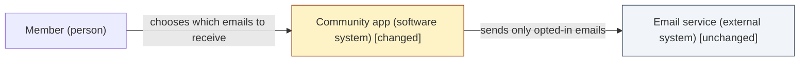
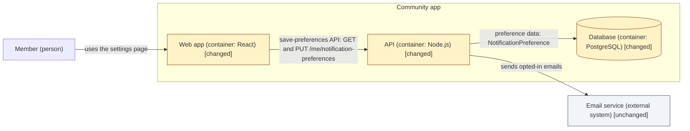

# Kind: three-tier application

> Standard: [design](../SKILL.md) · Notation: [reference/notations.md](../reference/notations.md#catalogue)

Use this path when the primary kind is **three-tier application**: a user interface (frontend), an API or service (backend), and stored data (database) that the requirements change together, or in part.

The path adds one step to the standard procedure. Before any layer's detailed design, write the **whole-system design** in `design/solution.md` and have the user approve it.

## Whole-system design (`design/solution.md`)

`design/solution.md` refines the all-kinds sections in `design/index.md`. It doesn't repeat them. It has four sections:

1. **Layers.** For each of frontend, backend and database: *changing* or *unchanged*, with the live `REQ-*` that change it, or "no live REQ touches it". The depth follows Define (see [Depth follows Define](../SKILL.md#depth-follows-define)). An unchanged layer gets one line and no layer design.
2. **Contracts between changing layers.** For each pair of adjacent changing layers, name the contract and its shape:
   - **Frontend ↔ backend:** each endpoint or message (method and path, or command and query name), request and response shape, and the error cases the frontend must handle.
   - **Backend ↔ database:** each entity or table the backend reads or writes, its key fields and relations, and any constraint the backend relies on.

   Name the contract and its shape here. The field-level detail goes in the layer designs.
3. **C4 L1 context view.** The system, the people who use it and the external systems it touches, with delta styling.
4. **C4 L2 container view.** The frontend, backend and database containers (plus any other container the design touches), with delta styling, and each contract from section 2 as a labelled edge.

Draw both views in the notation that [`reference/notations.md`](../reference/notations.md#catalogue) gives for this kind: C4 abstractions as a Mermaid `flowchart`, captioned with the C4 level. An L3 component view is optional, for a container whose internals the design changes significantly.

**Approval step.** When the whole-system design is written, return `needs_input` and ask the user to approve it: the layers marked changing, and the contracts. Write no layer file until the user approves. A change to a contract later goes back to the user in the same way.

## Example: notification preferences

The requirements for this example: members choose which notification emails they receive (REQ-001), their choices are saved per member (REQ-002), and emails are sent only for the kinds a member has opted into (REQ-003). Define's tier: short. The user chose to store preferences in a new `NotificationPreference` table rather than as columns on `User` (a significant choice, recorded in Decisions).

### Layers

| Layer | Status | Why |
|---|---|---|
| Frontend | changing | REQ-001: a settings page with one toggle per notification kind |
| Backend | changing | REQ-002, REQ-003: a save-preferences command, a get-preferences query, and a check in the email sender |
| Database | changing | REQ-002: a new `NotificationPreference` table related to `User` |

### Contracts

- **Frontend ↔ backend: save-preferences API.** `GET /me/notification-preferences` returns `[{ kind, enabled }]`. `PUT /me/notification-preferences` takes `[{ kind, enabled }]` and returns the saved list. Errors: `400` for an unknown kind, and `401` if the member isn't signed in.
- **Backend ↔ database: preference data.** `NotificationPreference(id, userId → User.id, kind, enabled)`, unique on `(userId, kind)`. `User` is unchanged. With no row for a kind, the default is enabled.

### C4 L1 context view

*Notation: C4 L1 context view, drawn as a Mermaid `flowchart` with delta styling.*

### C4 L2 container view

*Notation: C4 L2 container view, drawn as a Mermaid `flowchart` with delta styling.*

`log.md` then records the user approving this whole-system design before `design/frontend.md`, `design/backend.md` or `design/database.md` is written.

### The same feature, narrower scope

Say members can already choose and save their preferences, but the email sender ignores them. Define (short tier) has two live requirements: the sender skips emails a member has opted out of (REQ-001), and it logs each skipped email (REQ-002). The Layers table then marks the frontend and database *unchanged*, because no live REQ touches them. Only the backend is *changing*. No contract between layers changes, so the Contracts section says so, and the only layer design is `design/backend.md`. No Design tier is recorded. The depth comes from Define's tier and the two requirements.
