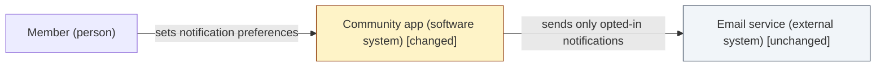
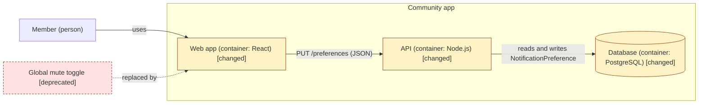
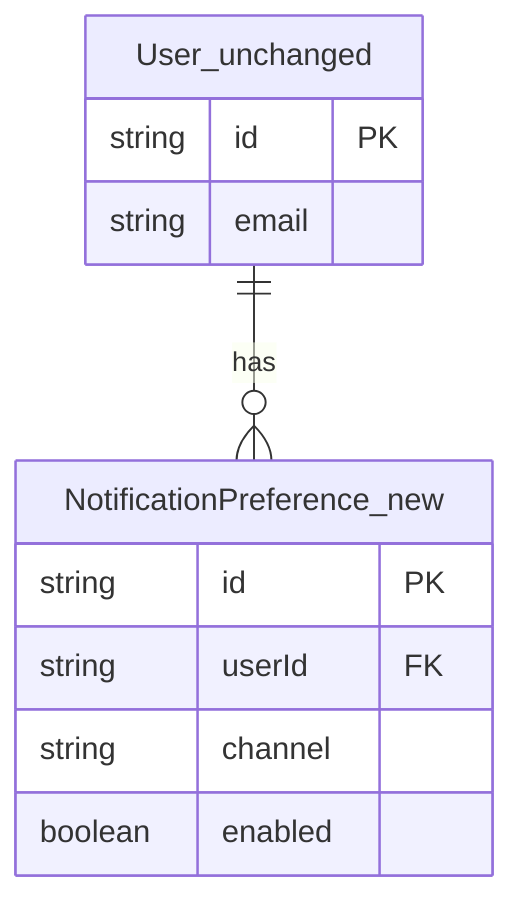
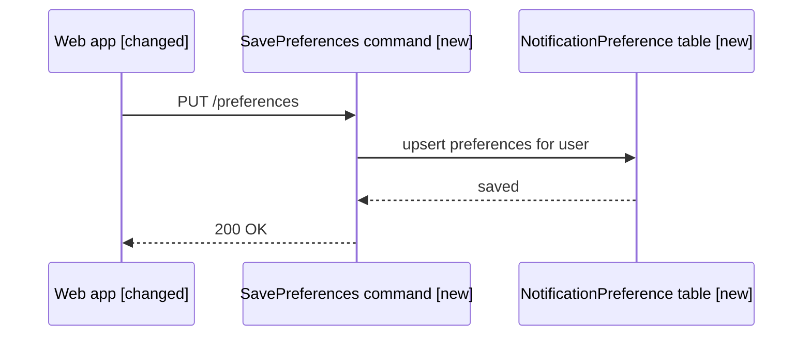

# Notation catalogue

> Standard: [design](../SKILL.md) · Rendering rules shared with: [requirements/reference/diagrams.md](../../requirements/reference/diagrams.md#rendering-rules)

This file covers four things:

- which notation each visual in a design uses,
- how a visual shows the delta,
- how to caption a visual,
- how to get a rendered image when GitHub can't render the notation itself.

A solution kind adds its rows here when it gains an in-depth path. See the kind contract in [`SKILL.md`](../SKILL.md).

## Catalogue

Pick the notation from the row for the solution's primary kind. Use the rows for any other area the scope checklist marks *in* for that area's visuals. Every design also has the context view and the delta list, whatever its kind.

| Kind or area | Notation | Mermaid form | Refined by |
|---|---|---|---|
| Three-tier application | C4: L1 context and L2 container (L3 component optional) | `flowchart` with C4 abstractions | [`kinds/three-tier.md`](../kinds/three-tier.md) |
| Database layer | Entity-relationship | `erDiagram` | dkoenawan/compass-labs#48 |
| Frontend layer | Component hierarchy and routes | `flowchart TB` | dkoenawan/compass-labs#46 |
| Backend layer | Commands, queries and API sequence | `sequenceDiagram`, `flowchart` | dkoenawan/compass-labs#47 |
| Process/workflow | BPMN 2.0 (through the [non-Mermaid route](#non-mermaid-route)). A simple flow may use a Mermaid `flowchart` | none / `flowchart` | dkoenawan/compass-labs#49 |
| Infrastructure | C4 deployment | `flowchart` | dkoenawan/compass-labs#50 |
| Plugin/tooling | C4 component view | `flowchart` | dkoenawan/compass-labs#51 |
| Other | Context view and delta list only | `flowchart` | none |

**C4 in Mermaid.** Draw C4 abstractions (person, software system, container, component) as `flowchart` nodes, and put the abstraction in the label, for example `API["Preferences API (container: Node.js) [new]"]`. Don't use Mermaid's `C4Context` or `C4Container` diagram types. Mermaid marks them experimental, they have no tags or legend, and they need one style line per element. That is why the caption has to name the C4 level.

## Captions

Every visual has a one-line italic caption directly above it that names its notation and, for C4, its level:

```markdown
*Notation: C4 L2 container view, drawn as a Mermaid `flowchart` with delta styling.*
```

## Delta styling

Each element a design touches has exactly one status: `new`, `changed`, `deprecated` or `unchanged`. Each visual shows the status in two ways, so it reads without colour:

1. **A classDef**, using these four definitions exactly:

   ```text
   classDef new fill:#DCFCE7,stroke:#166534
   classDef changed fill:#FEF3C7,stroke:#92400E
   classDef deprecated fill:#FEE2E2,stroke:#991B1B,stroke-dasharray:4 3
   classDef unchanged fill:#F1F5F9,stroke:#475569
   ```

2. **A `[status]` suffix on the label**, for example `"Settings page [changed]"`.

**The delta list is the source of truth.** It is a table in `design/index.md` with one row per element and its status. Each visual has to match it. Some diagram types can't carry classDefs, or can't carry them reliably on GitHub: `sequenceDiagram` can't, and `erDiagram` parses `classDef` in mermaid-cli 12 but GitHub's support for it is unverified. In those types, use the label suffix (for example, an entity or participant named `NotificationPreference_new`, or a note) and rely on the delta list. dkoenawan/compass-labs#48 settles the styling for the database layer.

## Mermaid rendering rules

Follow the [rendering rules in `requirements/reference/diagrams.md`](../../requirements/reference/diagrams.md#rendering-rules): one fence per diagram, alphanumeric node IDs with the real name in a quoted label, no bare `end` node ID. In addition:

- Use only the Mermaid forms named in the catalogue.
- Put the delta classDefs at the top of each `flowchart` that shows a delta, even if not every class is used.
- Keep one C4 level per diagram. If a view needs a second level, draw a second diagram.

## Examples

Each example below renders with mermaid-cli. The plugin's tests render every Mermaid block in this file.

### C4 L1 context view (three-tier)

*Notation: C4 L1 context view, drawn as a Mermaid `flowchart` with delta styling.*



### C4 L2 container view (three-tier)

*Notation: C4 L2 container view, drawn as a Mermaid `flowchart` with delta styling.*



### Entity-relationship (database layer)

*Notation: entity-relationship, drawn as a Mermaid `erDiagram`. The delta is in the entity names' suffix and in the delta list.*



### API sequence (backend layer)

*Notation: API sequence, drawn as a Mermaid `sequenceDiagram`. The delta is in the participant labels and in the delta list.*



## Non-Mermaid route

When a notation isn't Mermaid (BPMN 2.0, for example), GitHub can't render its source, so the design commits a rendered SVG beside it:

1. Save the editable source in the session's `assets/`, for example `assets/order-approval.bpmn`.
2. Render an SVG next to it with the same base name: `assets/order-approval.svg`.
3. In the design file, show the SVG and link the source:

   ```markdown
   *Notation: BPMN 2.0 process, rendered to SVG from [`order-approval.bpmn`](../assets/order-approval.bpmn).*

   
   ```

**BPMN 2.0.** The source needs diagram interchange (DI) information, which any BPMN modeller writes. Render from inside `assets/`:

```bash
PUPPETEER_EXECUTABLE_PATH=/usr/bin/google-chrome \
  npx -y bpmn-to-image@0.10.0 --no-footer order-approval.bpmn:order-approval.svg
```

`PUPPETEER_EXECUTABLE_PATH` points at an installed Chrome or Chromium. Use `which google-chrome chromium chromium-browser` to find it. Without it, `bpmn-to-image` launches the Chrome that Puppeteer downloads, which fails with "No usable sandbox" on hosts that restrict user namespaces (Ubuntu 23.10+).

**Manual fallback.** If Node or a browser isn't available, open the `.bpmn` in [bpmn.io](https://demo.bpmn.io) or Camunda Modeler, choose **Export SVG**, and save it beside the source with the same base name.

The Design agent may run these commands with Bash. Outputs go only to the session's `assets/` or a temp directory outside the repo.

## Render check (optional, before the gate)

Check that every Mermaid block in the design parses. mermaid-cli reads a Markdown file and renders each block. It exits non-zero if any block fails. Write the output only to a temp directory outside the repo:

```bash
tmp="$(mktemp -d)"
PUPPETEER_EXECUTABLE_PATH=/usr/bin/google-chrome \
  npx -y @mermaid-js/mermaid-cli@12.0.0 -i design/index.md -o "$tmp/index.md"
```

Without `PUPPETEER_EXECUTABLE_PATH` (or `-p {config}.json` holding `{"executablePath": "..."}`), mermaid-cli looks for Puppeteer's own `chrome-headless-shell` and fails if it isn't installed. If no tooling is available, paste each block into the [Mermaid Live Editor](https://mermaid.live) instead.

## Screenshots of the Claude Design export

Claude Design returns an HTML zip. Keep it as-is at `assets/ui-design.zip`, and never unzip it into the repo. GitHub can't render HTML inline, so add one PNG per screen at `assets/ui-{screen}.png`:

```bash
tmp="$(mktemp -d)"
unzip -q assets/ui-design.zip -d "$tmp"
google-chrome --headless --disable-gpu --hide-scrollbars --window-size=1280,800 \
  --screenshot="$PWD/assets/ui-settings.png" "file://$tmp/index.html"
```

Adjust the path to `index.html`, and the window size, to suit the export. If the export has one page per screen, run the command once per page. DBus or UPower errors on stderr are harmless.

**Manual fallback.** Unzip into a temp directory, open `index.html` in a browser, take a screenshot of each screen, and save it as `assets/ui-{screen}.png`.
