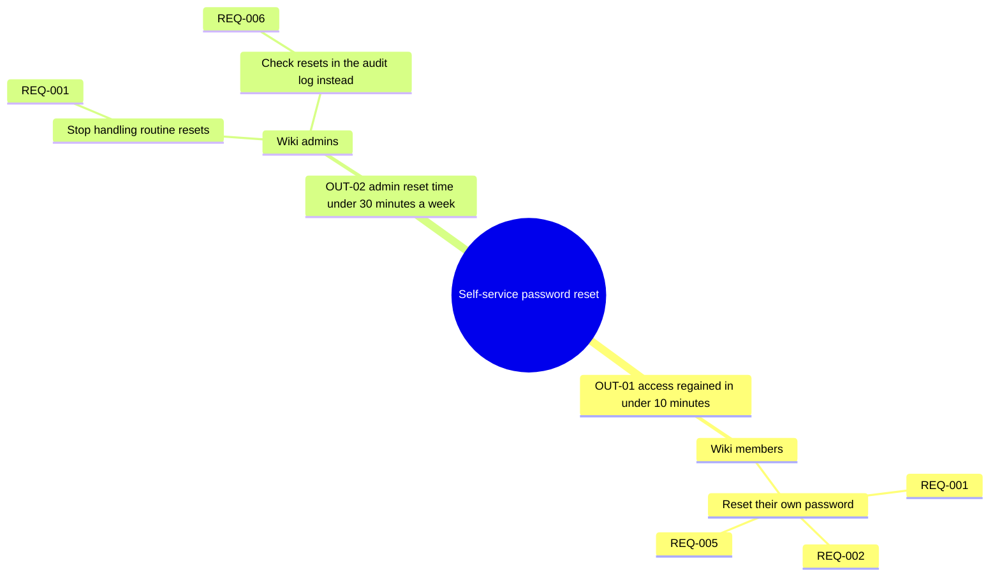
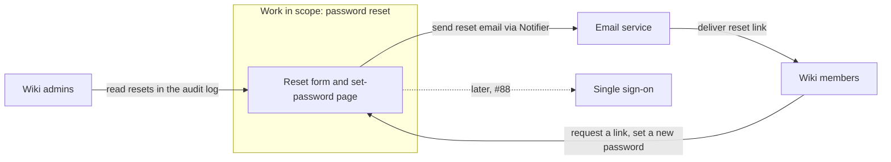
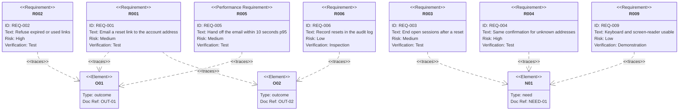
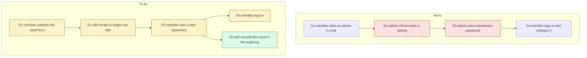

<!-- tier: full -->
# Diagrams: Self-service password reset for the team wiki

> Part of [index](index.md) · Define

## Impact map

## Context diagram

## Traceability

A small set with few crossing links, so a `requirementDiagram` is the easier one to review. REQ-003, REQ-004 and REQ-009 serve a need alone, so NEED-01 appears too. Struck REQ-007 and deferred REQ-008 are left out.

## As-is and to-be

The same step IDs in both. Admin steps are removed; the member's steps change, and the audit-log step is new.

