# Diagram catalogue

> Standard: [requirements](../SKILL.md) · Used by: [problem-statement/types/feature.md](../../problem-statement/types/feature.md), [types/feature.md](../types/feature.md)

Every diagram a Feature definition can contain, required or optional, with its Mermaid type, what it must show, the check that proves it, and a small example that renders. All of them go in `define/diagrams.md`, each under its own heading. Each diagram is owned by the type file of the section it illustrates; the rendering rules live here, once.

## Which diagrams, at which tier

| Diagram | Tier | Mermaid type | Owned by |
|---|---|---|---|
| [Impact map](#impact-map) | full, required | `mindmap` | problem-statement |
| [Context diagram](#context-diagram) | full, required | `flowchart LR` | problem-statement |
| [Traceability diagram](#traceability-diagram) | full, required | `requirementDiagram` or `flowchart LR` | requirements |
| [As-is / to-be](#as-is--to-be) | full, required when an existing process changes | `flowchart` ×2, or one with two subgraphs | problem-statement |
| [Customer journey](#customer-journey) | optional, any tier | `journey` | problem-statement |
| [Opportunity solution tree](#opportunity-solution-tree) | optional, any tier | `mindmap` | problem-statement |
| [Story map](#story-map) | optional, any tier | `flowchart TB`, one subgraph per activity | requirements |
| [Quality utility tree](#quality-utility-tree) | optional, any tier | `mindmap` | requirements |
| [Priority quadrant](#priority-quadrant) | optional, any tier | `quadrantChart` | requirements |
| [Example map](#example-map) | optional, any tier | `mindmap` | requirements |

**Short and skip tiers require no diagrams.** An optional diagram can be added at any tier when it helps, and `define/diagrams.md` then exists to hold it.

## Rendering rules

Diagrams must be viewable where the Markdown is read, without other tooling:

- Each diagram goes in its own ` ```mermaid ` fence.
- Use only the diagram types in this catalogue. GitHub renders all of them.
- Node IDs are alphanumeric (`R001`, `O01`), and the label carries the real ID: `R001["REQ-001"]`. A hyphen in a flowchart node ID can break parsing.
- Quote any label that contains punctuation, and never use a bare `end` as a flowchart node ID.
- A mindmap's hierarchy comes from indentation alone, so mindmap node text has no brackets or parentheses (other than the root's shape).
- In a `requirementDiagram`, block names are alphanumeric (`R001`), the `id` field carries the real ID, and `text` is quoted.

These examples are rendered with mermaid-cli when the plugin is tested. In a consuming repo nothing renders the diagrams at run time, so follow the rules above.

## Required at full tier

### Impact map

- **Must show:** the feature at the root → each `OUT-nn` → the stakeholder groups whose behaviour must change → each behaviour change → the `REQ-nnn` that deliver it. A REQ may appear under more than one branch.
- **Check:** every `OUT-nn` is present, each has at least one stakeholder and behaviour change, and each behaviour change has at least one REQ.
- **Helps with:** seeing why each requirement exists, and spotting an outcome nobody's behaviour serves.

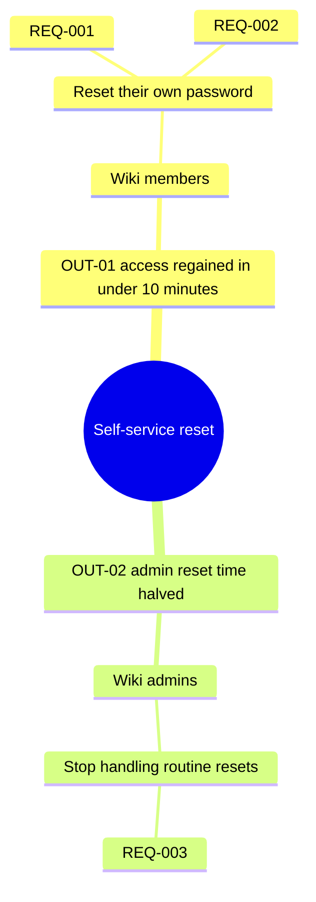

### Context diagram

- **Must show:** the work in scope as a central subgraph, every stakeholder group (from the `NEED-nn` rows) and every external system named in the problem statement or requirements, each with a labelled interaction edge.
- **Check:** every named group and system appears, with its interaction.
- **Helps with:** seeing the boundary of the work and every dependency across it.

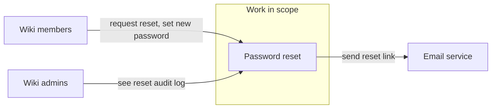

### Traceability diagram

- **Must show:** each `OUT-nn` linked to the `REQ-nnn` that serve it, with one link per Serves entry. `NEED-nn` appears only where a REQ serves a need alone. Show priority where the form makes that easy, for example with `classDef must`, `should` and `could` in a flowchart.
- **Check:** every `OUT-nn` and every live `REQ-nnn` appears, and every Serves link is drawn. Deferred and struck-through rows are left out.
- **Helps with:** showing that every requirement serves an outcome and every outcome is served.

**Choosing the form.** This is guidance, not a threshold:

- **`requirementDiagram`** suits a simple set: a handful of outcomes, requirements that each serve one or two of them, and few crossing links. Each REQ is a `requirement` block (`id`, `text`), each outcome is an `element`, and each Serves link is a `traces` relation. Its blocks show the requirement text, which helps a reviewer when there are few of them.
- **`flowchart LR`** suits a complicated set: many requirements, many-to-many Serves links, or a set where colouring by priority helps. Its nodes carry only IDs and short labels, so it stays compact.
- **Readability decides.** If one form is hard to read, try the other, or split the trace into one diagram per `OUT-nn`.
- **Too big to review is a signal.** If the trace is still too big to review after splitting, ask the user (through `needs_input`) whether the feature should be split into two sessions. The user decides; record the answer in `index.md`'s Open questions or framing summary.

A simple set, as a `requirementDiagram`:

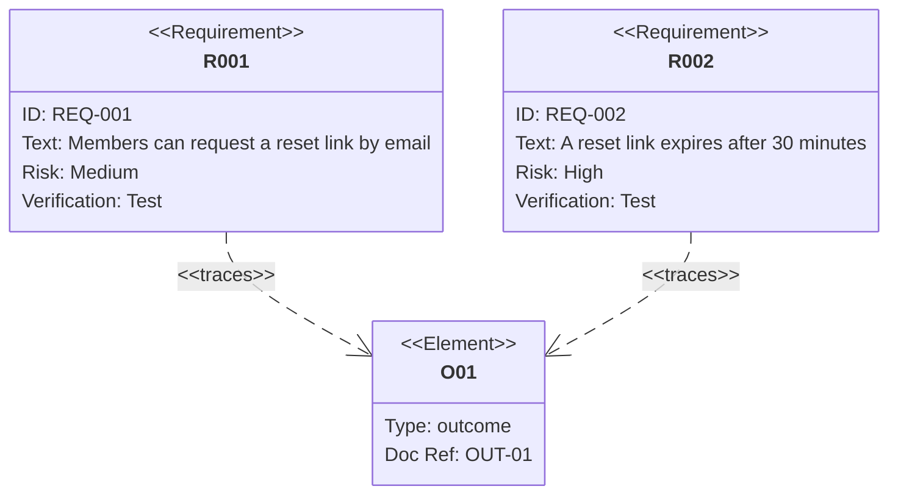

A complicated set, as a `flowchart LR` coloured by priority:

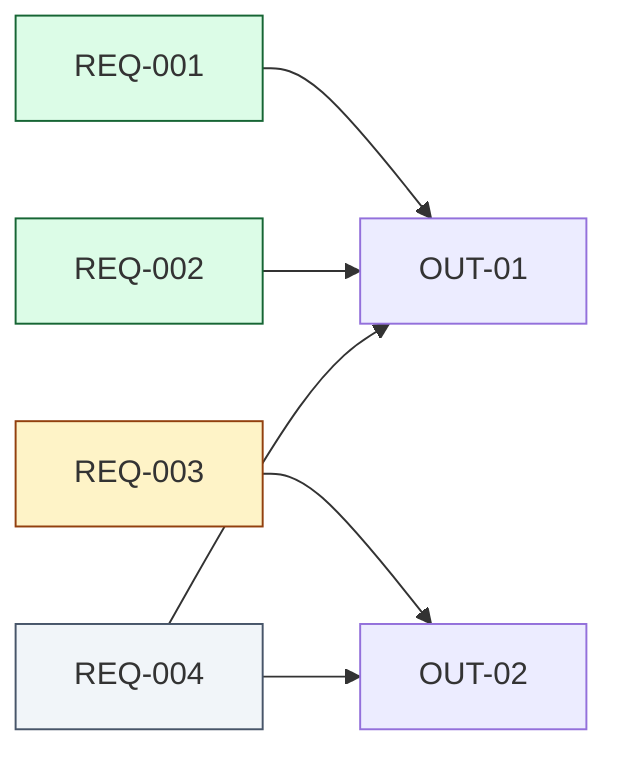

### As-is / to-be

- **Must show:** the process as it is today and as it will be, with the same step IDs in both. Changed, added and removed steps are styled with `classDef changed`, `new` and `removed`.
- **Check:** every step that differs between the two is visible.
- **Required when:** the problem statement describes a change to an existing process. Otherwise leave it out.

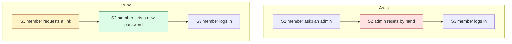

## Optional at any tier

These are never required. Add one when it makes the definition easier to review.

### Customer journey

- **Mermaid type:** `journey`. **Shows:** a stakeholder's stages, the steps in each, and a satisfaction score per step. **Helps when:** the problem is spread across several steps of someone's experience.

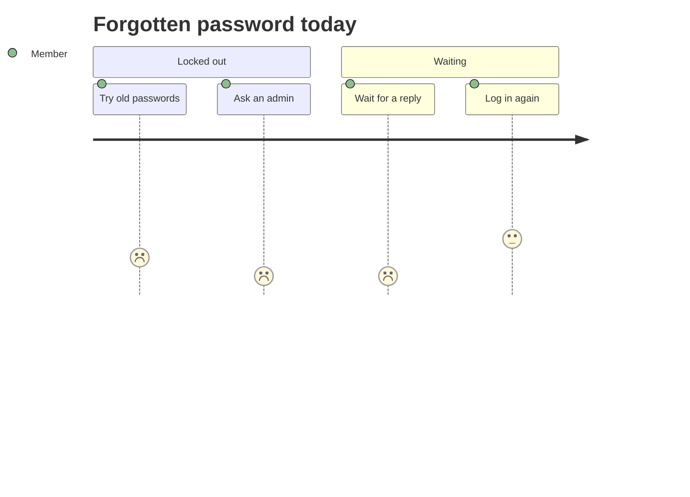

### Opportunity solution tree

- **Mermaid type:** `mindmap`. **Shows:** a desired outcome → the opportunities that would move it → candidate solutions under each. **Helps when:** there are several competing ways to reach an outcome, and the choice needs showing.

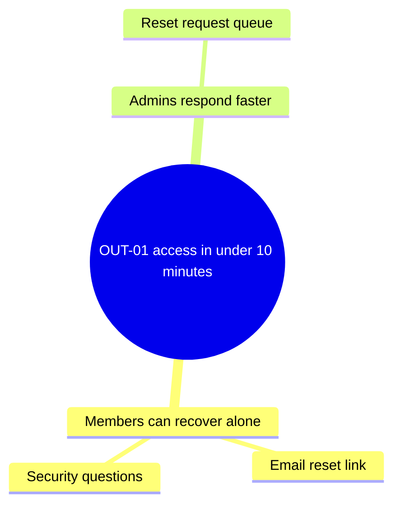

### Story map

- **Mermaid type:** `flowchart TB`, one subgraph per activity. **Shows:** the activities that form the backbone → the stories under each → the release slice. **Helps when:** there are many stories and you need to see gaps or where to slice.

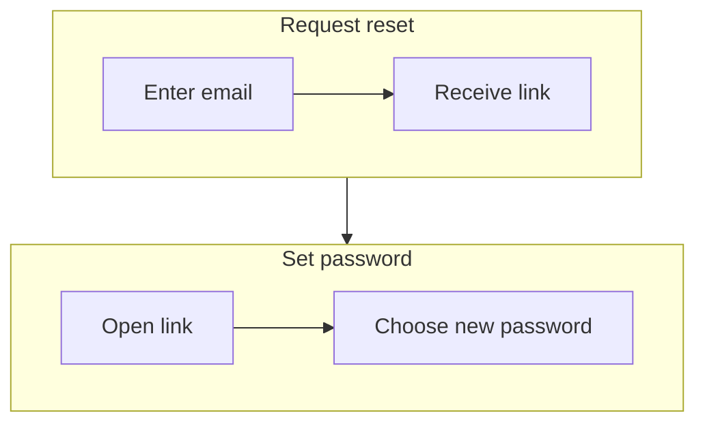

### Quality utility tree

- **Mermaid type:** `mindmap`. **Shows:** utility → ISO/IEC 25010 characteristic → refinement → the scenario REQ. **Helps when:** several quality characteristics compete and you need to see which matter most.

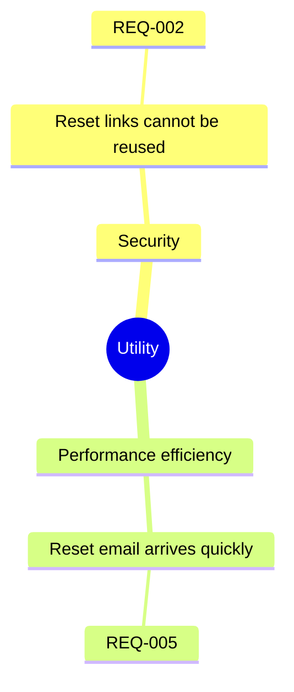

### Priority quadrant

- **Mermaid type:** `quadrantChart`. **Shows:** requirements placed by value against effort. **Helps when:** the Must/Should/Could split is contested and a picture helps the conversation.

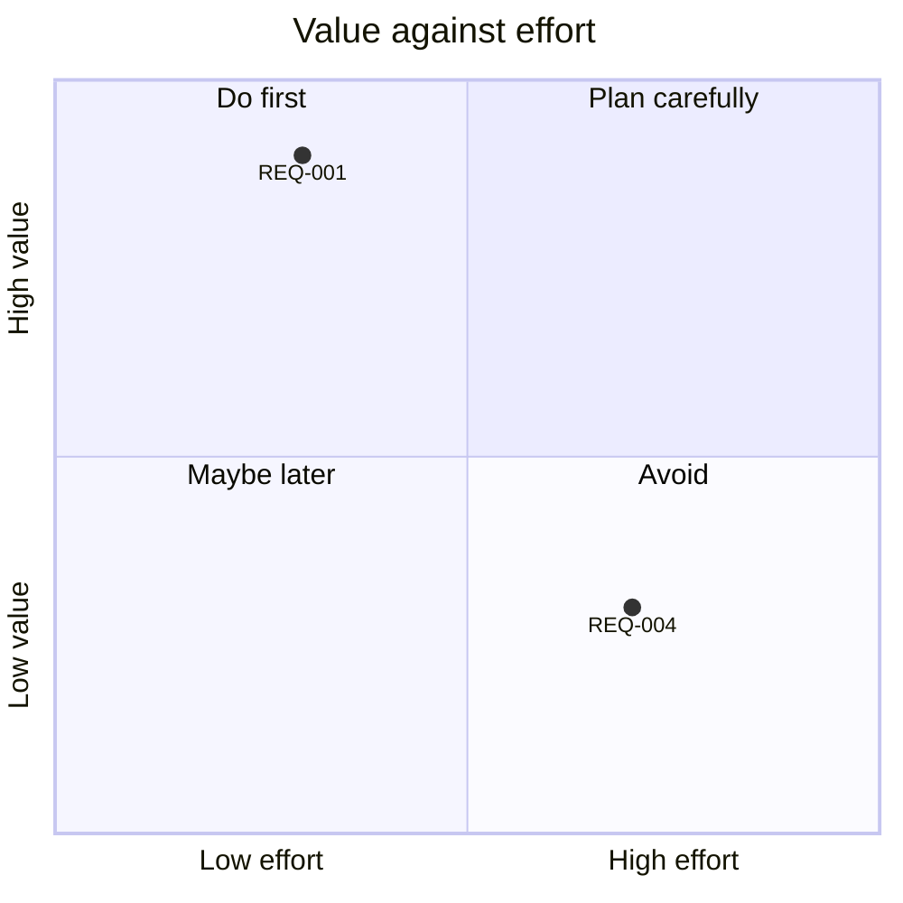

### Example map

- **Mermaid type:** `mindmap`. **Shows:** each rule (a REQ) → its examples → open questions. **Helps when:** a requirement has edge cases, and you want the unanswered ones visible before writing criteria.

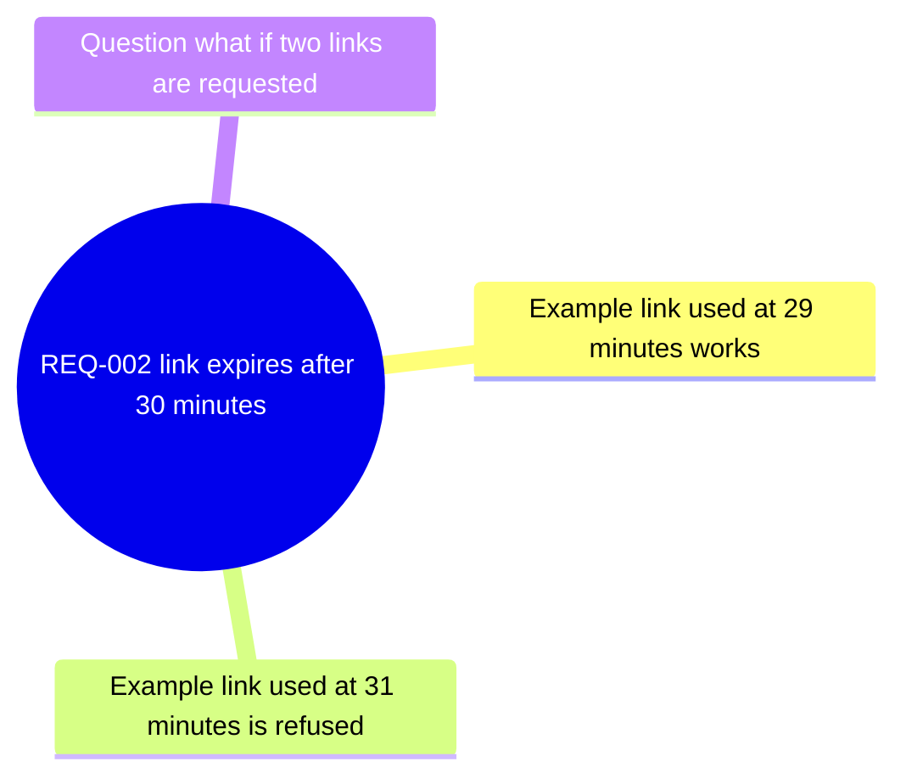
