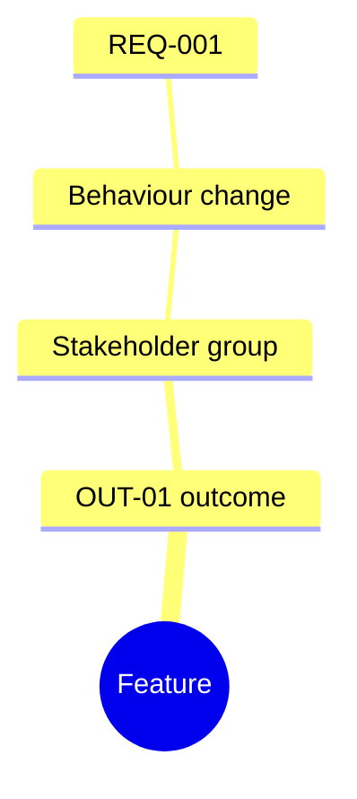
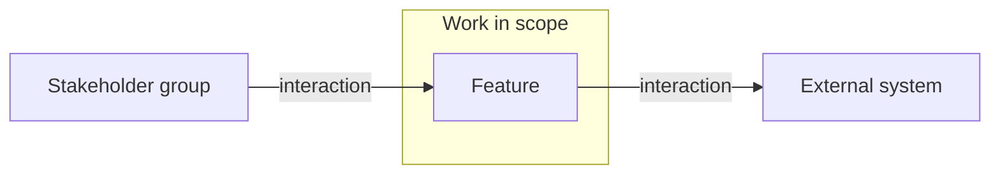
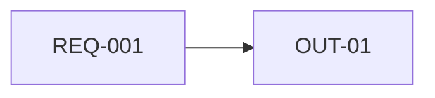
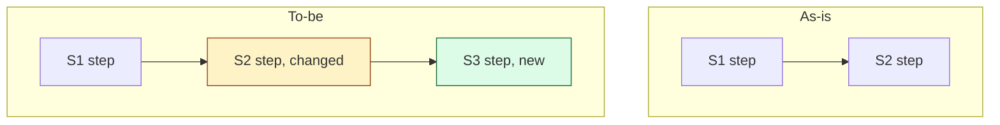

<!-- tier: full (the four required diagrams). At short or skip tier, created only when an optional diagram is chosen. Follow the rendering rules in the requirements skill's reference/diagrams.md. -->
# Diagrams: {Session Title}

> Part of [index](index.md) · Define

## Impact map

## Context diagram

## Traceability

<!-- requirementDiagram or flowchart LR, whichever is easier to review (D10). Every OUT, every live REQ, every Serves link. -->

## As-is and to-be

<!-- Only when an existing process changes. Same step IDs in both; changed, new and removed steps styled with classDef. -->

