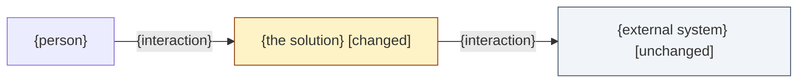

<!-- The main doc of the design/ folder. Every session has it. Its sections are the Design standard's all-kinds sections (skills/design/SKILL.md). Keep the headings: the Design gate checks Classification, Scope checklist, Context view and Delta list by name. -->
# Design: {Session Title}

> Phase: Design | Started: {date} | Status: Draft
> Requirements: [`define/index.md`](../define/index.md) · Session history: [`log.md`](../log.md)

## Contents

<!-- One line and a link per file that exists. Delete lines for files this design doesn't create. -->
- [Solution](solution.md): the kind's in-depth design (when the kind has an in-depth path)
- [Frontend](frontend.md), [Backend](backend.md), [Database](database.md): layer designs (when the layer changes and its standard exists)
- [UI handoff](ui-handoff.md): the Claude Design handoff and the returned visual design (when visual UI design is in scope)

## Prior knowledge

<!-- Only project docs, the code and this session (see the prior-knowledge rule). Never a past session folder. -->
- **Read:** {docs under docs/explanation, docs/reference and docs/registry, and the code, that this design builds on}
- **Not read:** any past session folder, including `docs/sessions/archive/`.

<!-- With no project documentation, replace the Read line with this sentence: -->
<!-- No project documentation found; designed from the Define output and the code. -->

## Classification

- **Primary kind:** {kind from the kind catalogue}: {one-line reason citing the requirements}
- **In-depth path:** {`kinds/{kind}.md` | none yet: dkoenawan/compass-labs#{nn}, see Open questions}

<!-- Confirmed by the user through needs_input before any further design. -->

## Scope checklist

| Area | In scope? | Reason |
|---|---|---|
| {area} | {in \| out} | {reason} |

## Context view

*Notation: {notation and C4 level}, drawn as a Mermaid `flowchart` with delta styling.*

## Delta list

Each element this design touches has exactly one status. Every visual matches this list.

| Element | Status | DES | Note |
|---|---|---|---|
| {element} | {new \| changed \| deprecated \| unchanged} | DES-{nnn} | {note} |

## Components (DES)

Each item names the `REQ-*` it covers, the result Implement must produce and the check that shows it's done.

| ID | Component | Covers | Result | Check |
|---|---|---|---|---|
| DES-001 | {component, and where it lives} | REQ-{nnn} | {what Implement produces} | {how to tell it's done} |

**Coverage:** {all N live REQs covered | the uncovered REQ and what was done about it}

## Decisions

<!-- One block per significant choice: at least two options, the user's choice and the reason. Link existing ADRs; flag new architecture-level decisions "ADR" for Close. -->

**D1: {the choice} ({ADR-nnn link | ADR | no ADR}).**

| Option | Pros | Cons |
|---|---|---|
| **{option} (chosen)** | {pros} | {cons} |
| {option} | {pros} | {cons} |

{The reason for the choice, and that the user chose it.}

## Principles check

<!-- KISS and YAGNI for every item; SOLID too for software elements. Mark met, traded off (with reason), or n/a (with reason). The user resolves every traded-off mark. -->

| Item | KISS | YAGNI | SOLID |
|---|---|---|---|
| DES-001 | {met} | {met} | {SRP met; OCP met; LSP n/a: reason; ISP met; DIP met \| n/a: not software} |
| D1 | {met} | {met} | {…} |

**Rejected under YAGNI:**
- {component or option no live REQ needs}: {reason}

## Risks

| Risk | Mitigation |
|---|---|
| {risk} | {mitigation} |

## Open questions

{Anything not yet resolved, including the follow-up issue (dkoenawan/compass-labs#{nn}) for a kind or area without an in-depth path. If none: "All questions resolved."}
