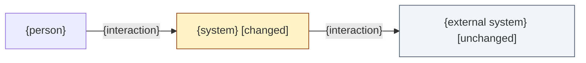
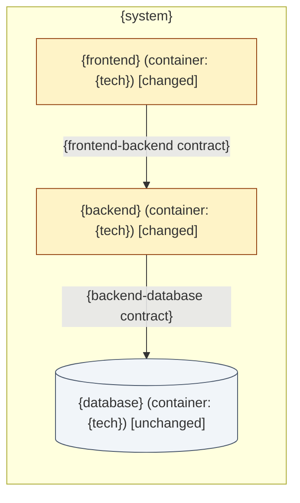

<!-- The kind's in-depth design. Write it only when the primary kind has an in-depth path (skills/design/kinds/{kind}.md); that file says which sections go here. It refines design/index.md and never repeats it. The headings below are three-tier's; replace them with your kind's. -->
# Solution design: {Session Title}

> Kind: {kind} (in-depth path: `skills/design/kinds/{kind}.md` in the compass-labs plugin) · Main doc: [`index.md`](index.md)

## Layers

| Layer | Status | Why |
|---|---|---|
| Frontend | {changing \| unchanged} | {the live REQ-* that change it, or "no live REQ touches it"} |
| Backend | {changing \| unchanged} | {…} |
| Database | {changing \| unchanged} | {…} |

## Contracts between changing layers

- **Frontend ↔ backend: {contract name}.** {endpoints or messages, request and response shape, error cases}
- **Backend ↔ database: {contract name}.** {entities, key fields and relations, constraints relied on}

## C4 L1 context view

*Notation: C4 L1 context view, drawn as a Mermaid `flowchart` with delta styling.*

## C4 L2 container view

*Notation: C4 L2 container view, drawn as a Mermaid `flowchart` with delta styling.*

<!-- Approval: the user approves this whole-system design through needs_input before any layer file is written. -->
